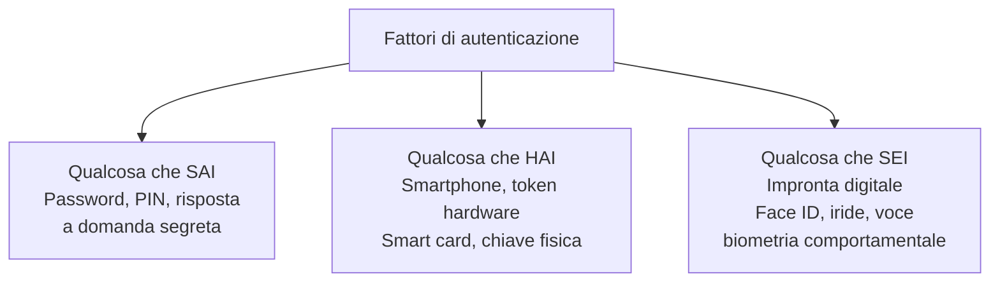
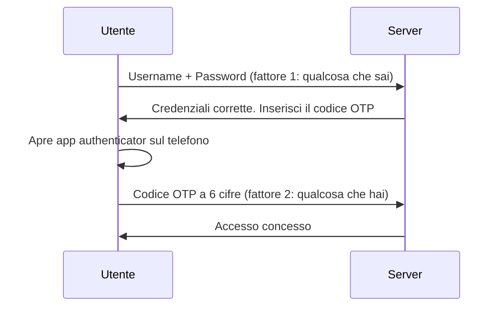
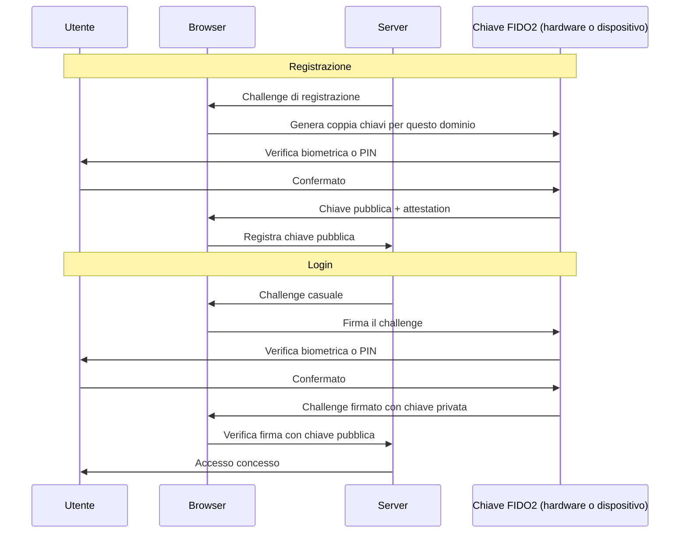
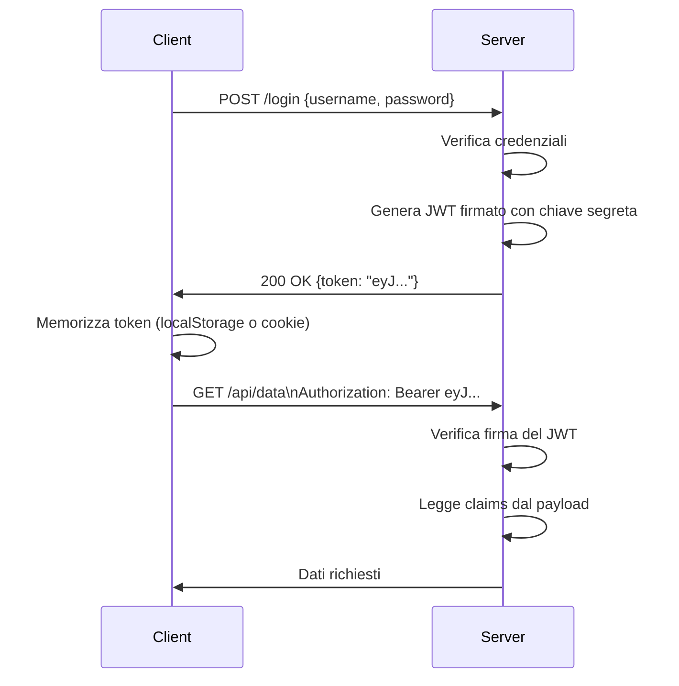
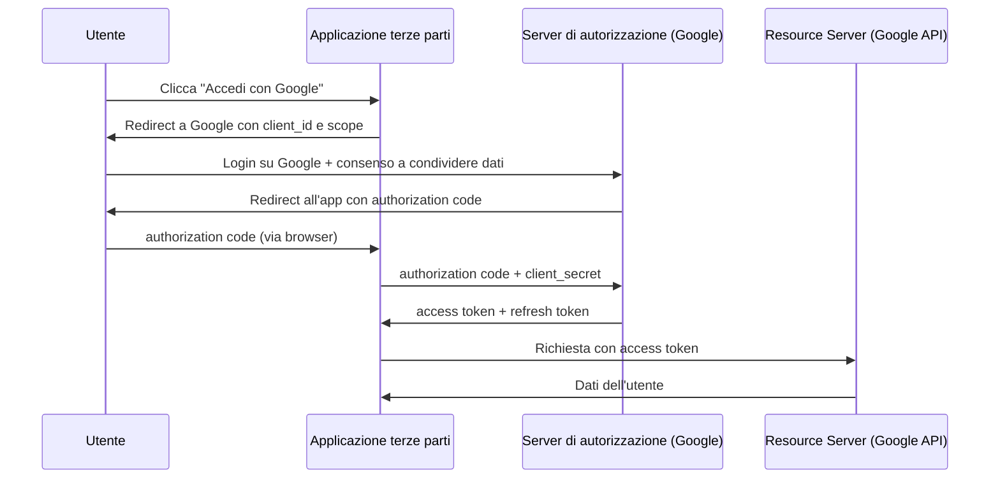
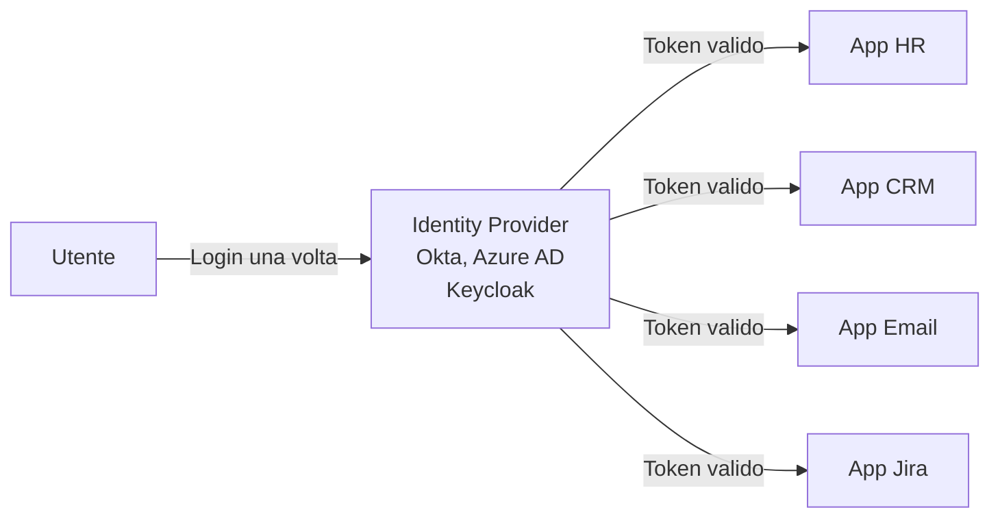
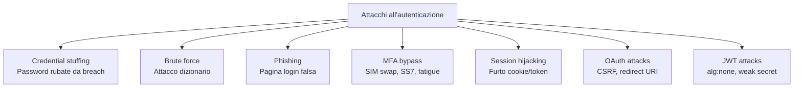

# Autenticazione e identità digitale: MFA, OAuth, SSO, JWT e come si attaccano

## Introduzione

L'autenticazione è il processo con cui un sistema verifica che tu sia chi dici di essere. Sembra semplice — eppure è uno dei campi più complessi e più attaccati della sicurezza informatica. La maggior parte delle breach aziendali inizia con credenziali compromesse: password rubate, token intercettati, sessioni dirottate.

Capire come funzionano i meccanismi di autenticazione moderni — e dove sono vulnerabili — è essenziale sia per chi costruisce sistemi che per chi li difende o li attacca.

---

## I tre fattori di autenticazione

L'autenticazione si basa su tre categorie fondamentali, note come i **tre fattori**:



Ognuno ha punti di forza e debolezze:

| Fattore | Punti di forza | Debolezze |
|---|---|---|
| Qualcosa che sai | Nessun hardware necessario | Rubabile, dimenticabile, prevedibile |
| Qualcosa che hai | Fisicamente presente | Perdibile, rubabile fisicamente |
| Qualcosa che sei | Non trasferibile | Non modificabile se compromessa, falsi positivi/negativi |

---

## Multi-Factor Authentication (MFA)

L'MFA richiede **due o più fattori distinti** per autenticarsi. Se un attaccante ruba la password, non basta — ha bisogno anche del secondo fattore.



Secondo Microsoft, l'MFA blocca il **99,9%** degli attacchi automatizzati di account takeover.

### TOTP — Time-based One-Time Password

Il meccanismo più diffuso per il secondo fattore. L'app authenticator (Google Authenticator, Authy, Aegis) genera un codice a 6 cifre che cambia ogni 30 secondi, basandosi su:

```
TOTP = HMAC(chiave_segreta, timestamp_corrente / 30)
```

La chiave segreta viene condivisa una volta sola al momento della configurazione (il QR code che scansioni). Né il server né il client trasmettono mai la chiave — solo il codice derivato da essa, che è valido solo per 30 secondi.

### SMS OTP vs App Authenticator

L'OTP via SMS è meglio di niente, ma è vulnerabile:

**SIM Swapping:** l'attaccante convince l'operatore telefonico di essere la vittima e trasferisce il numero su una sua SIM. Tutti gli SMS OTP arrivano all'attaccante. Casi documentati di SIM swapping contro account di criptovalute con perdite milionarie.

**SS7 Vulnerabilities:** il protocollo SS7 usato dalle reti telefoniche ha vulnerabilità note che permettono a chi vi ha accesso (governi, servizi di intelligence, criminali con accesso a carrier compiacenti) di intercettare SMS da qualsiasi numero.

L'app authenticator non ha questi problemi perché non usa la rete telefonica — usa solo l'orologio del dispositivo e la chiave segreta condivisa.

### FIDO2 / WebAuthn — il futuro dell'MFA

FIDO2 è lo standard più sicuro disponibile oggi. Usa crittografia a chiave pubblica invece di codici condivisi:



Vantaggi chiave di FIDO2:
- La chiave privata non lascia mai il dispositivo
- La firma è vincolata al dominio — resistente al phishing (un sito fake non ottiene mai la firma corretta)
- Non ci sono segreti condivisi da rubare dal server
- Nessun codice da digitare — esperienza utente migliore

---

## Sessioni e cookie

Dopo l'autenticazione, il server deve ricordare che l'utente è autenticato. HTTP è stateless — ogni richiesta è indipendente. La soluzione sono le **sessioni**.

```mermaid
sequenceDiagram
    participant U as Browser
    participant S as Server
    U->>S: POST /login {username, password}
    S->>S: Verifica credenziali
    S->>S: Crea sessione ID: "abc123xyz..."
    S->>U: 200 OK\nSet-Cookie: session=abc123xyz; HttpOnly; Secure; SameSite=Strict
    U->>S: GET /dashboard\nCookie: session=abc123xyz
    S->>S: Cerca "abc123xyz" nella session store
    S->>U: 200 OK (pagina dashboard)
```

### Attributi di sicurezza dei cookie

**HttpOnly:** il cookie non è accessibile via JavaScript (`document.cookie`). Protegge dal furto del cookie tramite XSS.

**Secure:** il cookie viene trasmesso solo su connessioni HTTPS. Protegge dall'intercettazione su canali non cifrati.

**SameSite:** controlla quando il cookie viene inviato nelle richieste cross-site.
- `Strict`: mai inviato nelle richieste cross-site — protegge da CSRF
- `Lax`: inviato solo per navigazione top-level (click su link)
- `None`: inviato sempre (richiede Secure)

### Session Hijacking

Se un attaccante ottiene il cookie di sessione, può impersonare l'utente senza conoscere la password.

Vettori di furto del cookie:
- **XSS:** script iniettato legge `document.cookie` (prevenuto da HttpOnly)
- **Sniffing:** sessione trasmessa su HTTP non cifrato (prevenuto da Secure)
- **Man-in-the-Middle:** intercettazione del cookie in transito
- **Malware sul client:** keylogger o stealer che legge i cookie direttamente dal browser

---

## JWT — JSON Web Token

I JWT sono un meccanismo di autenticazione **stateless** — invece di memorizzare la sessione sul server, il server emette un token che il client porta con sé in ogni richiesta.

### Struttura del JWT

Un JWT è composto da tre parti codificate in Base64url, separate da punti:

```
header.payload.signature

eyJhbGciOiJIUzI1NiIsInR5cCI6IkpXVCJ9.
eyJzdWIiOiJ1c2VyMTIzIiwicm9sZSI6ImFkbWluIiwiZXhwIjoxNjgwMDAwMDAwfQ.
SflKxwRJSMeKKF2QT4fwpMeJf36POk6yJV_adQssw5c
```

**Header:** algoritmo di firma e tipo di token
```json
{ "alg": "HS256", "typ": "JWT" }
```

**Payload:** i claim — dati sull'utente e sulla sessione
```json
{ "sub": "user123", "role": "admin", "exp": 1680000000 }
```

**Signature:** verifica che il token non sia stato modificato
```
HMAC-SHA256(base64url(header) + "." + base64url(payload), chiave_segreta)
```

### Come funziona l'autenticazione JWT



Il server non memorizza nulla — può verificare qualsiasi JWT con la sua chiave segreta. Scalabile orizzontalmente.

### Vulnerabilità dei JWT

**Algorithm confusion (alg: none):** alcune implementazioni difettose accettano JWT con algoritmo "none" — nessuna firma. Un attaccante può modificare il payload (es. `"role": "admin"`) e firmare con "none". Il server accetta il token modificato.

**RS256 to HS256 confusion:** se il server supporta sia RSA che HMAC, un attaccante può prendere la chiave pubblica del server (pubblica per definizione), modificare il token payload, e firmarlo con HMAC usando quella chiave pubblica come segreto. Se il server non valida l'algoritmo correttamente, accetta il token falsificato.

**Weak secret:** JWT firmati con HMAC-SHA256 con un segreto debole possono essere craccati offline. Un attaccante che ha un token valido può fare brute force del segreto.

**Missing expiration:** JWT senza campo `exp` o con scadenza molto lunga rimangono validi anche dopo il logout o il cambio password — non c'è modo di invalidarli senza mantenere una blacklist (che vanifica il vantaggio stateless).

---

## OAuth 2.0

OAuth 2.0 è un protocollo di **autorizzazione** (non autenticazione) che permette a un'applicazione di accedere a risorse di un altro servizio per conto dell'utente, senza condividere le credenziali.

Il caso d'uso classico: "Accedi con Google" su un sito di terze parti.



**Scope:** definisce cosa l'applicazione può fare. `email profile` permette di leggere nome ed email. `https://www.googleapis.com/auth/gmail.readonly` permette di leggere le email. L'utente vede esplicitamente cosa sta autorizzando.

**Access token:** valido per poco tempo (ore). Usato per le richieste API.

**Refresh token:** valido più a lungo (giorni/settimane). Usato per ottenere nuovi access token senza richiedere nuovamente l'autenticazione.

### Vulnerabilità OAuth

**Authorization Code Interception:** se il redirect URI non è validato correttamente, un attaccante può registrare un URI simile e intercettare il codice di autorizzazione.

**CSRF sul flusso OAuth:** senza state parameter, un attaccante può ingannare l'utente a completare un flusso OAuth con un account controllato dall'attaccante.

**Token leakage:** access token nei log, negli header Referer, o in URL non devono mai essere esposti.

---

## OpenID Connect (OIDC)

OpenID Connect è un layer di **autenticazione** costruito sopra OAuth 2.0. Se OAuth dice "puoi accedere a queste risorse", OIDC dice "questo è chi sei".

Aggiunge un **ID Token** (un JWT) al flusso OAuth che contiene informazioni sull'identità dell'utente autenticato: chi è, quando si è autenticato, con quale metodo.

```json
{
  "iss": "https://accounts.google.com",
  "sub": "110169484474386276334",
  "aud": "client_id_dell_applicazione",
  "email": "mario.rossi@gmail.com",
  "name": "Mario Rossi",
  "iat": 1680000000,
  "exp": 1680003600
}
```

---

## Single Sign-On (SSO)

Il SSO permette all'utente di autenticarsi una volta sola e accedere a tutte le applicazioni collegate senza riauthenticarsi per ciascuna.



**SAML (Security Assertion Markup Language):** standard XML-based usato prevalentemente in ambienti enterprise. L'IdP emette asserzioni SAML che le applicazioni verificano.

**OIDC/OAuth per SSO:** approccio moderno, più leggero e adatto ad applicazioni web e mobile.

### Rischio SSO: Single Point of Failure

Il vantaggio dell'SSO è anche il suo rischio principale: se l'account IdP viene compromesso, l'attaccante accede a tutte le applicazioni. Per questo l'MFA sull'IdP è non negoziabile in ambienti enterprise.

---

## Attacchi all'autenticazione: panoramica



### MFA Fatigue Attack

Un attacco moderno sempre più comune: l'attaccante ha già la password (rubata o crackata). Il sistema invia una notifica push MFA all'utente. L'attaccante invia decine di richieste push in rapida successione, a qualsiasi ora, finché l'utente non accetta per sbaglio, per frustrazione, o per fermare le notifiche.

Microsoft, Cisco, Uber — tutti hanno subito breach iniziati con MFA fatigue.

Difesa: passare a metodi MFA che richiedono un'azione deliberata con context matching (es. FIDO2, o push MFA con number matching — l'utente deve inserire un numero mostrato sul computer, non solo premere "approva").

---

## Best practice per l'autenticazione sicura

**Per gli sviluppatori:**
- Non implementare mai da zero — usa librerie e framework consolidati (Passport.js, Spring Security, Django auth)
- Argon2id per hashing delle password
- JWT con scadenza breve + refresh token rotation
- Validazione rigorosa dei redirect URI in OAuth
- Rate limiting sui tentativi di login
- Account lockout con backoff esponenziale
- Log di tutti gli eventi di autenticazione (successi, fallimenti, cambio password)

**Per gli utenti:**
- Password unica per ogni servizio (password manager)
- MFA su tutti gli account critici, preferibilmente con app authenticator o FIDO2
- Verifica sempre il dominio prima di inserire le credenziali
- Non "approvare" notifiche MFA che non hai richiesto tu

---

## Conclusione

L'autenticazione è il confine tra chi è autorizzato e chi non lo è — e gli attaccanti investono enormi risorse nel attraversarlo. I meccanismi moderni (FIDO2, JWT con rotazione, OAuth ben implementato) sono significativamente più sicuri della semplice password — ma ogni meccanismo ha le proprie vulnerabilità specifiche.

La tendenza del settore è chiara: verso l'autenticazione senza password con Passkey/FIDO2. Nel frattempo, MFA robusto + password manager + sessioni brevi è la combinazione che riduce drasticamente la superficie di attacco.
