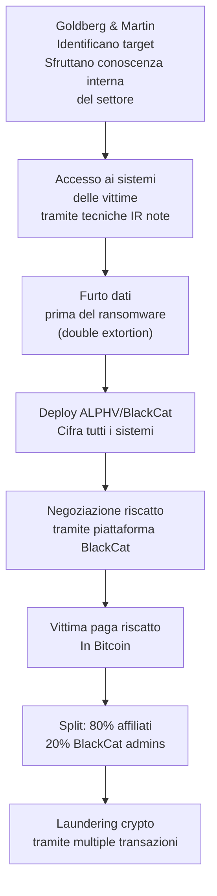

# I difensori che attaccavano: due professionisti cybersecurity condannati per BlackCat ransomware

## Il fatto

Il 12 marzo 2026, due professionisti della cybersecurity americani sono stati condannati da un tribunale federale della Florida per il loro ruolo come affiliati del gruppo ransomware **ALPHV/BlackCat** — uno dei più prolificici gruppi di ransomware della storia recente, responsabile di attacchi a oltre 1.000 organizzazioni in tutto il mondo.

**Ryan Goldberg**, 40 anni, della Georgia, lavorava come **incident response manager** presso la società di cybersecurity **Sygnia**. **Kevin Martin**, 36 anni, del Texas, era impiegato come **ransomware negotiator** presso **DigitalMint**, una società specializzata nella negoziazione di riscatti e nella risposta agli incidenti ransomware.

Entrambi hanno ammesso di aver usato la propria expertise professionale non per difendere le vittime — ma per attaccarle.

---

## Come funzionava lo schema

I due operavano sotto il modello **Ransomware-as-a-Service (RaaS)**: BlackCat forniva il malware, l'infrastruttura di estorsione e la piattaforma di negoziazione. Gli affiliati come Goldberg e Martin identificavano i target, eseguivano l'intrusione, rubavano i dati e deployavano il ransomware. In cambio, trattenevano l'**80% del riscatto**, versando il 20% agli amministratori di BlackCat.

In un caso documentato, le tre persone — Goldberg, Martin, e un terzo individuo non identificato — hanno ricevuto **1,2 milioni di dollari in Bitcoin** da una singola vittima.

---

## Il vantaggio sleale: conoscenza dall'interno

Quello che rende questo caso particolarmente significativo non è il ransomware in sé — è che i due avevano **conoscenze professionali privilegiate** su come le vittime rispondono agli attacchi, come funzionano le negoziazioni, e dove si trovano le vulnerabilità nei sistemi aziendali.

Goldberg, come incident response manager, aveva partecipato a centinaia di risposte agli incidenti. Sapeva esattamente quali sistemi vengono backup-ati, dove si trovano i punti deboli nelle architetture aziendali, come le aziende valutano se pagare o meno il riscatto, e quali tattiche rendono il pagamento più probabile.

Martin, come negoziatore ransomware, conosceva dall'interno i pattern comportamentali delle vittime durante le negoziazioni. Sapeva quanto un'azienda è disposta a pagare prima di cedere, quali argomenti sono più efficaci per pressurare, e come le aziende si preparano alla risposta.

Come ha commentato l'assistente Procuratore Generale: "Questi imputati hanno usato la loro formazione ed esperienza sofisticate in cybersecurity per commettere attacchi ransomware — esattamente il tipo di crimine che avrebbero dovuto lavorare per fermare."

---

## Il conflitto d'interessi strutturale

Il caso Goldberg-Martin ha riacceso un dibattito che covava da anni nell'industria della cybersecurity: il **conflitto d'interessi nel settore delle negoziazioni ransomware**.

Le società di negoziazione ransomware come DigitalMint si posizionano come intermediari critici tra vittime e attaccanti. Ma la struttura dei compensi — spesso una percentuale del riscatto pagato — crea incentivi perversi: una società di negoziazione che guadagna il 15% di 2 milioni di dollari ha un incentivo economico molto diverso da una che guadagna il 15% di 500.000 dollari.

James Taliento, CEO di AFTRDRK, aveva già sollevato questo problema: "Un negoziatore non è incentivato a far scendere il prezzo o a informare la vittima di tutti i fatti se la società per cui lavora guadagna in base alla dimensione della domanda pagata."

Il caso dei due imputati aggiunge una dimensione ancora più oscura: negoziatori che non solo hanno conflitti d'interesse economici, ma che usano attivamente la posizione di fiducia per identificare e attaccare futuri target.

---

## La fine di BlackCat

ALPHV/BlackCat è stato smantellato dal DOJ a dicembre 2023, quando l'FBI ha sviluppato e rilasciato uno strumento di decifrazione gratuito, permettendo a centinaia di vittime di recuperare i sistemi senza pagare il riscatto — salvando un totale stimato di 99 milioni di dollari.

Ma la storia di Goldberg e Martin dimostra che lo smantellamento dell'infrastruttura non elimina i danni già compiuti, né ferma la ricerca dei responsabili.

---

## La pena

Entrambi affrontano fino a **20 anni di prigione federale**. La sentenza definitiva è stata pronunciata il 12 marzo 2026.

---

## Conclusione

Nessuno è al di sopra di ogni sospetto — nemmeno i professionisti a cui si affida la propria sicurezza. Questo caso è un invito a ripensare come le organizzazioni selezionano e supervisionano i partner di incident response, a monitorare l'accesso privilegiato anche del personale di sicurezza, e a trattare il vetting dei vendor di cybersecurity con lo stesso rigore con cui si tratta il vetting di qualsiasi altro fornitore con accesso ai sistemi critici.
