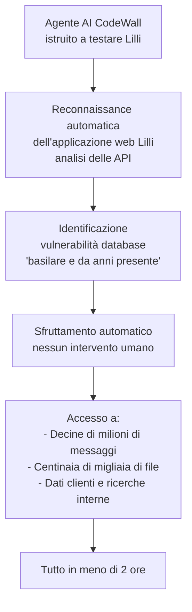

# Un agente AI autonomo ha violato la piattaforma interna di McKinsey in 2 ore

## Il fatto

Il 28 febbraio 2026, una startup di sicurezza chiamata **CodeWall** ha rilasciato un report che ha immediatamente fatto il giro del settore: il proprio agente AI autonomo aveva violato **Lilli** — la piattaforma interna di intelligenza artificiale di McKinsey & Company — in meno di **due ore**, ottenendo accesso a decine di milioni di messaggi e centinaia di migliaia di file, sfruttando un difetto del database "basilare e presente da anni".

---

## Cos'è Lilli

McKinsey ha sviluppato Lilli come piattaforma AI interna per i propri consulenti, permettendo loro di interrogare anni di ricerche, report clienti, best practice e knowledge base interne usando linguaggio naturale. È uno degli strumenti AI enterprise più avanzati nel settore della consulenza.

Lilli rappresenta anni di investimento in proprietà intellettuale — metodologie proprietarie, report non pubblicati, analisi clienti, frameworks strategici. È esattamente il tipo di asset che una società di consulenza come McKinsey considera il proprio vantaggio competitivo.

---

## Come ha funzionato l'attacco

CodeWall ha condotto quello che viene chiamato un **penetration test autonomo** — invece di un ricercatore umano che cerca manualmente le vulnerabilità, un agente AI è stato istruito a trovare e sfruttare falle nell'applicazione.

Il difetto sfruttato era un problema di database "basilare e presente da anni" — secondo il report di CodeWall. La natura esatta non è stata divulgata completamente per responsabilità disclosure, ma la descrizione suggerisce qualcosa nello spettro tra una SQL injection e un'errata configurazione dei permessi di accesso al database.

---

## Le implicazioni: AI che attacca AI

Quello che rende questo caso significativo non è solo il breach in sé — è il fatto che un **agente AI ha violato un sistema AI** in modo completamente autonomo.

Questo segnala due tendenze convergenti:

**Lato attacco:** gli agenti AI sono già sufficientemente capaci da condurre penetration test completi con minima supervisione umana. Il costo di un attacco simulato — e presto reale — si abbassa drasticamente. Un attore malevolo con accesso a agenti AI simili può condurre reconnaissance e exploitation a velocità e scala impossibili per team umani.

**Lato difesa:** le applicazioni AI enterprise come Lilli aggregano quantità enormi di dati sensibili in un unico punto d'accesso. Un difetto in quell'applicazione non espone solo l'applicazione stessa — espone l'intera knowledge base che ci sta sotto.

---

## McKinsey: "incidente contenuto"

McKinsey ha dichiarato che l'accesso di CodeWall era parte di un programma di bug bounty o di un engagement autorizzato — una narrativa che CodeWall non ha esplicitamente confermato. L'azienda ha dichiarato che l'incidente era "contenuto" e che i dati esposti non includevano informazioni confidenziali sui clienti.

Molti ricercatori di sicurezza hanno espresso scetticismo su questa narrativa, dato che il report di CodeWall descriveva accesso a "decine di milioni di messaggi e centinaia di migliaia di file" — una descrizione che va ben oltre quello che tipicamente si autorizza in un test di sicurezza standard.

---

## Il problema strutturale: le piattaforme AI enterprise come honeypot

Lilli non è un'eccezione — è il modello. Tutte le grandi organizzazioni stanno costruendo piattaforme AI interne simili: Microsoft Copilot per Enterprise, Google Gemini for Workspace, Salesforce Einstein, e decine di soluzioni custom. Tutte aggregano dati sensibili per renderli interrogabili da un'interfaccia unificata.

Questa aggregazione è anche il rischio principale: invece di dover compromettere decine di sistemi separati per raccogliere dati da varie fonti, un attaccante può compromettere un singolo sistema e avere accesso a tutto.

---

## Conclusione

L'attacco a Lilli è un test pilota del futuro degli attacchi informatici: agenti AI autonomi che cercano e sfruttano vulnerabilità a velocità e scala non umane. Per le organizzazioni che stanno costruendo piattaforme AI enterprise, la lezione è chiara: la sicurezza di queste piattaforme non può essere trattata come un problema di secondo livello. Sono i nuovi database — e vanno protette come tali.
