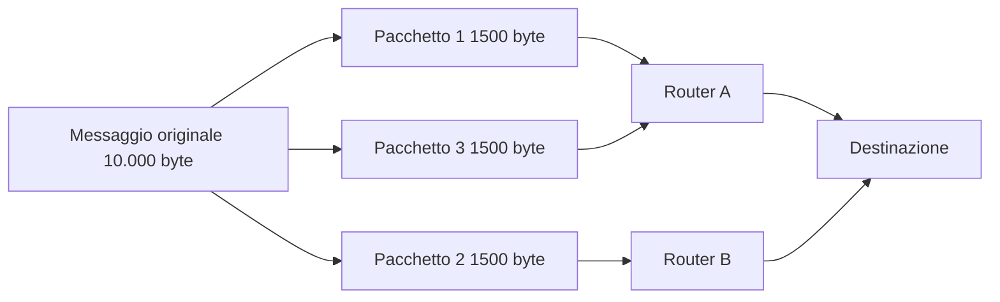
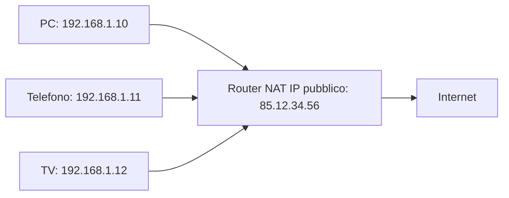
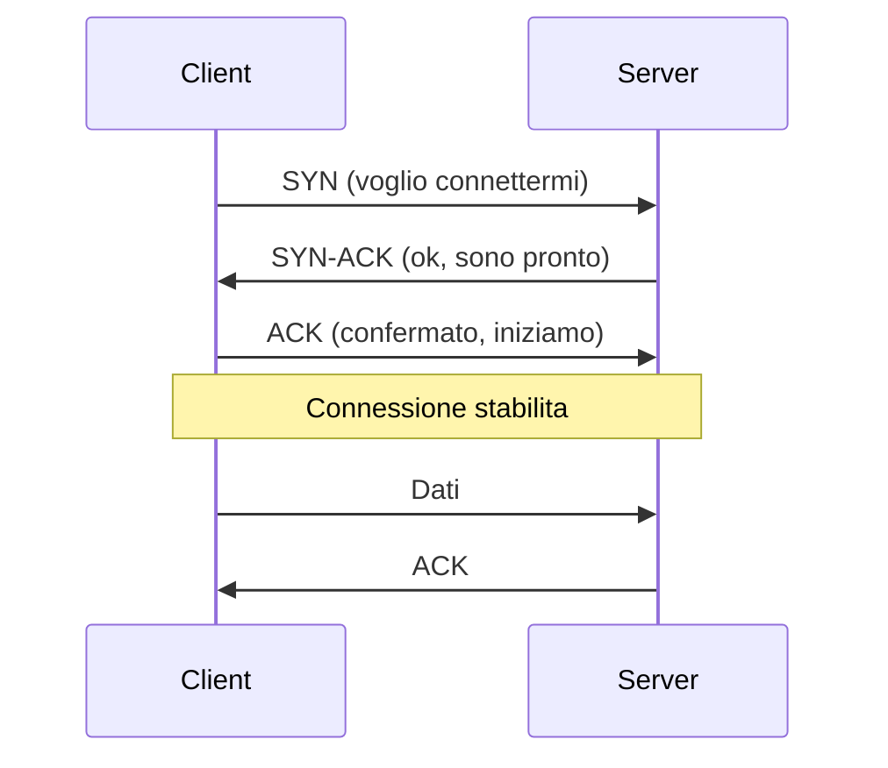
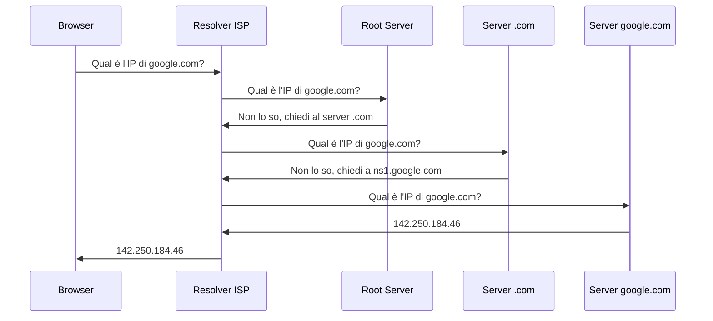
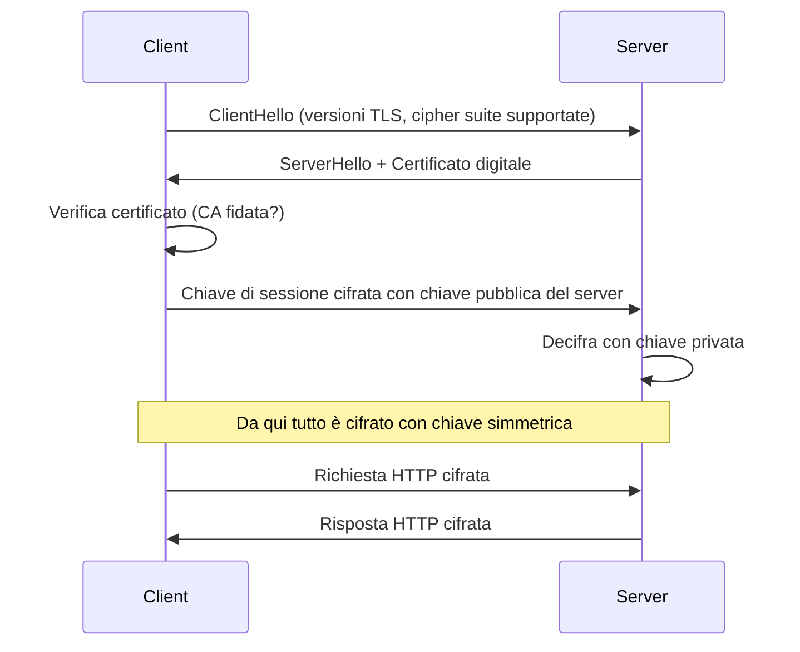
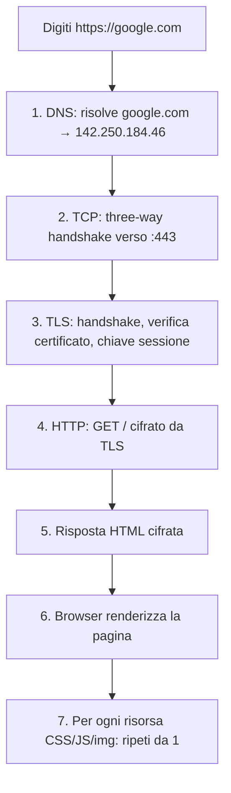

# Come funziona internet: il viaggio di un pacchetto

## Introduzione

Ogni volta che apri un sito web, mandi un'email o guardi un video in streaming, miliardi di operazioni avvengono in frazioni di secondo. Per chi lavora in sicurezza informatica, capire come funziona internet non è un dettaglio opzionale — è il prerequisito per capire quasi tutti gli attacchi e le difese. Non puoi analizzare traffico di rete senza capire TCP/IP. Non puoi capire il DNS poisoning senza capire come funziona il DNS. Non puoi scrivere regole firewall senza capire come viaggiano i pacchetti.

Questo articolo segue un pacchetto dal momento in cui premi Invio su una URL al momento in cui la pagina appare sul tuo schermo.

---

## La commutazione di pacchetto

Internet non funziona come un telefono. Una chiamata telefonica tradizionale stabilisce un **circuito dedicato** tra due punti per tutta la durata della comunicazione. Internet funziona diversamente: con la **commutazione di pacchetto**. I dati vengono sminuzzati in piccoli blocchi chiamati **pacchetti**, ciascuno instradato indipendentemente attraverso la rete, e riassemblati a destinazione.



Ogni pacchetto può seguire percorsi diversi e arrivare fuori ordine — il protocollo di trasporto si occupa di riordinarli.

Perché questo importa per la sicurezza:
- Un attaccante può intercettare singoli pacchetti (**packet sniffing**)
- Può iniettare pacchetti falsi in una comunicazione (**injection attack**)
- Può bloccare selettivamente pacchetti
- Può mandare pacchetti malformati per confondere i sistemi di destinazione

---

## Gli indirizzi IP

Ogni dispositivo connesso a internet ha un **indirizzo IP** — un numero che lo identifica sulla rete.

**IPv4:** 32 bit, scritti come quattro numeri da 0 a 255 separati da punti. Circa 4 miliardi di indirizzi possibili — ormai esauriti.

**IPv6:** 128 bit in esadecimale. Introdotto per risolvere l'esaurimento degli indirizzi IPv4. Esempio: `2001:0db8:85a3::8a2e:0370:7334`

### Indirizzi privati e NAT

La maggior parte dei dispositivi usa indirizzi privati non instradabili su internet:

| Range | Utilizzo |
|---|---|
| 10.0.0.0/8 | Reti aziendali grandi |
| 172.16.0.0/12 | Reti medie |
| 192.168.0.0/16 | Reti domestiche |

Il router trasla questi indirizzi nel proprio IP pubblico tramite **NAT** (Network Address Translation).



**Implicazione di sicurezza:** un attaccante esterno non può raggiungere direttamente un dispositivo privato dietro NAT — a meno che non ci sia port forwarding, o che il dispositivo abbia già stabilito una connessione verso l'esterno.

---

## Le porte

Un indirizzo IP identifica una macchina. Le **porte** identificano quale servizio su quella macchina si vuole raggiungere. Pensa all'IP come all'indirizzo di un palazzo, alle porte come ai numeri degli appartamenti.

Le porte vanno da 0 a 65535. Le più importanti da conoscere:

| Porta | Protocollo | Note |
|---|---|---|
| 21 | FTP | Trasferimento file, non cifrato |
| 22 | SSH | Shell remota cifrata |
| 23 | Telnet | Shell remota NON cifrata — mai usare |
| 25 | SMTP | Email in uscita |
| 53 | DNS | Risoluzione nomi |
| 80 | HTTP | Web non cifrato |
| 443 | HTTPS | Web cifrato |
| 3389 | RDP | Desktop remoto Windows |
| 8080 | HTTP alt | Proxy, development server |

Quando Nmap scansiona una rete, sta cercando esattamente questo: quali porte sono aperte e quali servizi sono in ascolto.

---

## TCP vs UDP

### TCP — Transmission Control Protocol

TCP garantisce che i dati arrivino completi, nell'ordine giusto, senza errori. Stabilisce la connessione con il **three-way handshake**:



Usato per HTTP/HTTPS, SSH, SMTP — tutto dove l'integrità è critica.

**Attacco SYN Flood:** l'attaccante manda migliaia di SYN senza mai completare l'handshake. Il server alloca risorse per ogni connessione pendente e si esaurisce. È una forma di DoS.

### UDP — User Datagram Protocol

UDP è fire and forget: manda i pacchetti senza conferma, senza ordine garantito, senza ritrasmissioni. Più veloce ma meno affidabile.

Usato per DNS, streaming video, gaming online, VoIP — dove la velocità è più importante dell'integrità assoluta.

**Amplification DDoS:** alcuni servizi UDP rispondono con risposte molto più grandi delle richieste (DNS, NTP, memcached). L'attaccante manda richieste con IP sorgente falsificato della vittima — la vittima riceve traffico amplificato fino a 100x.

---

## Il DNS

Quando scrivi `google.com` il browser non sa dove si trova. Il **Domain Name System** traduce i nomi in indirizzi IP.



Tutto questo avviene in millisecondi, con risultati salvati in cache per ridurre i tempi successivi.

### Record DNS principali

| Record | Funzione |
|---|---|
| A | Mappa nome → IPv4 |
| AAAA | Mappa nome → IPv6 |
| MX | Server di posta del dominio |
| CNAME | Alias verso un altro nome |
| TXT | SPF, DKIM, verifica dominio |
| NS | Name server autoritativi |

### Attacchi DNS

**DNS Cache Poisoning:** l'attaccante inietta risposte false nel cache del resolver. Tutti gli utenti vengono reindirizzati a IP controllati dall'attaccante senza saperlo.

**DNS Hijacking:** l'attaccante modifica i record DNS autoritativi del dominio, tipicamente compromettendo l'account del registrar.

**DNS Tunneling:** il DNS è raramente bloccato dai firewall. I dati vengono codificati nei nomi dei sottodomini delle query per esfiltrare informazioni o mantenere un canale C2 nascosto.

---

## HTTP e HTTPS

**HTTP** è il protocollo con cui il browser chiede pagine ai server. È testuale e basato su richiesta-risposta.

Una richiesta HTTP tipica:

```
GET /login HTTP/1.1
Host: example.com
User-Agent: Mozilla/5.0
Cookie: session=abc123
```

Una risposta HTTP tipica:

```
HTTP/1.1 200 OK
Content-Type: text/html
Set-Cookie: session=abc123; HttpOnly; Secure

<html>...</html>
```

Codici di stato importanti:

| Codice | Significato | Nota sicurezza |
|---|---|---|
| 200 | OK | — |
| 301/302 | Redirect | Redirect HTTP da HTTPS = downgrade attack |
| 401 | Autenticazione richiesta | — |
| 403 | Accesso negato | La risorsa esiste — info utile all'attaccante |
| 404 | Non trovato | — |
| 500 | Errore server | Può rivelare stack trace |

### HTTPS e TLS handshake

HTTPS aggiunge TLS sopra HTTP. Prima di scambiarsi dati, client e server eseguono un handshake:



**Attenzione:** HTTPS protegge il contenuto da intercettazione ma non dice nulla sull'affidabilità del sito. Un sito di phishing può avere HTTPS con certificato valido. Il lucchetto significa solo "connessione cifrata", non "sito legittimo".

---

## Il viaggio completo



---

## Le implicazioni di sicurezza fondamentali

**Tutto il traffico non cifrato è leggibile.** Qualsiasi dispositivo in mezzo — router, switch, access point WiFi — può vedere il contenuto di HTTP, DNS, SMTP non cifrato. Include il tuo ISP e il gestore del WiFi pubblico.

**Gli indirizzi IP si falsificano.** Il campo IP sorgente di un pacchetto può contenere qualsiasi valore. Questo è alla base degli amplification attack. TCP è più difficile da falsificare perché richiede il completamento dell'handshake — UDP no.

**Il DNS è il punto di controllo.** Chi controlla il DNS controlla dove va il traffico. Un attaccante che modifica i record DNS di un dominio può reindirizzare tutto il traffico senza toccare né il server originale né i client.

**Le porte aperte sono superficie d'attacco.** Ogni porta aperta è un potenziale punto d'ingresso. Il principio: apri solo le porte strettamente necessarie.

---

## Conclusione

Internet è una pila di protocolli stratificati — ciascuno risolve un problema specifico e si appoggia a quello sotto. IP instrada i pacchetti. TCP garantisce l'affidabilità. DNS traduce i nomi. HTTP trasporta il contenuto. TLS cifra tutto.

Ogni layer ha le proprie vulnerabilità. Un DNS hijacking colpisce il layer applicativo. Un SYN flood colpisce il layer di trasporto. Un ARP poisoning colpisce il layer di collegamento dati. Capire come questi layer interagiscono è la base per capire dove gli attaccanti cercano di inserirsi — e dove i difensori devono posizionarsi.
