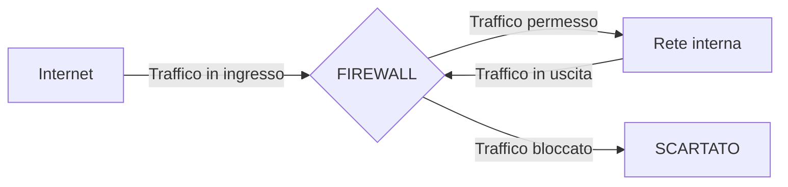
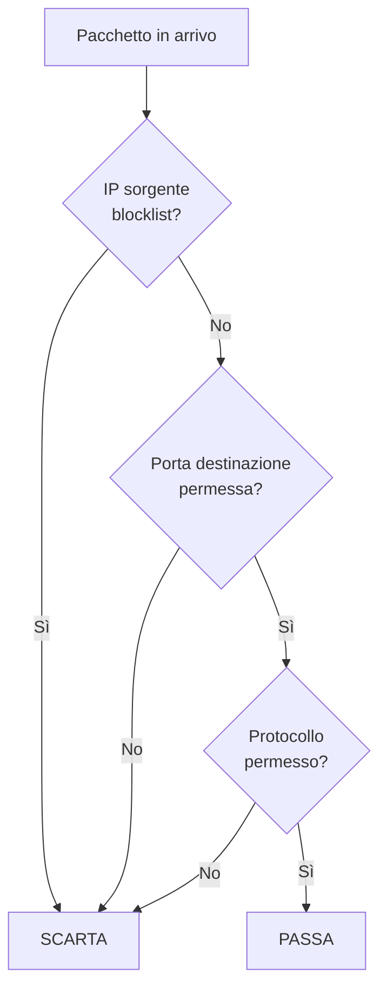
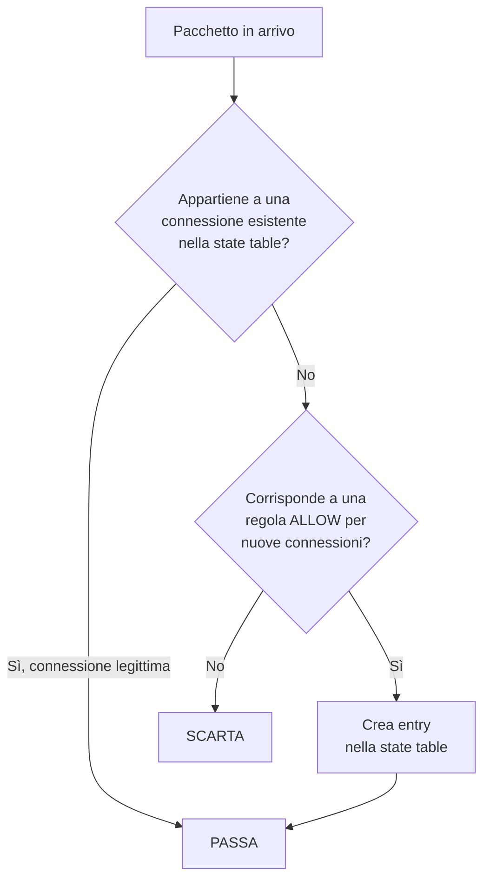
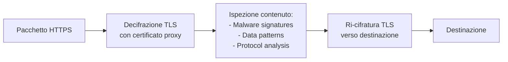
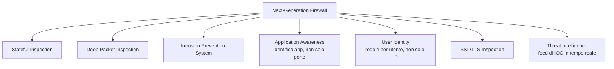
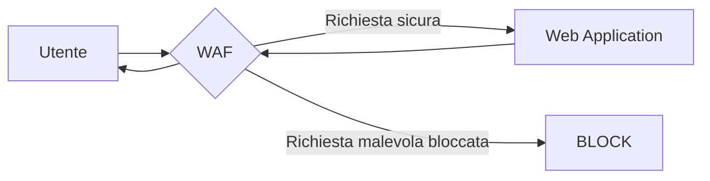
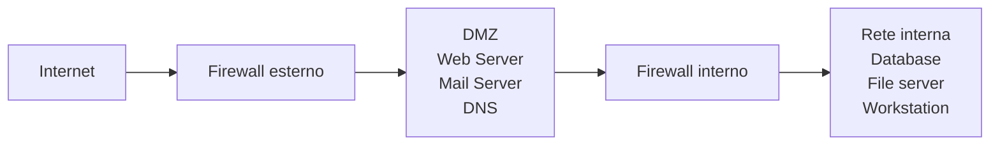

# Come funziona un firewall: stateless, stateful, WAF e i loro limiti

## Introduzione

Il firewall è il primo nome che chiunque associa alla sicurezza informatica. Eppure è anche uno degli strumenti più fraintesi: molte organizzazioni credono che avere un firewall significhi essere al sicuro, mentre in realtà un firewall mal configurato o usato da solo offre una protezione parziale.

Capire come funziona un firewall — i diversi tipi, cosa possono e non possono fare, come si configurano le regole — è fondamentale sia per difendere una rete sia per capire perché certi attacchi lo aggirano senza problemi.

---

## Cos'è un firewall

Un firewall è un sistema (hardware, software, o entrambi) che **monitora e controlla il traffico di rete** in base a un insieme di regole. Sta tra due reti — tipicamente internet e la rete interna — e decide cosa lasciare passare e cosa bloccare.



La metafora classica è quella del buttafuori di un locale: controlla chi entra in base a criteri prestabiliti (lista VIP, dress code, età) ma non sa cosa fa la gente una volta dentro.

---

## Firewall Stateless (Packet Filtering)

Il tipo più semplice e più antico. Analizza ogni pacchetto **indipendentemente**, senza tenere memoria delle connessioni precedenti.

Esamina solo le intestazioni del pacchetto:
- Indirizzo IP sorgente e destinazione
- Porta sorgente e destinazione
- Protocollo (TCP, UDP, ICMP)
- Flag TCP (SYN, ACK, FIN, RST)



### Esempio di regole stateless

```
# Permetti HTTP in ingresso
ALLOW TCP * * 80 INGRESS

# Permetti HTTPS in ingresso
ALLOW TCP * * 443 INGRESS

# Permetti SSH solo da IP specifico
ALLOW TCP 203.0.113.10 * 22 INGRESS

# Blocca tutto il resto in ingresso
DENY * * * * INGRESS
```

### Limiti del firewall stateless

Il problema fondamentale: **non sa se un pacchetto fa parte di una connessione legittima o è un pacchetto isolato malevolo**.

Un pacchetto ACK in ingresso — è la risposta a una connessione che il server ha aperto, o è un tentativo di TCP ACK scan? Il firewall stateless non lo sa. Deve permettere tutti i pacchetti ACK o bloccarli tutti.

Un pacchetto di risposta DNS in ingresso (UDP porta 53 sorgente) — è la risposta a una query che l'utente ha fatto, o è un tentativo di DNS spoofing? Il firewall stateless non lo sa.

---

## Firewall Stateful (State Inspection)

Il firewall stateful mantiene una **tabella delle connessioni attive** (state table). Ogni pacchetto viene valutato non solo in base alle sue intestazioni, ma anche in relazione alla connessione a cui appartiene.



### La state table

```
Connessioni attive:
SRC IP          SRC PORT   DST IP          DST PORT  PROTO  STATO
192.168.1.10    54231      142.250.184.46  443       TCP    ESTABLISHED
192.168.1.10    54232      8.8.8.8         53        UDP    NEW
192.168.1.15    61084      185.23.44.10    80        TCP    ESTABLISHED
```

Quando il server 142.250.184.46 risponde al client 192.168.1.10 sulla porta 54231, il firewall stateful vede che esiste già una connessione stabilita corrispondente e lascia passare la risposta — senza bisogno di una regola esplicita per il traffico di risposta.

### Vantaggi rispetto allo stateless

**Traffico di risposta automatico:** non serve una regola per permettere le risposte — il firewall sa che sono parte di connessioni legittime.

**Protezione da pacchetti anomali:** un pacchetto ACK senza un SYN precedente viene scartato perché non esiste nella state table.

**Timeout delle connessioni:** connessioni che rimangono idle troppo a lungo vengono rimosse dalla state table, liberando risorse.

### Limiti del firewall stateful

Anche il firewall stateful non ispeziona il **contenuto** dei pacchetti. Se la connessione TCP è valida e la porta è permessa, il traffico passa — anche se il payload contiene una SQL injection, un malware, o dati esfiltrati.

Un attaccante che ottiene accesso tramite una porta permessa (es. HTTPS/443) può fare qualsiasi cosa all'interno di quella connessione legittima.

---

## Deep Packet Inspection (DPI)

La DPI va oltre le intestazioni e analizza il **contenuto** dei pacchetti — il payload. Può identificare:

- Protocolli applicativi (anche se usano porte non standard)
- Pattern di malware nelle sequenze di byte
- Dati sensibili in uscita (DLP)
- Traffico P2P mascherato come HTTP
- Tunnel non autorizzati (DNS tunneling, HTTP tunneling)



### SSL/TLS Inspection

Il problema con la DPI moderna: il traffico è cifrato. Per ispezionarlo, il firewall deve fare un **SSL bump** (o SSL interception): si comporta come proxy, decifra il traffico con un certificato intermedio, lo ispeziona, e lo ri-cifra verso la destinazione.

Dal punto di vista del client, la connessione TLS termina al firewall, non al server reale. Il browser mostrerà il certificato del firewall, non quello del sito.

Questo crea implicazioni di privacy significative — l'azienda può vedere tutto il traffico HTTPS dei dipendenti, incluso accessi a banche e email personali.

---

## Next-Generation Firewall (NGFW)

Il NGFW combina il firewall stateful tradizionale con funzionalità avanzate:



**Application Awareness:** un NGFW può permettere LinkedIn ma bloccare Facebook, o permettere Skype ma bloccare il file sharing di Skype — indipendentemente dalle porte usate.

**User Identity:** integrato con Active Directory, può applicare regole per utente o gruppo. "I dipendenti del reparto vendite possono accedere a Salesforce, gli altri no."

**IPS integrato:** riconosce pattern di attacchi noti (signature-based) e comportamenti anomali (anomaly-based) nel traffico.

---

## WAF — Web Application Firewall

Il WAF è specializzato nella protezione delle **applicazioni web**. Opera al layer 7 e comprende il protocollo HTTP/HTTPS nel dettaglio.



### Cosa rileva un WAF

**SQL Injection:**
```
GET /search?q=1' OR '1'='1 HTTP/1.1
→ WAF: pattern SQLi rilevato → BLOCK
```

**Cross-Site Scripting (XSS):**
```
GET /comment?text=<script>document.cookie</script> HTTP/1.1
→ WAF: pattern XSS rilevato → BLOCK
```

**Path Traversal:**
```
GET /download?file=../../etc/passwd HTTP/1.1
→ WAF: path traversal rilevato → BLOCK
```

**HTTP Flood:**
Troppi request al secondo da un singolo IP → RATE LIMIT → BLOCK

### Modalità operative del WAF

**Detection mode (monitor):** logga le richieste sospette senza bloccarle. Usato durante la fase di tuning per identificare i falsi positivi.

**Prevention mode (block):** blocca attivamente le richieste che corrispondono alle regole. Richiede tuning accurato per evitare di bloccare traffico legittimo.

### Limiti del WAF

**Falsi positivi:** un WAF aggressivo può bloccare richieste legittime. Un campo di ricerca che contiene "SELECT" o "DROP" per ragioni valide può far scattare le regole SQLi.

**Bypass:** un attaccante esperto può aggirare molte regole WAF con encoding alternativo, frammentazione, o tecniche di obfuscation. Un WAF non è un sostituto per il codice applicativo sicuro.

**Traffico cifrato:** un WAF senza SSL inspection non può ispezionare il traffico HTTPS end-to-end.

---

## Architettura DMZ

Una zona demilitarizzata (DMZ) è un segmento di rete separato che ospita i servizi esposti a internet (web server, mail server, DNS) isolandoli dalla rete interna.



Se un attaccante compromette un server in DMZ, non ha accesso diretto alla rete interna — deve superare anche il firewall interno. Il firewall interno è configurato in modo molto più restrittivo: la DMZ può connettersi al database interno solo su porte specifiche, con protocolli specifici, e solo in lettura/scrittura limitate.

---

## Regole: best practice

### Principio del default deny

La regola di base di qualsiasi firewall sicuro: **blocca tutto per default, permetti solo quello che è esplicitamente necessario**.

```
# SBAGLIATO: default allow
ALLOW TCP * * * * INGRESS
DENY TCP * * 22 INGRESS   # blocca SSH
DENY TCP * * 3389 INGRESS  # blocca RDP

# CORRETTO: default deny
ALLOW TCP * * 80 INGRESS   # permetti HTTP
ALLOW TCP * * 443 INGRESS  # permetti HTTPS
ALLOW TCP 10.0.1.0/24 * 22 INGRESS  # permetti SSH solo dalla rete admin
DENY * * * * * INGRESS     # blocca tutto il resto
```

### Ordine delle regole

Le regole vengono valutate in ordine. La prima regola che corrisponde viene applicata — le successive vengono ignorate.

```
Regola 1: ALLOW TCP 192.168.1.10 * 22   → permette SSH da IP specifico
Regola 2: DENY TCP * * 22               → blocca SSH da tutti gli altri
Regola 3: DENY * * * *                  → blocca tutto il resto
```

### Pulizia periodica

Le regole dei firewall tendono ad accumularsi nel tempo. Regole aggiunte per esigenze temporanee rimangono per anni. Una revisione periodica ("firewall rule review") è essenziale per mantenere la configurazione pulita e comprensibile.

---

## Cosa un firewall non può fare

Questa è forse la parte più importante: capire i limiti.

**Non protegge dal traffico cifrato che non ispeziona.** Malware che usa HTTPS per comunicare con il C2 passa attraverso un firewall tradizionale senza problemi.

**Non protegge dagli insider.** Un dipendente malintenzionato che opera dall'interno della rete è già "dentro il firewall".

**Non protegge da vulnerabilità nei servizi permessi.** Se la porta 443 è aperta e il web server ha una vulnerabilità, il firewall non può aiutare.

**Non protegge da attacchi social engineering.** Un dipendente che clicca su un link di phishing aggira completamente il firewall perché è lui stesso a stabilire la connessione verso l'esterno.

**Non è un sostituto per il patching.** Un sistema non aggiornato esposto su una porta permessa può essere compromesso.

---

## Conclusione

Il firewall è uno strato fondamentale della difesa in profondità — non l'unico. La sua efficacia dipende dalla qualità della configurazione, dalla regolarità della revisione delle regole, e dalla comprensione di ciò che può e non può fare.

Un NGFW con DPI e IPS integrati su una rete ben segmentata con DMZ rappresenta un'architettura solida. Ma rimane uno strato di difesa tra molti — non una soluzione completa. La sicurezza informatica moderna richiede difesa in profondità: firewall, EDR, SIEM, patching, formazione degli utenti, e incident response coordinati insieme.
