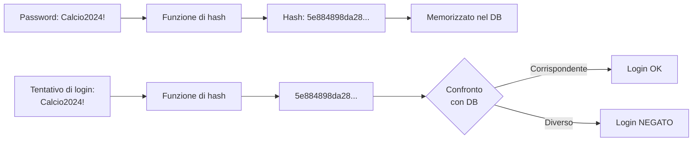
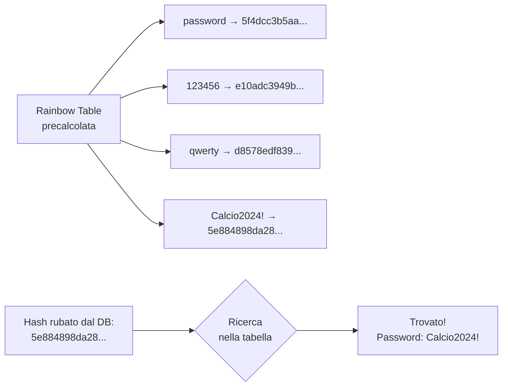
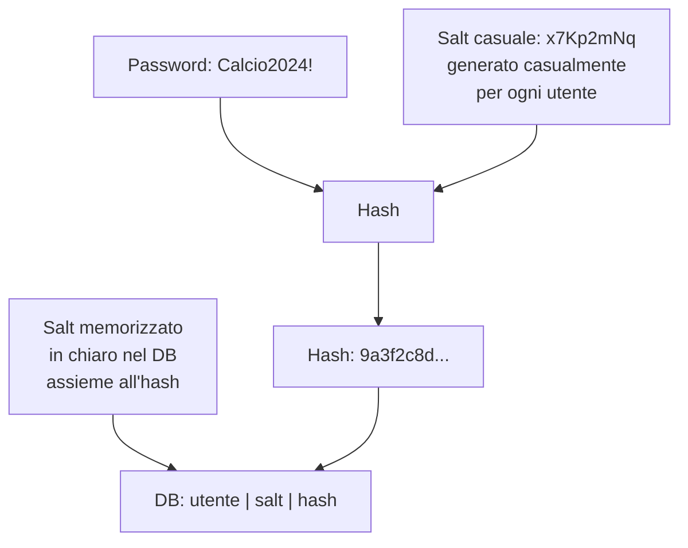
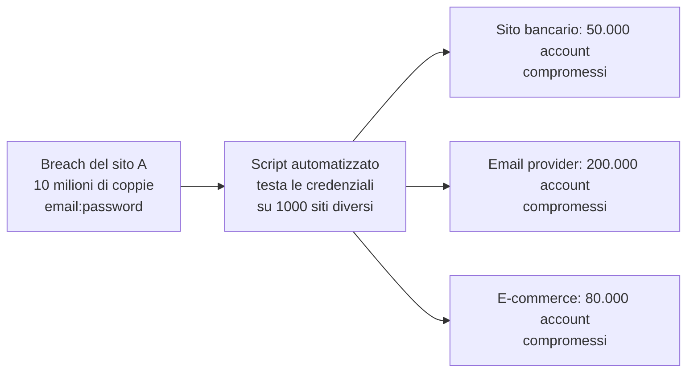
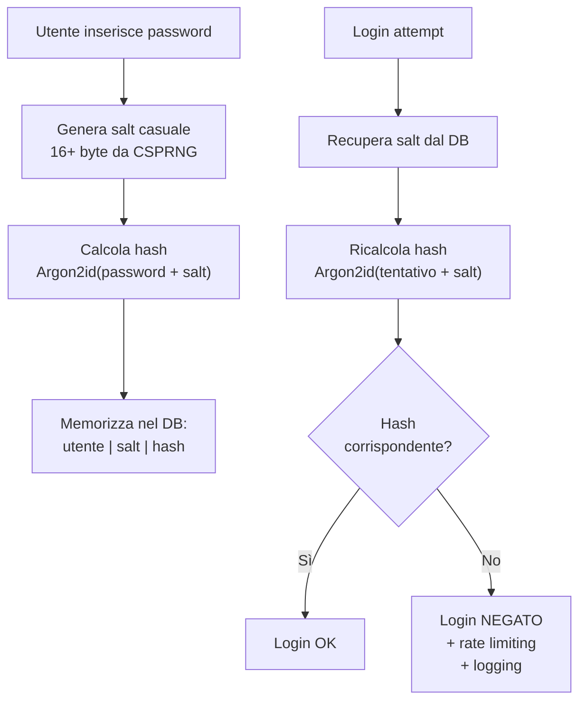
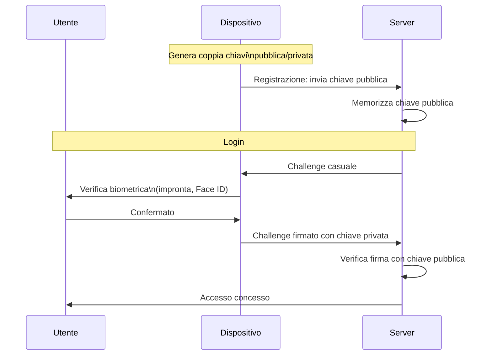

# Come funzionano le password: hashing, salting e perché le password sono il punto debole

## Introduzione

Le password sono il meccanismo di autenticazione più usato al mondo — e uno dei più vulnerabili. Non perché l'idea sia sbagliata, ma perché la loro implementazione è spesso difettosa, e perché il comportamento umano è prevedibile. Capire come le password vengono memorizzate, attaccate e difese è fondamentale sia per chi costruisce sistemi sicuri sia per chi li attacca.

---

## Come NON si memorizzano le password

Prima di capire cosa si fa, è utile capire cosa non si deve fare.

### In chiaro (plaintext)

Il modo più ingenuo: memorizzare la password esattamente come l'utente l'ha inserita.

```
Database:
utente: mario.rossi
password: Calcio2024!
```

Se il database viene compromesso — e prima o poi accade — l'attaccante ha immediatamente accesso a tutte le password di tutti gli utenti. E poiché le persone riutilizzano le password su più siti, un singolo breach può compromettere account bancari, email, social.

Sony nel 2011 memorizzava le password dei propri utenti in chiaro. LulzSec pubblicò il database e lo annunciò con un comunicato sarcastico.

### Cifrate (encryption)

Un miglioramento: cifrare le password con AES prima di memorizzarle. Sembra sicuro — ma ha un problema fondamentale: **se l'attaccante ruba il database, probabilmente ruba anche la chiave di cifratura**. E con la chiave, può decifrare tutte le password.

La cifratura è reversibile per design. Per le password, non vogliamo reversibilità.

---

## Hashing delle password

La soluzione corretta: usare una **funzione di hash crittografica**. L'hash è irreversibile — dato l'hash, non si può risalire alla password originale.



Il server non sa mai la password originale — conosce solo il suo hash. Quando l'utente effettua il login, calcola l'hash della password inserita e confronta con quello memorizzato.

---

## Il problema degli hash senza sale: Rainbow Tables

Se tutti gli utenti con la password "password123" hanno lo stesso hash, un attaccante può costruire una **rainbow table** — una tabella precalcolata che mappa hash comuni alle password originali.



Con hardware moderno e tabelle da terabyte, è possibile craccare milioni di hash MD5 o SHA-1 in pochi secondi. Il problema non è l'algoritmo in sé — è che due utenti con la stessa password hanno lo stesso hash.

---

## Il salting

La soluzione è il **sale** (salt): un valore casuale e unico generato per ogni utente, aggiunto alla password prima dell'hashing.



Il salt viene memorizzato in chiaro nel database — non è un segreto. Il suo scopo non è nascondersi, ma rendere ogni hash unico anche se due utenti hanno la stessa password.

Con il salting:
- Due utenti con la stessa password hanno hash completamente diversi
- Le rainbow table diventano inutili — bisognerebbe precalcolare una tabella separata per ogni possibile salt
- Un attaccante che ruba il database deve craccare ogni hash individualmente

---

## Algoritmi moderni per le password

Gli hash generici (MD5, SHA-256) sono progettati per essere **veloci** — ottimi per verificare l'integrità di un file, pessimi per le password. La velocità è il nemico: una GPU moderna può calcolare miliardi di hash SHA-256 al secondo, rendendo il brute force praticabile.

Gli algoritmi dedicati alle password sono progettati per essere **deliberatamente lenti** e per richiedere molta memoria.

### bcrypt

Progettato nel 1999, bcrypt è ancora oggi uno degli standard più usati. Include il salting automaticamente e ha un parametro di **work factor** (o cost factor) che controlla la lentezza computazionale.

```
$2b$12$salt_22_caratteri_hash_31_caratteri
 |   |
 |   cost factor (2^12 = 4096 iterazioni)
 versione algoritmo
```

Con work factor 12, bcrypt impiega circa 300ms per hash su hardware moderno — abbastanza lento per rendere il brute force impraticabile, abbastanza veloce per non disturbare gli utenti legittimi.

Aumentando il work factor di 1, raddoppia il tempo di calcolo. Il parametro può essere aumentato nel tempo man mano che l'hardware diventa più veloce.

### Argon2

Vincitore del Password Hashing Competition nel 2015, Argon2 è l'algoritmo raccomandato oggi per le nuove implementazioni. Ha tre varianti:

| Variante | Uso consigliato |
|---|---|
| Argon2d | Resistenza a GPU, per applicazioni non a rischio side-channel |
| Argon2i | Resistenza a side-channel attack |
| Argon2id | Combinazione delle due — raccomandato per password |

Argon2 ha tre parametri configurabili: tempo (iterazioni), memoria (quanto RAM occupare), parallelismo (quanti thread usare). Occupare molta memoria è la chiave per resistere agli attacchi con GPU e ASIC — che hanno molti core ma memoria limitata per core.

### scrypt e PBKDF2

**scrypt** è simile ad Argon2 nell'approccio memory-hard. Molto usato in applicazioni crypto (incluso il wallet di Bitcoin).

**PBKDF2** è più vecchio e meno robusto degli altri, ma è certificato FIPS e quindi obbligatorio in certi contesti governativi e aziendali.

| Algoritmo | Velocità | Memory-hard | Raccomandato |
|---|---|---|---|
| MD5 | Velocissimo | No | No — mai |
| SHA-256 | Veloce | No | No per password |
| bcrypt | Lento (configurabile) | No | Sì — buona scelta |
| scrypt | Lento | Sì | Sì |
| Argon2id | Lento | Sì | Sì — prima scelta |
| PBKDF2 | Lento (configurabile) | No | Solo se obbligatorio da normativa |

---

## Attacchi alle password

### Brute force

Prova sistematicamente tutte le possibili combinazioni. Con password brevi e senza rate limiting, è efficace.

```
a, b, c, ..., z, aa, ab, ..., password123, ...
```

La lunghezza è la difesa principale contro il brute force. Una password di 8 caratteri alfanumerici ha ~218 miliardi di combinazioni — crackata in ore con hardware moderno. Una di 16 caratteri ha ~47 milioni di miliardi di miliardi di combinazioni.

### Dictionary attack

Usa un dizionario di password comuni, variazioni prevedibili, e parole con sostituzioni classiche (a→@, e→3, i→1, o→0).

I dizionari più usati (RockYou, SecLists) contengono miliardi di password reali da breach precedenti. Se la tua password è in un dizionario, verrà crackata in secondi indipendentemente dalla lunghezza.

### Credential stuffing

Se un sito viene violato e le password vengono esposte, gli attaccanti le testano automaticamente su migliaia di altri siti. Funziona perché il 65% delle persone riusa la stessa password su più account.



### Password spraying

Invece di attaccare un singolo account con molte password (che attiva i lock-out), l'attaccante prova una sola password comune contro molti account.

```
Prova "Password123!" su 10.000 account diversi
→ Nessun account viene bloccato (1 tentativo each)
→ Statisticamente, alcuni useranno quella password
```

### Phishing

Tecnicamente non è un attacco alle password — è un attacco alle persone. Una pagina di login falsa, convincente, convince l'utente a inserire le proprie credenziali. Bypassa completamente qualsiasi hashing.

---

## Difese lato utente

### Password lunghe e uniche

La lunghezza conta più della complessità. `cavallo-batteria-graffetta-corretta` è più sicura di `P@$$w0rd!` perché è più lunga, più facile da ricordare, e meno probabile in un dizionario.

Una password unica per ogni sito elimina il rischio di credential stuffing. Se un sito viene violato, gli altri account rimangono al sicuro.

### Password manager

L'unico modo pratico per avere password uniche e complesse per ogni servizio. Genera password casuali (es. `xK9#mP2@nL5$qR8`) e le memorizza cifrate. L'utente ricorda solo una master password.

Strumenti raccomandati: Bitwarden (open source, gratuito), 1Password, KeePassXC (locale, nessun cloud).

### Multi-Factor Authentication (MFA)

Anche se la password viene compromessa, l'attaccante non può accedere senza il secondo fattore. MFA riduce del 99,9% il rischio di account compromise secondo i dati Microsoft.

Fattori in ordine di sicurezza crescente:
1. SMS OTP — meglio di niente, vulnerabile a SIM swapping
2. App authenticator (TOTP) — Authy, Google Authenticator
3. Passkey/FIDO2 — resistente al phishing, il futuro dell'autenticazione

---

## Difese lato sviluppatore



**Non inventare il tuo sistema di hashing.** Usa librerie consolidate: `bcrypt` per Node.js/Python/PHP, `password_hash()` in PHP (usa bcrypt di default), `Argon2` disponibile in quasi tutti i linguaggi moderni.

**Rate limiting e account lockout:** limita i tentativi di login per IP e per account. Dopo N tentativi falliti, introduce un delay esponenziale o blocca temporaneamente l'account.

**Have I Been Pwned API:** al momento della registrazione o del cambio password, verifica se la password scelta compare in database di breach noti. HIBP offre una API gratuita che usa k-anonymity — non invia la password al server, solo i primi 5 caratteri dell'hash SHA-1.

**Rehashing progressivo:** se un sistema usa bcrypt con work factor 10 e vuoi aggiornare a 12, non puoi ricalcolare tutti gli hash senza conoscere le password originali. La soluzione: al prossimo login di ogni utente, ricalcola l'hash con il nuovo parametro e aggiorna il database.

---

## Il futuro: le Passkey

Le **Passkey** (FIDO2/WebAuthn) stanno rimpiazzando gradualmente le password tradizionali. Invece di una stringa da ricordare, usano crittografia a chiave pubblica:



Vantaggi delle Passkey:
- La chiave privata non lascia mai il dispositivo
- Resistenti al phishing — la firma è vincolata al dominio
- Nessuna password da ricordare, rubare o violare
- Nessun database di password da proteggere

Google, Apple, Microsoft e la maggior parte dei servizi principali supportano già le Passkey.

---

## Conclusione

Le password sono deboli non per un difetto concettuale, ma per come vengono usate (riutilizzate, brevi, prevedibili) e come vengono memorizzate (in chiaro, con MD5, senza salt). La combinazione di algoritmi appropriati (Argon2id, bcrypt), salt casuali, MFA e password manager risolve la maggior parte dei problemi pratici.

Il futuro è senza password — le Passkey offrono sicurezza superiore con usabilità migliore. Ma nel breve termine, comprendere il meccanismo dell'hashing è essenziale sia per difendere i sistemi che si costruisce, sia per capire perché i breach di password continuano a succedere nonostante decenni di consapevolezza del problema.
