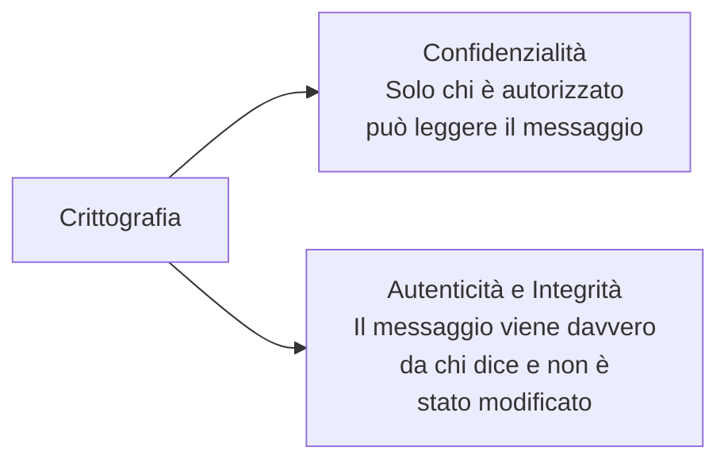
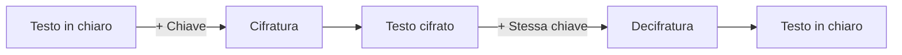
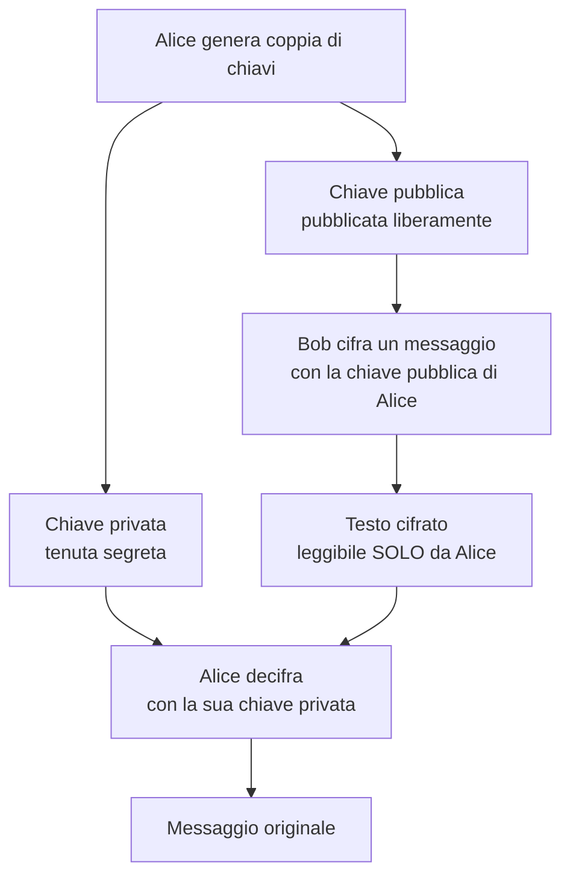
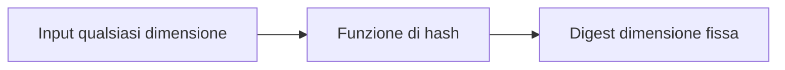
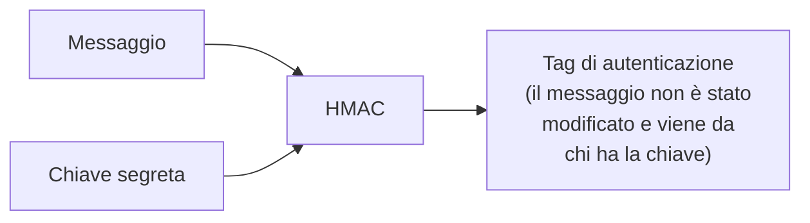
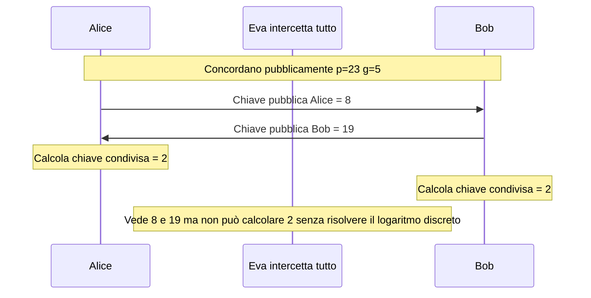
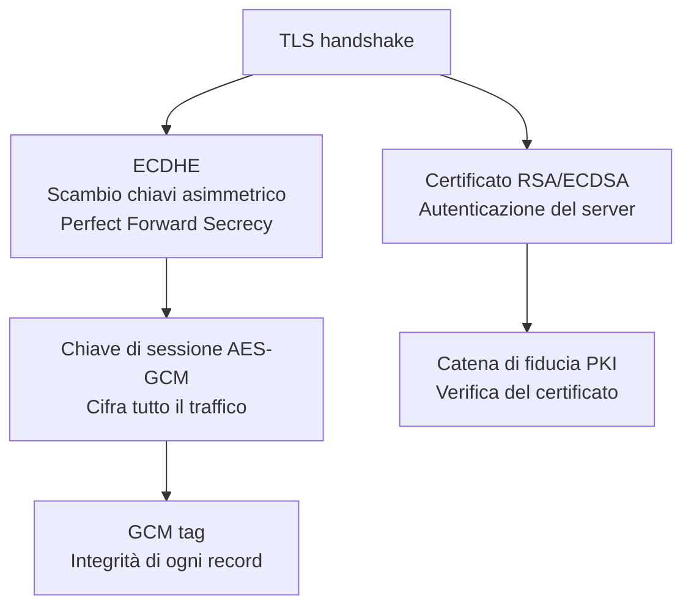

# Crittografia: le basi che ogni professionista della sicurezza deve conoscere

## Introduzione

La crittografia è il fondamento matematico su cui poggia quasi tutta la sicurezza informatica moderna. HTTPS, VPN, autenticazione a due fattori, firme digitali, blockchain — tutto dipende da principi crittografici. Non serve essere matematici per lavorare in cybersecurity. Ma capire le primitive crittografiche fondamentali — e soprattutto i loro limiti — è indispensabile.

Molte delle vulnerabilità più gravi nella storia della sicurezza sono state causate non da bug tecnici, ma da un uso scorretto della crittografia: algoritmi deprecati in produzione, chiavi troppo corte, nonce riutilizzati, cifrari a blocchi in modalità ECB, implementazioni home-made. "Don't roll your own crypto" è uno degli assiomi fondamentali del settore.

---

## Due problemi distinti

La crittografia risolve due problemi che spesso vengono confusi:

Sono problemi diversi che richiedono strumenti diversi. Un messaggio può essere cifrato ma non autenticato — chiunque potrebbe averlo alterato senza che il destinatario se ne accorga. Un messaggio può essere autenticato ma non cifrato — leggibile da tutti, ma con garanzia di provenienza.

Nella pratica, spesso servono entrambe le proprietà insieme.

---

## Crittografia simmetrica

Nella crittografia simmetrica, mittente e destinatario usano la **stessa chiave segreta** per cifrare e decifrare.

Veloce ed efficiente — ideale per cifrare grandi quantità di dati.

### AES — Advanced Encryption Standard

AES è lo standard di riferimento per la crittografia simmetrica moderna. Adottato dal NIST nel 2001 dopo una competizione pubblica internazionale. Lavora su blocchi di 128 bit con chiavi di 128, 192 o 256 bit.

AES-256 è considerato sicuro contro computer classici e probabilmente anche contro computer quantistici per le prossime decadi.

### Le modalità operative

AES da solo cifra un singolo blocco di 128 bit. Per messaggi più lunghi serve una **modalità operativa**.

**ECB (Electronic Codebook)** — la più semplice e la più pericolosa: ogni blocco viene cifrato indipendentemente con la stessa chiave. Il problema: blocchi di testo in chiaro identici producono blocchi cifrati identici. Su dati strutturati (come immagini) il pattern del testo in chiaro rimane visibile nel cifrato. Non usare mai ECB.

**CBC (Cipher Block Chaining)** — ogni blocco viene combinato (XOR) con il blocco cifrato precedente prima della cifratura. Rompe i pattern. Richiede un IV (Initialization Vector) casuale e unico per ogni messaggio.

**GCM (Galois/Counter Mode)** — la modalità consigliata oggi. Combina cifratura con autenticazione del messaggio (AEAD). Garantisce sia confidenzialità che integrità in una sola operazione. Usato in TLS 1.3.

| Modalità | Pattern nascosti | Autenticazione | Consigliata |
|---|---|---|---|
| ECB | No | No | Mai |
| CBC | Sì | No | Solo con HMAC separato |
| GCM | Sì | Sì | Sì |

### Il problema della distribuzione delle chiavi

Il limite fondamentale della crittografia simmetrica: **come si condivide la chiave segreta in modo sicuro?**

Se Alice vuole comunicare con Bob usando AES, deve prima condividere la chiave con Bob su un canale sicuro. Ma se il canale non è sicuro, la chiave può essere intercettata. Per decenni questo sembrava un problema irrisolvibile. La risposta arrivò nel 1976.

---

## Crittografia asimmetrica

Nel 1976, Whitfield Diffie e Martin Hellman pubblicarono "New Directions in Cryptography" — un paper che rivoluzionò la crittografia moderna. Proposero la **crittografia a chiave pubblica**.

Ogni entità ha una **coppia di chiavi**:
- **Chiave pubblica** — distribuita liberamente a chiunque
- **Chiave privata** — tenuta segreta dal proprietario

Non è necessario condividere nessun segreto in anticipo. Il problema della distribuzione delle chiavi è risolto.

### RSA

RSA (Rivest-Shamir-Adleman, 1977) fu il primo algoritmo a implementare concretamente la crittografia a chiave pubblica. Si basa sulla difficoltà computazionale di **fattorizzare il prodotto di due numeri primi molto grandi**.

Generare la coppia di chiavi significa scegliere due numeri primi enormi p e q, calcolare n = p × q (parte della chiave pubblica), e derivare le chiavi dal risultato. Risalire a p e q conoscendo solo n è computazionalmente impraticabile per numeri abbastanza grandi.

Chiavi RSA da 2048 bit sono considerate sicure oggi. A 4096 bit per dati che devono rimanere segreti per decenni.

### Crittografia a curva ellittica (ECC)

ECC offre lo stesso livello di sicurezza di RSA con chiavi molto più corte, rendendola più efficiente su dispositivi con risorse limitate.

| Sicurezza equivalente | RSA | ECC |
|---|---|---|
| 112 bit | 2048 bit | 224 bit |
| 128 bit | 3072 bit | 256 bit |
| 192 bit | 7680 bit | 384 bit |

TLS moderno usa prevalentemente ECC per lo scambio di chiavi.

---

## Funzioni di hash crittografiche

Una funzione di hash trasforma un input di qualsiasi dimensione in un output di dimensione fissa (il **digest**) con queste proprietà fondamentali:

**Deterministico:** lo stesso input produce sempre lo stesso output.

**Irreversibile:** dato il digest, è computazionalmente impossibile risalire all'input originale.

**Effetto valanga:** cambiare un solo bit dell'input cambia completamente il digest. "ciao" e "Ciao" producono hash totalmente diversi.

**Resistente a collisioni:** è computazionalmente impossibile trovare due input diversi che producono lo stesso digest.

### Algoritmi di hash

| Algoritmo | Output | Stato |
|---|---|---|
| MD5 | 128 bit | Compromesso — non usare |
| SHA-1 | 160 bit | Deprecato — non usare |
| SHA-256 | 256 bit | Sicuro |
| SHA-512 | 512 bit | Sicuro |
| SHA-3 | variabile | Sicuro, architettura diversa |
| BLAKE2/BLAKE3 | variabile | Sicuro, molto veloce |

### Usi pratici degli hash

**Integrità dei file:** scarichi un file e verifichi che il suo SHA-256 corrisponda a quello pubblicato dal sito ufficiale — nessun byte è stato modificato o corrotto.

**Password storage:** non si memorizzano mai le password in chiaro — si memorizza il loro hash. Quando l'utente effettua il login, si calcola l'hash della password inserita e si confronta con quello memorizzato.

**Firme digitali:** si firma l'hash del documento, non il documento intero — molto più efficiente.

**Chain of trust:** in blockchain ogni blocco contiene l'hash del blocco precedente — modificare un blocco invalida tutta la catena successiva.

---

## HMAC e autenticazione dei messaggi

Hash + chiave segreta = **HMAC** (Hash-based Message Authentication Code).

Un HMAC garantisce che il messaggio non sia stato alterato e che provenga da qualcuno che conosce la chiave. Non cifra il contenuto — lo autentica.

---

## Diffie-Hellman Key Exchange

Come fanno Alice e Bob a concordare una chiave segreta su un canale pubblico senza che un intercettatore possa ricavarla? Diffie-Hellman risolve questo problema basandosi sulla difficoltà del logaritmo discreto.

Questo meccanismo è alla base dello scambio di chiavi in TLS. Con DH effimero (ECDHE), viene generata una nuova coppia di chiavi per ogni sessione — garantendo la **Perfect Forward Secrecy**: anche se un giorno la chiave privata del server venisse compromessa, le sessioni passate non sarebbero decifrabili.

---

## Come si usano insieme: TLS in pratica

TLS combina tutti questi strumenti in un protocollo coerente:

La combinazione è precisa: l'asimmetrica per lo scambio sicuro della chiave di sessione, la simmetrica per cifrare il traffico (veloce), hash e HMAC per garantire l'integrità di ogni pacchetto, i certificati per autenticare l'identità del server.

---

## Attacchi crittografici comuni

**Brute force:** prova tutte le possibili chiavi. Impraticabile con chiavi moderne — AES-256 richiederebbe più energia dell'intero universo osservabile per essere forzata.

**Dictionary attack:** prova le parole di un dizionario come chiavi o password. Efficace contro password deboli o hash non salati.

**Birthday attack:** sfrutta la probabilità statistica di trovare collisioni in una funzione di hash. Ragione per cui MD5 e SHA-1 sono considerati insicuri.

**Padding oracle attack:** sfrutta le risposte di errore di un sistema per dedurre informazioni sul testo in chiaro — reso possibile dalla modalità CBC senza autenticazione adeguata.

**Downgrade attack:** forza il client e il server a usare una versione precedente e meno sicura del protocollo. POODLE (2014) e DROWN (2016) sono esempi famosi contro SSL/TLS.

---

## Conclusione

La crittografia è lo strumento che trasforma internet — una rete intrinsecamente insicura — in un mezzo su cui è possibile fare operazioni bancarie, comunicare privatamente, firmare contratti. Capire le primitive (simmetrica, asimmetrica, hash, HMAC, DH) e come si combinano è il prerequisito per capire perché certi protocolli sono sicuri, e perché altri non lo sono.

La regola d'oro rimane: non inventare i tuoi algoritmi crittografici. Usa primitive consolidate, implementazioni auditate, e protocolli standard. La crittografia non è un campo in cui il "sembra sicuro" è sufficiente.
