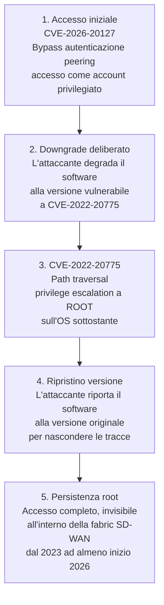

# CVE-2026-20127: score perfetto 10.0 e sfruttato dal 2023 nell'ombra

## Il fatto

A fine febbraio 2026, Cisco ha rivelato l'esistenza di una vulnerabilità critica nel proprio **Cisco Catalyst SD-WAN** — il prodotto che molte grandi organizzazioni usano per gestire centralmente le proprie reti geograficamente distribuite. La vulnerabilità, tracciata come **CVE-2026-20127**, ha ricevuto un **CVSS score di 10.0**: il massimo possibile, riservato ai bug più pericolosi in assoluto.

La notizia peggiore: l'actor sofisticato tracciato da Cisco Talos come **UAT-8616** stava sfruttando questa vulnerabilità in silenzio **almeno dal 2023** — due anni prima che il bersaglio venisse identificato e la patch rilasciata.

---

## Cos'è Cisco Catalyst SD-WAN

**SD-WAN (Software-Defined Wide Area Network)** è la tecnologia che permette alle grandi organizzazioni di gestire centralmente come le proprie sedi — uffici, fabbriche, ospedali, filiali — si connettono tra loro e a internet. Cisco Catalyst SD-WAN è una delle implementazioni enterprise più diffuse al mondo.

Il sistema è composto da due componenti centrali:

- **SD-WAN Controller** (ex vSmart): distribuisce le informazioni di routing e le policy a tutti i device della rete SD-WAN
- **SD-WAN Manager** (ex vManage): la console web centralizzata da cui gli amministratori configurano e monitorano l'intera rete

Questi componenti siedono al centro del "piano di controllo" della rete. Chi li compromette può influenzare come la rete instrada il traffico, chi si connette a chi, e quali configurazioni vengono applicate a ogni dispositivo dell'organizzazione.

---

## La vulnerabilità in dettaglio

**CVE-2026-20127** è un difetto di autenticazione nel meccanismo di **peering** tra i componenti SD-WAN — il processo con cui Controller e Manager verificano l'identità dei peer legittimi prima di instaurare connessioni fidate.

```
Tipo:          Authentication Bypass (CWE-287: Improper Authentication)
CVSS Score:    10.0 (Critical)
Attack Vector: Network (remoto, nessun accesso fisico richiesto)
Complexity:    Low (bassa complessità di sfruttamento)
Privileges:    None (nessun privilegio precedente richiesto)
User Interaction: None (nessuna interazione dell'utente richiesta)
Scope:         Changed
```

Il punteggio CVSS 10.0 è la combinazione peggiore possibile di questi fattori: attaccabile da remoto, facile da sfruttare, senza credenziali, senza che l'utente debba fare nulla.

In pratica: un attaccante può inviare richieste appositamente costruite che bypassano completamente i controlli di autenticazione del peering, e accedere come account interno ad alto privilegio (non-root, ma con accesso NETCONF per manipolare la configurazione dell'intera fabric SD-WAN).

---

## La catena di exploit di UAT-8616

La cosa che ha sorpreso i ricercatori non è solo la vulnerabilità in sé — è come UAT-8616 l'ha sfruttata. L'actor ha costruito una catena di attacco sofisticata:



Il passo più sofisticato è il ripristino della versione dopo l'escalation. Abbassare e poi rialzare la versione software riduce gli indicatori forensi legati a un downgrade permanente. Come ha commentato il CEO di Polygraf AI: "Chaining CVE-2026-20127 con CVE-2022-20775 trasforma due vulnerabilità separate in un percorso verso un accesso root persistente su tutta la fabric SD-WAN. Questa trasformazione è la parte sofisticata."

---

## Scoperto da chi e quando

Cisco Talos ha attribuito l'exploitation a **UAT-8616**, valutato come un actor altamente sofisticato. L'Australia (ASD-ACSC) è stata la prima agenzia governativa a documentare pubblicamente l'attività, confermando che il gruppo aveva compromesso Cisco SD-WAN dal 2023 tramite il zero-day.

CISA ha emesso l'**Emergency Directive 26-03: Mitigate Vulnerabilities in Cisco SD-WAN Systems**, con deadline il 27 febbraio 2026 per le agenzie federali americane. Ha anche aggiunto CVE-2026-20127 e CVE-2022-20775 al catalogo KEV (Known Exploited Vulnerabilities).

Il fatto che la vulnerabilità fosse sfruttata dal 2023 senza essere rilevata per oltre due anni è il dato più preoccupante: UAT-8616 aveva accesso silenzioso alle reti di organizzazioni di alto profilo — incluse infrastrutture critiche — per tutto questo tempo.

---

## Versioni affette

| Componente | Versioni affette | Prima versione sicura |
|---|---|---|
| SD-WAN Controller (vSmart) | < 20.15.1 | 20.15.1 |
| SD-WAN Manager (vManage) | < 20.15.1 | 20.15.1 |
| Versioni < 20.9 | Tutte affette | Migrare a release fissa |

Non esistono workaround. L'unica soluzione è aggiornare.

---

## La satellite di vulnerabilità: altri CVE scoperti insieme

Nello stesso advisory, Cisco ha rivelato altre vulnerabilità correlate:

| CVE | CVSS | Tipo | Sfruttamento confermato |
|---|---|---|---|
| CVE-2026-20127 | **10.0** | Auth bypass (unauth) | Sì — dal 2023 |
| CVE-2026-20129 | 9.8 | Accesso come netadmin (unauth) | No |
| CVE-2026-20126 | 8.8 | Privilege escalation a root | No |
| CVE-2026-20128 | 7.5 | Credential disclosure (DCA) | Sì — dal 5 marzo 2026 |
| CVE-2026-20122 | 7.1 | Arbitrary file overwrite | Sì — dal 5 marzo 2026 |

---

## Indicatori di compromissione

Cisco e CISA raccomandano di cercare nei log questi indicatori:

```bash
# Connessioni di peering non autorizzate
grep "control-connection" /var/log/vmanage-server.log | grep "new-peer"

# Downgrade software inaspettati seguiti da reboot
grep "software-upgrade" /var/log/installer.log

# Sessioni SSH root anomale
grep "root" /var/log/auth.log | grep "sshd"

# Chiavi SSH non autorizzate
cat /root/.ssh/authorized_keys

# Clearing dei log
grep "truncate\|>.*log" /var/log/audit/audit.log
```

---

## Cosa fare ora

Per qualsiasi organizzazione che usa Cisco Catalyst SD-WAN:

1. **Patcha immediatamente** alla versione 20.15.1 o superiore
2. **Isola i piani di gestione e controllo** da internet — il NETCONF (TCP/830) non dovrebbe mai essere esposto pubblicamente
3. **Analizza i log** per i IoC descritti sopra — se CVE-2026-20127 era presente, considera il sistema compromesso fino a prova contraria
4. **Limita l'accesso** alle interfacce di management con IP allowlisting o zero trust
5. **Abilita MFA** su tutti gli accessi amministrativi

---

## Conclusione

CVE-2026-20127 è esattamente il tipo di vulnerabilità che gli actor più sofisticati cercano: CVSS 10.0, remotamente sfruttabile senza credenziali, nel cuore dell'infrastruttura di controllo della rete. Il fatto che sia rimasto silenziosamente sfruttato per oltre due anni prima di essere scoperto è un promemoria sulla difficoltà di rilevare actor pazienti e metodici che operano all'interno di canali di comunicazione apparentemente legittimi.
