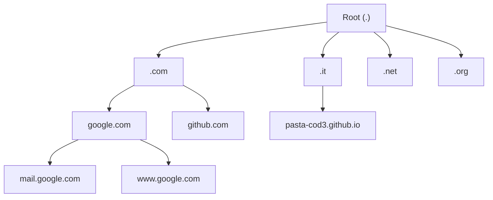
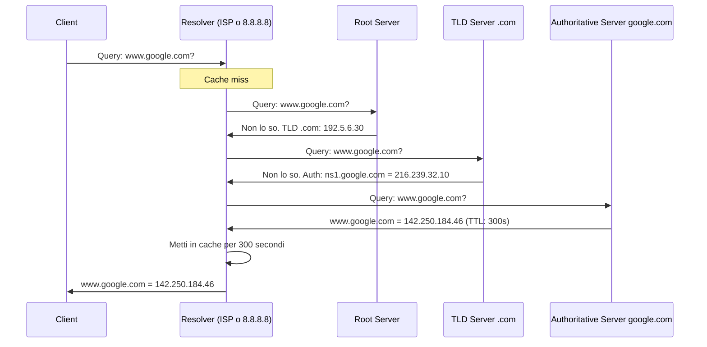
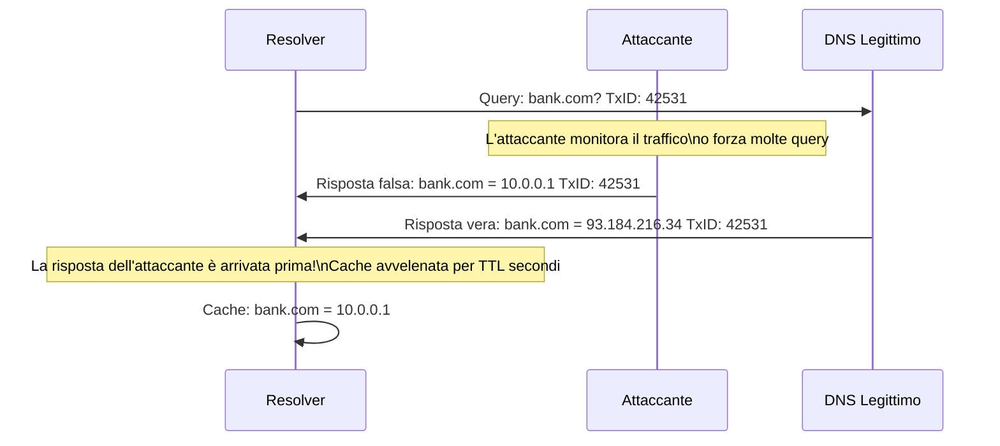
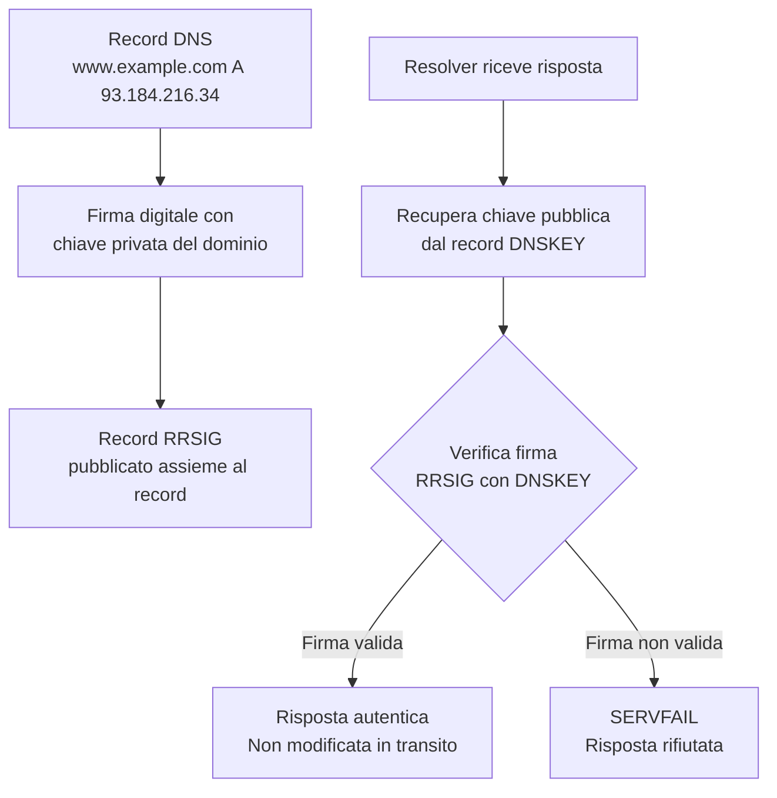
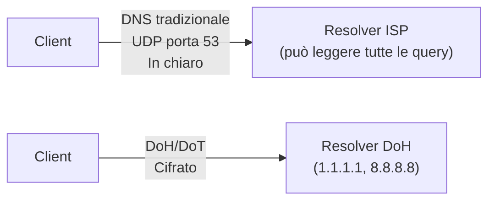
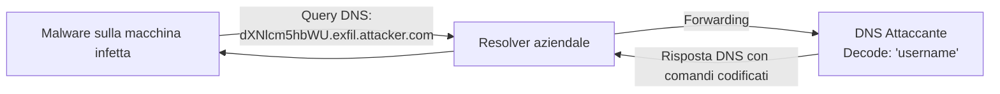

# DNS: il telefono di internet e come viene abusato

## Introduzione

Il DNS è uno dei protocolli più fondamentali di internet — e uno dei più trascurati dal punto di vista della sicurezza. Quasi tutto ciò che fai online passa per il DNS: ogni sito che visiti, ogni email che mandi, ogni API che chiami inizia con una query DNS. Eppure il protocollo originale del 1983 non aveva nessun meccanismo di autenticazione o cifratura.

Questa combinazione — onnipresenza e assenza di sicurezza — rende il DNS uno dei bersagli preferiti degli attaccanti per ricognizione, reindirizzamento del traffico, esfiltrazione dati, e disruption dei servizi.

---

## Come funziona il DNS in profondità

### La gerarchia del DNS

Il DNS è organizzato come un albero invertito con una struttura gerarchica precisa:



Ogni livello è gestito da server DNS autoritativi diversi:
- **Root servers:** 13 cluster logici (a.root-servers.net → m.root-servers.net) gestiti da IANA e vari operatori. Conoscono solo i server TLD.
- **TLD servers:** gestiti dai registry (.com da Verisign, .it da GARR). Conoscono solo i server autoritativi di secondo livello.
- **Authoritative servers:** gestiti dal proprietario del dominio o dal registrar. Contengono i record DNS definitivi.

### La risoluzione ricorsiva passo per passo



Il **TTL (Time To Live)** indica per quanti secondi il resolver può tenere la risposta in cache. Un TTL di 300 significa che per 5 minuti, chiunque usi quel resolver otterrà la stessa risposta senza una nuova query verso i server autoritativi.

---

## I record DNS nel dettaglio

### Record A e AAAA

```
www.example.com.    300    IN    A       93.184.216.34
www.example.com.    300    IN    AAAA    2606:2800:220:1:248:1893:25c8:1946
```

Un dominio può avere più record A — il resolver li restituisce in ordine diverso ad ogni query (round-robin DNS), distribuendo il carico tra più server.

### Record MX — Mail Exchange

```
example.com.    300    IN    MX    10    mail1.example.com.
example.com.    300    IN    MX    20    mail2.example.com.
```

Il numero è la priorità — il server con valore più basso viene provato per primo. Il valore più alto è il fallback. Usato per capire quale server riceve le email per un dominio.

### Record TXT — Testo libero

```
example.com.    300    IN    TXT    "v=spf1 include:_spf.google.com ~all"
example.com.    300    IN    TXT    "v=DMARC1; p=quarantine; rua=mailto:dmarc@example.com"
_dkim._domainkey.example.com.    300    IN    TXT    "v=DKIM1; k=rsa; p=MIGfMA0G..."
```

I record TXT hanno infiniti usi: SPF e DMARC per l'email authentication, verifica del dominio per Google/Azure, configurazione DKIM, e molti altri.

### Record CNAME — Alias

```
www.example.com.    300    IN    CNAME    example.com.
blog.example.com.   300    IN    CNAME    myblog.wordpress.com.
```

Un CNAME punta a un altro nome, non a un indirizzo IP. Utile per alias e per delegare sottodomini a servizi esterni.

### Record NS — Name Server

```
example.com.    86400    IN    NS    ns1.example.com.
example.com.    86400    IN    NS    ns2.example.com.
```

Indicano quali server sono autoritativi per quel dominio. Cambiarli è il modo di trasferire il controllo del DNS a un altro provider.

### Record SOA — Start of Authority

```
example.com.    3600    IN    SOA    ns1.example.com. hostmaster.example.com. (
                                    2024031501    ; serial
                                    3600          ; refresh
                                    900           ; retry
                                    604800        ; expire
                                    300 )         ; minimum TTL
```

Il SOA contiene informazioni amministrative sulla zona: chi la gestisce, quando è stata aggiornata, parametri di sincronizzazione.

---

## Ricognizione tramite DNS

Prima ancora di attaccare un target, un attaccante raccoglie informazioni tramite DNS. Il DNS è pubblico per design — chiunque può interrogarlo.

### Enumerazione di sottodomini

```bash
# Query diretta per un sottodominio specifico
dig mail.target.com A

# Dizionario di sottodomini comuni
for sub in www mail ftp api admin dev staging; do
    dig $sub.target.com A +short
done

# Strumenti automatizzati
subfinder -d target.com
amass enum -d target.com
```

Un sottodominio come `dev.target.com` o `staging-api.target.com` può puntare a ambienti di sviluppo meno protetti, con versioni vecchie del software, o credenziali di test.

### Zone Transfer

Il **Zone Transfer** (AXFR) è una funzionalità legittima per sincronizzare i server DNS secondari con il primario. Se non è limitato agli IP dei server secondari, un attaccante può scaricare l'intera zona DNS del dominio — tutti i record, tutti i sottodomini.

```bash
dig axfr target.com @ns1.target.com
```

Un server DNS mal configurato che risponde a zone transfer da qualsiasi IP espone l'intera struttura interna del dominio.

### Reverse DNS

```bash
# Dato un IP, trova l'hostname associato
dig -x 93.184.216.34

# Enumerazione di un range IP
for i in $(seq 1 254); do
    dig -x 192.168.1.$i +short
done
```

Il reverse DNS rivela la struttura di naming dei server, spesso informativi: `prod-db01.internal.company.com`, `vpn-gateway.company.com`.

---

## DNS Cache Poisoning

Il DNS Cache Poisoning è uno degli attacchi più pericolosi al DNS: l'attaccante inietta risposte false nella cache del resolver, facendo sì che tutti gli utenti che usano quel resolver vengano reindirizzati a destinazioni controllate dall'attaccante.

### Come funziona

Il protocollo DNS originale usa UDP. Una query DNS ha un **Transaction ID** a 16 bit (65.536 possibili valori). Se l'attaccante riesce a indovinare il Transaction ID di una query in corso e risponde prima del server legittimo, la risposta falsa viene accettata.



### L'attacco di Kaminsky (2008)

Nel 2008, Dan Kaminsky scoprì una variante molto più efficace del cache poisoning classico. Invece di indovinare il TxID di una query specifica (difficile), induceva il resolver a fare query per sottodomini casuali (`random1234.bank.com`, `random5678.bank.com`) e iniettava risposte con record NS modificati che puntavano ai server dell'attaccante.

La patch di emergenza coordinata per questa vulnerabilità fu uno degli eventi di sicurezza più significativi della storia del DNS. La soluzione principale: **source port randomization** — usare porte sorgente casuali per le query DNS, aumentando da 65.536 a oltre 1 miliardo le combinazioni da indovinare.

---

## DNSSEC — DNS Security Extensions

DNSSEC aggiunge **firme digitali** ai record DNS, permettendo ai resolver di verificare l'autenticità delle risposte.



### La catena di fiducia DNSSEC

La fiducia si propaga gerarchicamente dalla radice:

```
Root → firma i record DS dei TLD → .com
.com → firma i record DS dei domini → example.com
example.com → firma i propri record → www.example.com
```

Ogni livello firma il record **DS (Delegation Signer)** del livello inferiore, creando una catena verificabile dalla radice.

### Limitazioni di DNSSEC

DNSSEC protegge dall'autenticità ma **non dalla confidenzialità** — le query e le risposte DNS rimangono visibili a chi è in ascolto sulla rete. E l'adozione è ancora parziale — molti domini non hanno DNSSEC configurato.

---

## DNS su HTTPS (DoH) e DNS su TLS (DoT)

Per risolvere il problema della privacy nelle query DNS:

**DNS over TLS (DoT)** — cifra le query DNS usando TLS sulla porta 853.

**DNS over HTTPS (DoH)** — cifra le query DNS come traffico HTTPS sulla porta 443. Indistinguibile dal normale traffico web.



**Pro:** l'ISP non può vedere le query DNS dell'utente, proteggendo la privacy di navigazione.

**Contro:** dal punto di vista della sicurezza aziendale, DoH può aggirare il DNS filtering aziendale (controllo parentale, blocco di malware C2 via DNS). Per questo molte aziende bloccano DoH sui propri dispositivi e forzano l'uso del DNS interno.

---

## DNS Hijacking

Il DNS Hijacking modifica i record DNS autoritativi del dominio stesso — non la cache del resolver. Chi controlla il dominio controlla il DNS.

### Vettori di DNS Hijacking

**Compromissione dell'account registrar:** se l'account del registrar (GoDaddy, Namecheap, Cloudflare) viene compromesso, l'attaccante può cambiare i name server del dominio verso server sotto il suo controllo.

**Attacco al registrar stesso:** alcuni attacchi storici hanno compromesso direttamente i sistemi del registrar, modificando i record di molti domini contemporaneamente.

**BGP Hijacking + DNS:** combinazione di hijacking del routing BGP e manipolazione DNS per intercettare traffico su larga scala.

### Caso reale: Sea Turtle (2019)

Il gruppo APT noto come "Sea Turtle" condusse una campagna sistematica di DNS hijacking contro organizzazioni governative, militari e ONG in Medio Oriente e Africa. Compromisero i registrar e i provider DNS per modificare i record NS dei domini target, reindirizzando il traffico (incluse le email) verso infrastrutture controllate dagli attaccanti. Le credenziali intercettate venivano poi usate per accedere ai sistemi reali.

---

## DNS Tunneling

Il DNS è quasi mai bloccato dai firewall — anche le reti più restrittive permettono le query DNS verso il resolver aziendale. Questa caratteristica può essere sfruttata per creare un canale di comunicazione nascosto codificando dati nei nomi dei sottodomini.



### Come funziona il tunneling

**Esfiltrazione:** i dati vengono codificati in Base32/64 e inseriti come sottodomini di un dominio controllato dall'attaccante:
```
aGVsbG8gd29ybGQ.c2VjcmV0LmRhdGE.attacker.com
```

**C2 (Command & Control):** il malware interroga periodicamente il DNS per ricevere comandi. Le risposte DNS (record TXT, CNAME) contengono istruzioni codificate.

Il canale è lento — DNS non è progettato per questo — ma persistente e difficile da rilevare con controlli standard.

### Rilevamento del DNS Tunneling

Pattern anomali che indicano possibile tunneling:

```
- Sottodomini molto lunghi (>50 caratteri)
- Alto volume di query verso un singolo dominio
- Query per sottodomini con caratteri casuali (base64/hex)
- Molti record TXT in risposta
- Dominio registrato di recente
- Query verso domini non esistenti in blocchi
```

Strumenti di rilevamento: Zeek (analisi del traffico DNS), regole Sigma per il SIEM, anomaly detection sul volume di query.

---

## DNS come strumento difensivo

Il DNS non è solo un bersaglio — può essere usato attivamente come strumento di difesa.

**DNS Sinkholing:** i server DNS aziendali risolvono i domini C2 noti verso un IP controllato (il sinkhole). Il malware che tenta di comunicare con il suo C2 viene silenziosamente reindirizzato, isolato, e rilevato. Usato dai ricercatori di sicurezza per "smontare" botnet — come Marcus Hutchins con WannaCry.

**DNS Filtering (RPZ - Response Policy Zone):** blocca la risoluzione di domini malevoli noti. Feed di IOC (Emerging Threats, Cisco Umbrella, Quad9) vengono integrati nel resolver aziendale.

**Split-horizon DNS:** il resolver risponde con IP diversi a seconda che la query provenga dalla rete interna o da internet. I dipendenti interni vedono i server interni; gli utenti esterni vedono i server pubblici.

---

## Conclusione

Il DNS è l'infrastruttura invisibile su cui poggia tutto internet — e la sua sicurezza è spesso sottovalutata. Un attaccante che controlla il DNS controlla dove va il traffico, anche senza toccare i server di destinazione.

Le difese fondamentali: DNSSEC per l'integrità dei record, DoH/DoT per la privacy delle query, monitoraggio delle anomalie DNS per rilevare tunneling e exfiltration, DNS filtering per bloccare comunicazioni verso C2 noti, e protezione robusta degli account registrar con MFA.

Il DNS è silenzioso finché non diventa il problema — e quando diventa il problema, tutto smette di funzionare.
