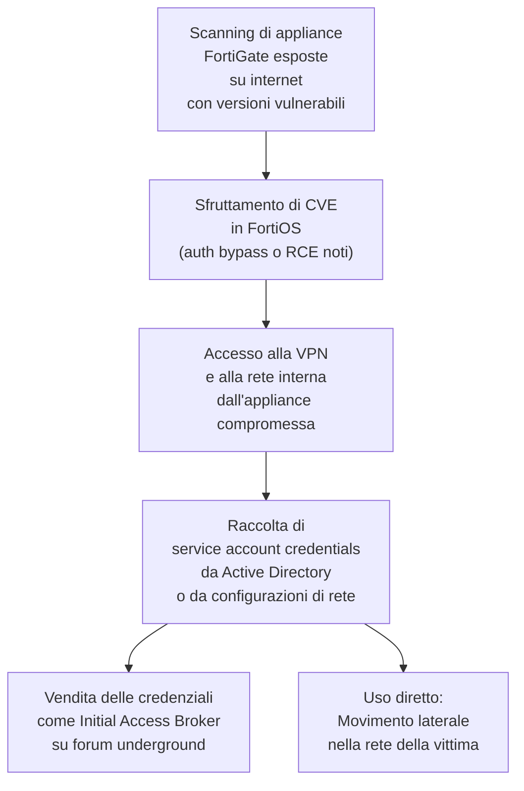

# FortiGate come porta d'ingresso: attaccanti rubano credenziali di servizio dalle reti aziendali

## Il fatto

A marzo 2026, i ricercatori di sicurezza hanno documentato una nuova campagna in cui threat actor sfruttano le appliance **FortiGate Next-Generation Firewall (NGFW)** come punto d'ingresso per violare reti aziendali e rubare credenziali di account di servizio. La campagna, ancora attiva al momento della pubblicazione, prende di mira organizzazioni con appliance FortiGate vulnerabili esposte su internet.

Fortinet è uno dei produttori di firewall enterprise più diffusi al mondo. I prodotti FortiGate proteggono reti di aziende, ospedali, enti governativi e infrastrutture critiche in tutto il globo — il che rende ogni vulnerabilità in questi dispositivi di interesse sistematico per gli attori più sofisticati.

---

## Il pattern d'attacco

La campagna segue un pattern in due fasi:



Gli attaccanti non si fermano all'appliance: usano il FortiGate come trampolino per spostarsi nella rete interna e raccogliere **credenziali di account di servizio** — quegli account tecnici usati da applicazioni, script e sistemi automatizzati per comunicare tra loro. Questi account spesso hanno privilegi elevati e la loro rotazione è raramente automatizzata.

---

## Il valore delle credenziali di servizio

Le credenziali di account di servizio sono particolarmente preziose per gli attaccanti per alcune ragioni specifiche:

**Nessuna MFA:** gli account di servizio raramente hanno autenticazione multi-fattore abilitata perché devono operare in modo automatizzato senza interazione umana.

**Privilegi elevati:** per funzionare correttamente, molti account di servizio hanno privilegi che andrebbero oltre il minimo necessario — per convenienza durante la configurazione, mai ridotti dopo.

**Rotazione rara:** le password degli account di servizio vengono cambiate raramente perché richiedono di aggiornare tutti i sistemi che le usano. Alcune organizzazioni hanno credenziali di servizio non ruotate da anni.

**Difficile tracciabilità:** un attaccante che usa un account di servizio legittimo appare come traffico normale nei log.

---

## La storia di FortiGate: un bersaglio ricorrente

FortiGate ha avuto una serie di vulnerabilità critiche negli ultimi anni che lo hanno reso uno dei target più attivamente sfruttati nell'ecosistema enterprise:

| Anno | CVE | Tipo | CVSS | Sfruttato da |
|---|---|---|---|---|
| 2022 | CVE-2022-40684 | Auth bypass | 9.8 | Gruppi APT, ransomware |
| 2023 | CVE-2023-27997 | Heap overflow SSL-VPN | 9.8 | Volt Typhoon, altri APT |
| 2024 | CVE-2024-21762 | Out-of-bounds write | 9.6 | Sfruttato massivamente |
| 2025 | CVE-2025-32756 | Stack overflow FGFM | 9.6 | Nation-state actors |
| 2026 | Campagna attiva | Vettore multiplo | — | In corso |

Il pattern è sistematico: ogni vulnerabilità significativa di FortiGate viene sfruttata rapidamente da attori con risorse sufficienti per testare su scala, spesso prima che molte organizzazioni abbiano applicato la patch.

---

## I "configuration leaks" del 2024-2025

Una componente aggravante di questa campagna è la disponibilità di dati storici di compromissioni FortiGate. Nel 2024-2025, un threat actor aveva pubblicato online configurazioni e credenziali VPN di oltre 15.000 appliance FortiGate. Molte di queste credenziali sono ancora valide — perché le organizzazioni colpite non le hanno ruotate dopo aver patchato l'appliance.

Questo crea una superficie d'attacco persistente: anche dopo aver applicato una patch, le credenziali rubate durante la finestra di vulnerabilità rimangono utilizzabili finché non vengono cambiate.

---

## Come verificare la compromissione

Fortinet e i ricercatori raccomandano:

```bash
# Verificare la presenza di account amministrativi non autorizzati
# nella console FortiGate
get system admin

# Controllare i log di autenticazione per accessi anomali
get log memory filter
execute log display

# Verificare la versione del firmware
get system status
# Confrontare con le versioni sicure nel Fortinet Security Advisory
```

---

## Raccomandazioni

- **Aggiorna FortiOS** all'ultima versione — non esiste alternativa
- **Limita l'accesso di management** delle appliance FortiGate alla rete interna o a indirizzi IP specifici
- **Disabilita SSL-VPN** se non necessario, o limita il suo accesso
- **Ruota tutte le credenziali** di servizio e VPN, anche se non c'è conferma di compromissione
- **Monitora** i log di autenticazione per accessi da IP inusuali o in orari anomali

---

## Conclusione

I firewall sono il confine della rete — ma anche il punto più esposto. Una vulnerabilità in un FortiGate non è solo un problema del dispositivo: è l'apertura di una porta nella rete interna per chiunque abbia l'exploit. La velocità con cui queste vulnerabilità vengono sfruttate rende il patching immediato non un'opzione ma un obbligo.
