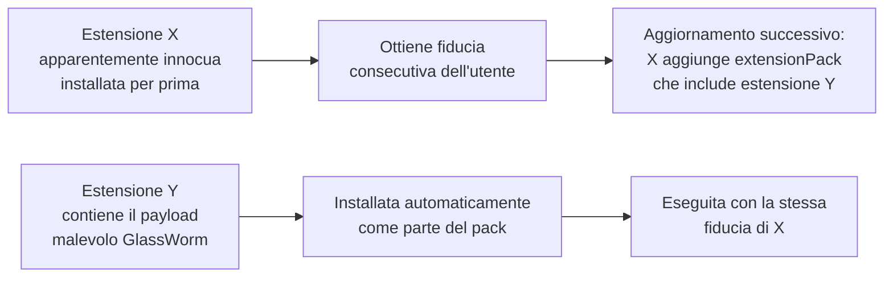

# GlassWorm: la supply chain attack che infetta gli sviluppatori tramite il registry VS Code

## Il fatto

I ricercatori di **Socket** — una società specializzata nella sicurezza della supply chain del software — hanno pubblicato a marzo 2026 un report che documenta una nuova iterazione della campagna **GlassWorm**, definita come una "significativa escalation" rispetto alle versioni precedenti.

Dall'analisi di Socket sono emerse almeno **72 estensioni malevole** nell'**Open VSX Registry** (il marketplace alternativo di estensioni per VS Code usato principalmente da sviluppatori che usano VSCodium e altri fork open source) pubblicate a partire dal 31 gennaio 2026. Il bersaglio: sviluppatori di software, con particolare attenzione a chi usa strumenti di AI coding come Claude Code e Gemini.

---

## Il meccanismo: extensionPack per nascondersi

L'innovazione di questa iterazione di GlassWorm è nell'uso delle relazioni tra estensioni per nascondere il payload malevolo.

VS Code supporta due tipi di dipendenze tra estensioni:
- **extensionDependencies:** estensioni richieste per il funzionamento
- **extensionPack:** bundle di estensioni raccomandate

GlassWorm sfrutta queste relazioni in modo subdolo:

In pratica: un'estensione inizialmente innocua viene installata, guadagna la fiducia dell'utente e del sistema, e solo dopo un aggiornamento inizia a trascinare estensioni malevole come dipendenze. Questo scavalca la revisione iniziale che molti utenti fanno prima di installare un'estensione.

---

## Target: tool per sviluppatori AI

Le estensioni GlassWorm mimano strumenti comuni nello stack dei developer moderni:

- Linter e formatter (ESLint, Prettier alternativi)
- Code runner e task automation
- **Strumenti per AI coding assistant** — simulando integrazioni con Claude Code e Google Gemini

Quest'ultimo punto è particolarmente preoccupante: gli sviluppatori che usano AI coding assistant tendono ad avere accesso a codebase sensibili, API key, e variabili di ambiente con credenziali. Un'estensione malevola che opera nel contesto di VS Code ha accesso a tutto ciò che l'editor stesso può leggere — inclusi i file `.env`, le chiavi SSH, e i token di autenticazione nei workspace.

---

## Open VSX vs Visual Studio Marketplace

**Open VSX** non è il marketplace principale di VS Code (quello è Visual Studio Marketplace di Microsoft), ma è il registry open source usato da:

- VSCodium (la build open source di VS Code senza telemetria Microsoft)
- Eclipse Theia
- GitPod
- GitHub Codespaces (in parte)
- Molte distribuzioni Linux che includono editor VS Code-compatibili

Microsoft ha processi di vetting più robusti per il suo marketplace. Open VSX, essendo un progetto open source con risorse più limitate, ha una revisione meno sistematica — il che lo rende un vettore più accessibile per campagne di questo tipo.

---

## La supply chain degli sviluppatori: perché è un target critico

Un attacco che compromette gli strumenti degli sviluppatori è un attacco con effetto moltiplicatore. Uno sviluppatore compromesso non è solo una vittima — è potenzialmente:

- Un vettore per introdurre backdoor nel codice che sviluppa
- Un punto di accesso alle pipeline CI/CD
- Una fonte di credenziali per sistemi di produzione
- Un trampolino verso i sistemi dei clienti del software che produce

La supply chain del software è diventata il bersaglio più ambito per gli attori più sofisticati: comprometterla significa potenzialmente colpire migliaia di organizzazioni downstream.

---

## Come proteggersi

**Per gli sviluppatori:**
- Usa il Visual Studio Marketplace ufficiale quando possibile
- Verifica il publisher e la reputazione di ogni estensione prima di installarla
- Rivedi periodicamente le estensioni installate e rimuovi quelle non più necessarie
- Non installare estensioni che richiedono permessi eccessivi rispetto alla loro funzione dichiarata
- Considera l'uso di ambienti di sviluppo isolati per i progetti più sensibili

**Per le organizzazioni:**
- Implementa policy di gestione centralizzata delle estensioni VS Code
- Usa soluzioni di software composition analysis (SCA) che monitorano anche le estensioni editor
- Monitora le variabili di ambiente e le API key per uso anomalo

---

## Conclusione

GlassWorm è l'ennesimo promemoria che la supply chain del software è un battleground attivo. L'evoluzione della tecnica — dall'embedding diretto del loader all'abuso delle relazioni di dependenza per "infettare dopo" — mostra una maturità crescente degli attori. Gli sviluppatori sono bersagli di alto valore. I loro strumenti devono essere trattati con lo stesso rigore dei sistemi che gestiscono.
