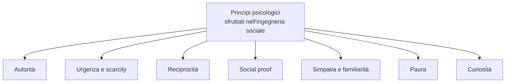
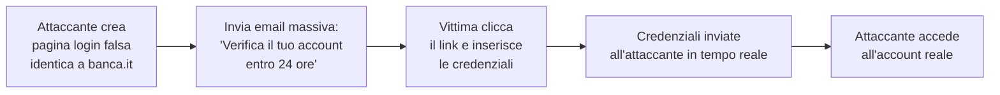
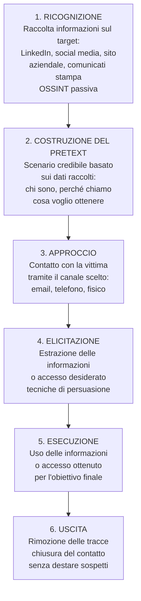
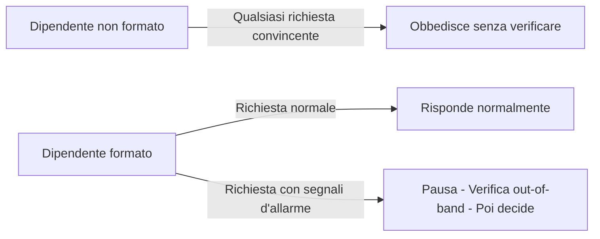

# Ingegneria sociale: la psicologia degli attacchi

## Introduzione

Puoi avere il firewall più sofisticato del mondo, l'EDR più avanzato, patch applicate il giorno stesso del rilascio. Se un dipendente consegna volontariamente la propria password a qualcuno che si spaccia per il supporto IT, tutto questo diventa irrilevante.

L'**ingegneria sociale** è la manipolazione psicologica di persone per indurle a compiere azioni o a rivelare informazioni riservate. Non attacca i sistemi — attacca le persone che li usano. È il vettore di attacco più efficace e più difficile da difendere, perché sfrutta caratteristiche fondamentali della psicologia umana che non possono essere "patchate".

Kevin Mitnick — l'hacker più ricercato d'America — sosteneva che la tecnologia era la parte più facile da bucare. Le persone erano il vero punto debole.

---

## I principi psicologici sfruttati

L'ingegneria sociale funziona perché sfrutta bias cognitivi e tendenze psicologiche universali. Cialdini, nel suo lavoro sulla persuasione, identifica principi che gli attaccanti sfruttano sistematicamente:



### Autorità

Gli esseri umani tendono a obbedire alle figure di autorità — è un istinto evolutivo e culturale. Un attaccante che si presenta come il CEO, il responsabile IT, o un agente del fisco ha un potere persuasivo immediato.

Esempio classico: "Sono il direttore finanziario. Ho bisogno urgentemente della tua password per accedere al sistema durante la conferenza. Ti richiamo quando torno." Il dipendente, intimidito dalla figura di autorità e dall'urgenza, obbedisce.

### Urgenza e scarcity

La pressione temporale disattiva il pensiero critico. Quando si deve agire "adesso o mai più", non c'è tempo per verificare, chiedere conferma, o riflettere sulle anomalie.

"Il tuo account verrà sospeso entro 24 ore se non verifichi le tue credenziali." "C'è un'intrusione in corso nel sistema — ho bisogno che tu resetti immediatamente la tua password cliccando questo link."

### Reciprocità

Se qualcuno ti fa un favore, ti senti in obbligo di ricambiare. Un attaccante che offre aiuto (risolve un problema tecnico, fa un regalo, condivide informazioni utili) crea un senso di debito che può essere sfruttato successivamente.

### Social proof

Tendiamo a conformarci al comportamento degli altri, specialmente in situazioni incerte. "Tutti gli altri del tuo reparto hanno già completato la verifica — sei l'unico che manca."

### Paura

La paura di conseguenze negative — perdere il lavoro, essere accusato di qualcosa, subire danni economici — può far prendere decisioni affrettate e irrazionali.

"Abbiamo rilevato attività sospetta sul tuo account bancario. Per bloccare la transazione fraudolenta devi verificare le tue credenziali immediatamente."

---

## Tecniche principali

### Phishing

Il phishing è la tecnica più diffusa: email, SMS, o messaggi che imitano comunicazioni legittime per indurre la vittima a cliccare link malevoli, aprire allegati, o inserire credenziali su siti falsi.



**Spear phishing:** phishing altamente personalizzato su un target specifico. L'attaccante raccoglie informazioni (LinkedIn, social media, sito aziendale) per rendere l'email convincente. Conosce il nome del capo della vittima, i progetti correnti, i colleghi.

**Whaling:** spear phishing contro i vertici aziendali (CEO, CFO, CISO). Le email imitano comunicazioni del consiglio di amministrazione o di autorità regolatorie.

**BEC — Business Email Compromise:** l'attaccante compromette o imita l'email di un dirigente per ordinare bonifici urgenti. Una delle frodi più lucrative: le perdite globali superano i 43 miliardi di dollari negli ultimi anni secondo l'FBI.

### Vishing (Voice Phishing)

Attacchi via telefono. L'attaccante si presenta come supporto tecnico, banca, agenzia governativa, o collega aziendale.

Tecniche usate nel vishing:

**Spoofing del numero:** tecnologia VoIP permette di far apparire qualsiasi numero sul display del destinatario. La chiamata sembra provenire dalla propria banca o dalla propria azienda.

**Conoscenza del target:** prima della chiamata, l'attaccante raccoglie informazioni — nome, ruolo, nome del responsabile, progetti recenti — per rendere la conversazione credibile.

**Urgenza + autorità:** "Sono del supporto tecnico di Microsoft. Abbiamo rilevato che il suo computer è infetto e sta inviando dati a server russi. Ho bisogno di accesso remoto immediatamente per risolverlo."

### Smishing (SMS Phishing)

Phishing via SMS. Il tasso di apertura degli SMS è molto più alto delle email — le persone aprono quasi tutti gli SMS che ricevono.

Pattern comuni: "Il tuo pacco DHL non può essere consegnato. Paga €1,99 di spese doganali qui: [link]", "Hai ricevuto un rimborso delle tasse. Clicca qui per richiedere €340: [link]".

Il link porta a pagine che rubano credenziali o dati delle carte di credito, o scaricano malware su Android.

### Pretexting

Il pretexting è la costruzione di uno scenario (pretext) credibile per giustificare la richiesta di informazioni o accessi. È il fondamento di quasi tutte le tecniche di ingegneria sociale.

Esempi di pretext:

**Tecnico IT:** "Buongiorno, sono Marco del supporto IT. Stiamo migrando i server questo weekend e ho bisogno di verificare le tue credenziali per assicurarmi che il tuo account venga migrato correttamente."

**Nuovo collega:** "Ciao, sono appena entrato nel reparto commerciale. Non riesco ancora ad accedere al sistema CRM — il mio account non è stato configurato. Potresti mostrarmi come si accede? Devo presentare un report al cliente tra un'ora."

**Fornitore:** "Sono il tecnico di Xerox che viene a fare manutenzione sulle fotocopiatrici. Ho bisogno dell'accesso alla sala server per aggiornare i driver. Posso avere un badge temporaneo?"

### Tailgating / Piggybacking

Accesso fisico non autorizzato seguendo qualcuno che ha le credenziali. Un attaccante in giacca e cravatta, con le mani occupate da scatole, aspetta davanti a una porta con badge reader. Un dipendente apre la porta e, per cortesia, la tiene aperta anche per l'attaccante.

Non c'è hacking tecnico — solo sfruttamento della cortesia e della diffidenza a farsi valere contro qualcuno che "sembra" appartenere al posto.

### Baiting

Si lascia un dispositivo fisico (chiavetta USB, hard disk esterno) in un luogo dove la vittima possa trovarlo — parcheggio aziendale, sala break, reception. L'etichetta dice "Stipendi 2026 Q1" o "Progetti confidenziali".

La curiosità umana è quasi irresistibile. La vittima inserisce la chiavetta nel proprio computer per "vedere cosa c'è" — e il payload eseguibile si installa silenziosamente.

Uno studio del 2016 ha lasciato 297 chiavette USB nei campus di 6 università americane. Il 98% di quelle trovate vennero inserite in un computer, e il 45% dei trovatori cliccarono su file all'interno della chiavetta.

### Quid pro quo

L'attaccante offre qualcosa in cambio di informazioni. "Se mi dai accesso al sistema per 5 minuti posso risolvere quel bug che vi sta dando problemi da settimane." Oppure: finge di essere il supporto IT e chiama utenti a caso offrendo aiuto tecnico — fino a trovare qualcuno con un problema reale, che fornirà accesso in cambio dell'assistenza.

---

## Il ciclo di un attacco di ingegneria sociale



---

## OSINT come base dell'ingegneria sociale

Prima di qualsiasi contatto, l'attaccante raccoglie informazioni. Più conosce il target, più convincente sarà il pretext.

**LinkedIn:** ruolo, responsabilità, colleghi, stack tecnologico usato in azienda ("Esperto in Salesforce, SAP, AWS"), storico lavorativo.

**Sito aziendale:** organigramma, nomi dei dirigenti, fornitori citati, comunicati stampa recenti.

**Social media:** hobby, famiglia, viaggi recenti, eventi a cui ha partecipato — tutto utilizzabile per stabilire rapport o costruire pretext.

**Job posting:** "Stiamo cercando un sistemista con esperienza in Cisco ASA, Palo Alto e VMware" — rivela l'infrastruttura aziendale.

**Google Dorking:**
```
site:company.com filetype:pdf       # documenti interni
site:company.com inurl:login        # pagine di login
"@company.com" filetype:xls         # spreadsheet con email
```

---

## Difese: tecnologiche e umane

### Formazione e consapevolezza

La difesa più importante è la formazione continuativa. Non un corso di e-learning annuale da 20 minuti — ma simulazioni reali, esempi concreti, aggiornamento costante.

**Phishing simulation:** strumenti come GoPhish, KnowBe4, Proofpoint permettono di simulare campagne di phishing interne. Chi clicca sul link riceve immediatamente formazione contestuale. Misurare il click rate nel tempo è l'unica metrica significativa per valutare l'efficacia della formazione.

**Cultura del "verifica prima di agire":** i dipendenti devono sentirsi liberi di verificare richieste sospette senza sentirsi scortesi o ostruzionisti. "Posso richiamarti tra 5 minuti dopo aver verificato con il mio responsabile?" non è maleducazione — è sicurezza.

### Procedure di verifica

**Out-of-band verification:** se ricevi una richiesta via email, verifica via telefono (usando un numero che hai già, non quello nell'email). Se ricevi una richiesta via telefono, verifica via email.

**Mai fornire credenziali a chi le chiede:** nessun sistema IT legittimo ha bisogno della tua password. Il supporto tecnico può resettare il tuo account senza conoscere la password attuale.

**Callback procedure per bonifici:** qualsiasi richiesta di bonifico urgente ricevuta via email deve essere verificata con una chiamata telefonica al mittente usando un numero precedentemente verificato. Il BEC (Business Email Compromise) è fermato quasi completamente da questa procedura.

### Controlli tecnici

**MFA:** anche se la password viene rubata tramite phishing, l'attaccante non può accedere senza il secondo fattore. FIDO2 è resistente al phishing per design — la firma è vincolata al dominio, e un sito fake non riceve mai la firma corretta.

**Email filtering:** filtri anti-spam e anti-phishing, verifica SPF/DKIM/DMARC, sandboxing degli allegati, URL rewriting con verifica in tempo reale.

**Privilegio minimo:** un dipendente manipolato per dare accesso a un account con privilegi limitati causa meno danni di uno con privilegi amministrativi.

**Zero Trust:** non fidarsi automaticamente di nessuno, nemmeno degli utenti già "dentro" la rete. Ogni accesso viene verificato indipendentemente.

---

## Come riconoscere un attacco in corso

Segnali d'allarme da cercare in qualsiasi comunicazione sospetta:

**Urgenza non spiegata:** "Devi agire entro 1 ora altrimenti il tuo account viene chiuso."

**Richiesta di bypassare le procedure normali:** "Non c'è tempo per aprire un ticket — fammelo direttamente."

**Richiesta di segretezza:** "Non dire nulla al tuo responsabile — è una cosa confidenziale."

**Autorità non verificabile:** qualcuno che dice di essere il CEO o un agente governativo ma non può essere verificato.

**Informazioni che tornano troppo bene:** l'attaccante conosce molti dettagli — ma li ha raccolti da fonti pubbliche. Il fatto che sappia il nome del tuo capo non significa che sia chi dice di essere.

**Richiesta di credenziali o accesso remoto:** nessun supporto IT legittimo chiede la password o l'accesso remoto non programmato.

---

## Il caso Ubiquiti (2021)

Un dipendente di Ubiquiti Networks ricevette email apparentemente dal proprio CEO e CFO che richiedevano il trasferimento urgente di 46,7 milioni di dollari a conti bancari esteri per finalizzare l'acquisizione di un'azienda — classificato confidenziale per ragioni legali.

Il dipendente eseguì il bonifico. Era un classico BEC.

Ubiquiti recuperò circa 15 milioni tramite le autorità — ma perse oltre 46 milioni definitivamente.

L'intera breach fu possibile non per una vulnerabilità tecnica, ma perché nessuno verificò la richiesta fuori dal canale email con un metodo indipendente.

---

## Il paradosso della difesa

C'è un paradosso fondamentale nella difesa contro l'ingegneria sociale: le stesse caratteristiche che rendono le persone vulnerabili (fiducia, cortesia, disponibilità ad aiutare, rispetto dell'autorità) sono caratteristiche positive in un contesto normale.

Non si può "patchare" la fiducia umana — né si dovrebbe volerlo fare. L'obiettivo non è creare dipendenti paranoici che non si fidano di nessuno, ma dipendenti consapevoli che sanno riconoscere i segnali d'allarme e hanno procedure chiare per verificare le richieste anomale.



---

## Conclusione

L'ingegneria sociale è il vettore d'attacco più antico e più efficace in cybersecurity — e l'unico che non può essere risolto con un aggiornamento software. Finché esistono esseri umani che devono prendere decisioni rapide, rispettare l'autorità, e aiutare i colleghi, esisteranno attaccanti che sfruttano queste caratteristiche.

La difesa efficace combina formazione continua, procedure di verifica chiare, controlli tecnici (MFA, email filtering), e una cultura aziendale dove verificare una richiesta strana è incoraggiato, non visto come ostruzionismo.

Il primo passo è la consapevolezza: sapere che questi attacchi esistono, come funzionano, e quali sono i segnali d'allarme. È impossibile difendersi da qualcosa che non si conosce.
