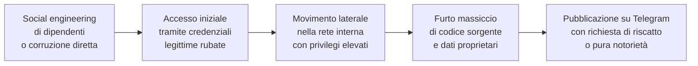

# Lacoste colpita da Lapsus$: il gruppo torna dopo due anni di silenzio

## Il fatto

A marzo 2026, **Lacoste** — il marchio francese dell'iconico coccodrillo, con oltre 1.000 boutique in 100 paesi e un fatturato di circa 3 miliardi di euro — è diventata l'ultima vittima di un attacco ransomware rivendicato da **Lapsus$**. La natura e la quantità dei dati compromessi sono ancora sotto indagine, ma la sola rivendicazione di Lapsus$ è sufficiente a mettere in allerta tutto il settore.

---

## Chi è Lapsus$: una storia di caos e sorprese

Lapsus$ è forse il gruppo di cybercriminali più atipico della storia recente. Non sono un'organizzazione professionale strutturata con catene di comando chiare — o almeno, non lo erano. Emersi nel 2021, si sono distinti per una serie di caratteristiche insolite:

**Età dei membri:** la maggior parte degli arrestati nelle operazioni contro Lapsus$ erano adolescenti. Il leader principale, arrestato nel 2022 a Oxford, aveva 17 anni. Diversi altri membri avevano tra i 16 e i 21 anni.

**Targets di altissimo profilo:** nonostante la giovane età dei membri, Lapsus$ ha compromesso alcune delle organizzazioni più grandi e meglio difese al mondo — Microsoft, NVIDIA, Samsung, Ubisoft, Okta, Rockstar Games (rubando il codice sorgente di GTA VI), Uber.

**Metodi non convenzionali:** a differenza dei gruppi ransomware tradizionali, Lapsus$ non usava exploit tecnici sofisticati. Si affidava principalmente al social engineering, al SIM swapping, e alla corruzione di dipendenti interni per ottenere accesso iniziale.

**Comunicazione pubblica:** Lapsus$ comunicava con le vittime e annunciava le proprie breach pubblicamente su Telegram, spesso in modo beffardo.

Dopo una serie di arresti nel 2022-2023, il gruppo sembrava dissolto. Il ritorno con l'attacco a Lacoste nel 2026 — se confermato come opera degli originali — indica o una ricostituzione del gruppo con nuovi membri, o l'uso del brand Lapsus$ da parte di criminali che vogliono sfruttarne la notorietà.

---

## Il pattern d'attacco di Lapsus$

Gli attacchi di Lapsus$ seguivano tipicamente questo schema:

La fase chiave è la prima: Lapsus$ era maestro nel manipolare i dipendenti, incluso offrire pagamenti diretti a chi forniva le proprie credenziali aziendali. Il gruppo aveva pubblicato su Telegram messaggi alla ricerca di "insider" in grandi aziende, offrendo compensi in criptovaluta.

---

## Perché Lacoste è un target interessante

Lacoste non è un'azienda tech, ma gestisce:

- Una piattaforma e-commerce globale con dati di pagamento e account di milioni di clienti
- Sistemi di gestione della supply chain per produzione e distribuzione globale
- Dati di partnership con retailer in 100 paesi
- Proprietà intellettuale sui design delle collezioni future
- Dati dei programmi fedeltà

In un settore come la moda luxury, la fuga di dati su collezioni future è particolarmente dannosa — può avvantaggiare concorrenti e far crollare il valore percepito dell'esclusività del brand.

---

## Il contesto: la moda sotto attacco

Lacoste non è isolata. Il settore moda e retail è diventato un target frequente:

- **Guess** — ransomware DarkSide nel 2021
- **Intersport** — ransomware nel 2022
- **PVH Group** (Calvin Klein, Tommy Hilfiger) — breach nel 2023
- **The North Face** — credential stuffing nel 2022 e 2023
- **Vans/VF Corporation** — ransomware nel 2023

La moda combina sistemi legacy (molte boutique usano POS datati), dati di pagamento di clienti high-value, e brand reputation che rende le aziende disposte a pagare per evitare la pubblicità negativa.

---

## Conclusione

Il ritorno di Lapsus$ — o di chi ne usa il brand — con un target di livello Lacoste segnala che l'industria della moda deve prendere la cybersecurity seriamente quanto i settori tradizionalmente più colpiti. I dati sono ancora in corso di valutazione, ma la storia del gruppo suggerisce che le conseguenze potrebbero essere più gravi di quanto inizialmente dichiarato.
