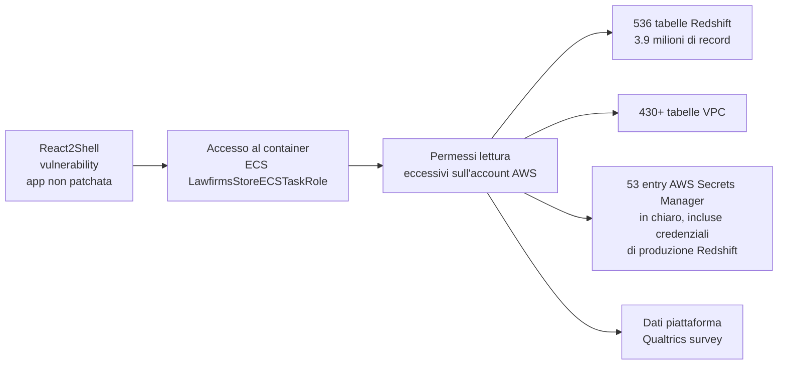

# LexisNexis violata: la password era "Lexis1234" e la chiave AWS era in chiaro

## Il fatto

Il 24 febbraio 2026, un threat actor noto come **FulcrumSec** ha compromesso l'infrastruttura cloud di **LexisNexis Legal & Professional** — una delle più grandi società di dati legali e di risk management al mondo, fornitrice di informazioni a studi legali, procure, agenzie governative e aziende finanziarie di tutto il globo.

FulcrumSec ha esfiltrato **2,04 GB di dati** contenenti circa **3,9 milioni di record** da 536 tabelle Redshift e 430 tabelle di database VPC, più le credenziali di produzione presenti in 53 entry di AWS Secrets Manager — incluse alcune apparentemente in chiaro. Il 3 marzo 2026, i dati sono stati pubblicati su un forum del cybercrimine. LexisNexis ha confermato la breach quello stesso giorno.

---

## Il vettore: React2Shell su un'app non patchata

Il punto d'ingresso è stato una vulnerabilità nota chiamata **React2Shell** — un bug in un'applicazione React frontend nell'infrastruttura AWS di LexisNexis. La flaw era nota da mesi. FulcrumSec la ha trovata su un sistema non aggiornato.

Da lì, l'attaccante ha compromesso un container **AWS Elastic Container Service (ECS)** con un task role chiamato "LawfirmsStoreECSTaskRole". Questo ruolo aveva permessi di lettura eccessivamente ampi sull'intero account AWS.

---

## La password più imbarazzante dell'anno

FulcrumSec ha pubblicamente deriso il livello di sicurezza di LexisNexis, rivelando che la **master password del database RDS di produzione** era:

> `Lexis1234`

Una password che non supererebbe un test di sicurezza base di qualsiasi organizzazione. Nel contesto di un'azienda che gestisce dati di milioni di profili legali e governativi — inclusi giudici, procuratori DOJ e staff della SEC — è un fallimento difficile da spiegare.

---

## Cosa contenevano i dati

L'archivio esfiltrato include:

- **400.000 profili utente** con nome, email, numero di telefono e ruolo
- **118 profili con indirizzi .gov** — personale governativo USA, giudici federali, law clerk, procuratori del DOJ, funzionari della SEC
- **21.042 account clienti** aziendali
- Record di database da 536 tabelle Redshift
- Potenziali credenziali di produzione da AWS Secrets Manager

I profili con indirizzi .gov sono particolarmente sensibili. LexisNexis fornisce strumenti di ricerca legale e risk analytics usati da agenzie governative, studi legali e aziende finanziarie. Avere nomi, email e ruoli di procuratori e giudici federali in mano a un threat actor è materiale potenzialmente utile per phishing mirato ad altissimo valore.

---

## La risposta di LexisNexis: "erano solo dati legacy"

LexisNexis Legal & Professional ha dichiarato a SecurityWeek che i server compromessi "contenevano principalmente dati legacy e deprecati precedenti al 2020" e che "l'impatto è limitato". L'azienda ha confermato che i dati esposti includono nomi clienti, user ID, dettagli di contatto aziendali, IP di rispondenti a survey e ticket di supporto.

Questa risposta ha generato scetticismo tra i ricercatori: FulcrumSec ha dimostrato con il dataset pubblicato di aver avuto accesso a sistemi attivi, non solo ad archivi storici.

---

## Il problema sistemico: IAM troppo permissivo su AWS

Il cuore tecnico di questa breach non è la vulnerabilità React2Shell — quella è solo la porta d'ingresso. Il problema reale è l'**IAM misconfiguration**: un task role ECS con permessi di lettura su praticamente tutto l'account AWS.

Il principio del minimo privilegio dice che ogni componente dovrebbe avere accesso solo alle risorse strettamente necessarie per la sua funzione. Un container che serve una frontend web per studi legali non ha motivo di poter leggere credenziali di produzione del database, tabelle Redshift di tutto l'account, e entry di Secrets Manager.

Come ha scritto un ricercatore: "Un singolo task role ha concesso accesso in lettura a tutte le entry di AWS Secrets Manager, incluse le credenziali del database di produzione. Questa è la configurazione che trasforma un problema piccolo in uno enorme."

---

## Conclusione

Il breach di LexisNexis è un caso di studio su come i problemi di sicurezza cloud si sommano: una vulnerabilità nota non patchata + IAM eccessivamente permissivo + password di produzione debole = esfiltrazione di milioni di record legali e governativi. La singola parola d'ordine "Lexis1234" ha reso tutto più facile di quanto avrebbe dovuto essere.
