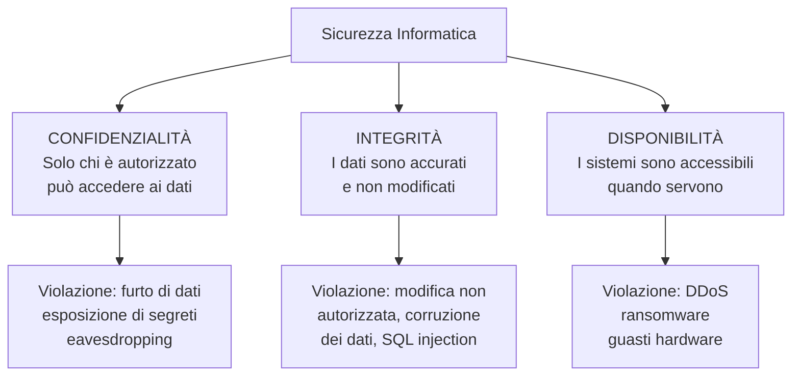
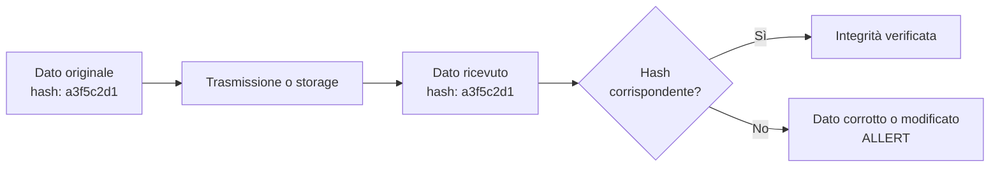
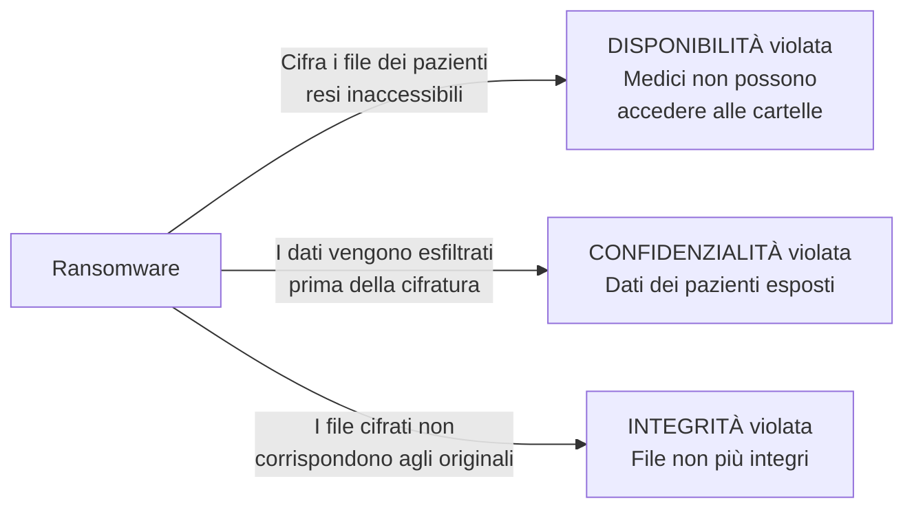

# Il Modello CIA: Confidenzialità, Integrità, Disponibilità

## Introduzione

In sicurezza informatica esiste un framework concettuale che sta alla base di qualsiasi analisi del rischio, qualsiasi policy aziendale, qualsiasi decisione di architettura: la **triade CIA**. Non è un'organizzazione segreta — è l'acronimo di **Confidentiality, Integrity, Availability** (Confidenzialità, Integrità, Disponibilità).

Ogni attacco informatico viola almeno uno di questi tre pilastri. Ogni controllo di sicurezza ne protegge almeno uno. Capire la triade significa capire il linguaggio con cui i professionisti della sicurezza descrivono minacce, rischi e soluzioni.

---

## La triade CIA

I tre pilastri sono spesso in tensione tra loro. Aumentare la confidenzialità (più cifratura, più controlli di accesso) può ridurre la disponibilità (sistemi più lenti, accesso più difficile). Massimizzare la disponibilità (ridondanza, accesso semplificato) può ridurre la confidenzialità. Il compito del professionista della sicurezza è trovare il giusto equilibrio per il contesto specifico.

---

## Confidenzialità

La confidenzialità garantisce che le informazioni siano accessibili **solo a chi è autorizzato** a vederle. Non si tratta solo di cifratura — include tutto il ciclo di vita dell'informazione: chi può accedervi, come viene trasmessa, dove viene memorizzata, come viene eliminata.

### Minacce alla confidenzialità

**Intercettazione (eavesdropping):** un attaccante legge traffico di rete non cifrato. Classico su reti WiFi pubbliche con HTTP o SMTP non cifrati.

**Data breach:** accesso non autorizzato a database, file server, cloud storage. Può avvenire per exploit tecnico, credenziali rubate, insider malintenzionato.

**Social engineering:** la persona autorizzata viene manipolata a rivelare informazioni riservate — phishing, pretexting, vishing.

**Shoulder surfing:** semplicemente guardare lo schermo di qualcuno in un luogo pubblico. Banale ma reale.

**Metadata leak:** anche senza leggere il contenuto di un messaggio, i metadati (chi parla con chi, quando, da dove) rivelano informazioni sensibili. Come dimostrò Snowden con i programmi NSA.

### Controlli per la confidenzialità

**Cifratura a riposo:** i dati vengono cifrati quando sono memorizzati su disco. Se il disco viene rubato fisicamente, i dati rimangono illeggibili senza la chiave.

**Cifratura in transito:** TLS per le comunicazioni web, SSH per le shell remote, SFTP per i trasferimenti di file. Nessun dato sensibile viaggia in chiaro.

**Controllo degli accessi:** principio del minimo privilegio — ogni utente e ogni sistema accede solo alle risorse strettamente necessarie per il suo compito. Un dipendente del marketing non ha bisogno di accedere al database dei clienti della divisione legale.

**DLP (Data Loss Prevention):** strumenti che monitorano e bloccano l'esfiltrazione di dati sensibili — allegati email con numeri di carte di credito, upload di file riservati su servizi cloud non autorizzati.

**Classificazione dei dati:** non tutti i dati hanno lo stesso livello di sensibilità. Una policy di classificazione (pubblico, interno, confidenziale, segreto) permette di applicare controlli proporzionati al rischio.

---

## Integrità

L'integrità garantisce che le informazioni siano **accurate, complete e non modificate** senza autorizzazione. Non riguarda solo gli attacchi — include anche la corruzione accidentale dei dati.

### Minacce all'integrità

**SQL Injection:** un attaccante inietta comandi SQL in un form web per modificare, cancellare o inserire dati nel database. Un `UPDATE` non autorizzato può cambiare il saldo di un conto bancario, il risultato di un'elezione, il dosaggio di un farmaco in un sistema ospedaliero.

**Man-in-the-Middle (MitM):** l'attaccante si interpone tra client e server, modificando i dati in transito. Senza TLS (o con TLS mal configurato), può modificare un aggiornamento software scaricato, iniettare codice in una pagina web, alterare una transazione finanziaria.

**Ransomware:** cifra i file rendendoli inaccessibili — una violazione dell'integrità (i file non sono più utilizzabili nella loro forma originale) oltre che della disponibilità.

**Insider threat:** un dipendente malintenzionato modifica dati aziendali — record contabili, log di sistema, configurazioni. Particolarmente insidioso perché l'accesso è legittimo.

**Corruzione accidentale:** hardware difettoso, bug software, errori umani. Non tutti i problemi di integrità sono attacchi.

### Controlli per l'integrità

**Hash crittografici:** SHA-256 o SHA-512 calcolati sui dati critici. Se un singolo bit cambia, l'hash cambia completamente — la modifica è immediatamente rilevabile.

**Firme digitali:** combinano hash e crittografia asimmetrica. Garantiscono sia l'integrità del dato sia l'autenticità del mittente — il dato non è stato modificato e proviene davvero da chi dice.

**Controllo delle versioni:** git e sistemi simili mantengono la storia completa di ogni modifica, permettendo di rilevare e revertire modifiche non autorizzate.

**WAF (Web Application Firewall):** filtra le richieste malevole prima che raggiungano l'applicazione, bloccando i tentativi di SQL injection e altri attacchi al layer applicativo.

**Audit log immutabili:** log di sistema che non possono essere modificati o cancellati dagli stessi utenti che generano gli eventi. Un attaccante che compromette un sistema non deve poter coprire le proprie tracce.

**Backup verificati:** backup regolari con verifica dell'integrità (confronto degli hash) permettono il ripristino a uno stato noto-buono dopo una corruzione.

---

## Disponibilità

La disponibilità garantisce che i sistemi e le informazioni siano **accessibili quando servono** agli utenti autorizzati. Un sistema perfettamente sicuro ma offline il 50% del tempo è inutile.

### Minacce alla disponibilità

**DDoS (Distributed Denial of Service):** migliaia di macchine compromesse (botnet) sommergono un server con traffico fino a renderlo irraggiungibile. Può colpire il layer di rete (flood di pacchetti), il layer di trasporto (SYN flood), o il layer applicativo (HTTP flood che esaurisce le connessioni del web server).

**Ransomware:** cifra i file critici rendendoli inaccessibili finché non viene pagato il riscatto. Ospedali, infrastrutture critiche, aziende manifatturiere — la perdita di disponibilità può avere conseguenze fisiche dirette.

**Errori di configurazione:** un firewall mal configurato che blocca traffico legittimo, un aggiornamento che rompe un servizio critico, una migrazione cloud che non considera le dipendenze. Non tutti i problemi di disponibilità sono attacchi.

**Guasti hardware:** dischi che si rompono, alimentatori che cedono, datacenter che perdono alimentazione. La ridondanza hardware è un controllo di disponibilità, non solo di affidabilità.

**Attacchi fisici:** distruzione fisica di hardware, taglio di cavi, accesso non autorizzato a sale server.

### Controlli per la disponibilità

**Ridondanza:** nessun single point of failure. Server multipli in load balancing, connessioni internet ridondanti, alimentatori UPS, generatori di backup.

**CDN (Content Delivery Network):** distribuisce i contenuti su decine o centinaia di server geograficamente distribuiti. Un attacco DDoS che satura un singolo datacenter non abbatte un'infrastruttura distribuita globalmente.

**Rate limiting:** limita il numero di richieste per IP o per utente in un dato periodo. Mitiga automaticamente i flood di richieste senza bloccare gli utenti legittimi.

**Disaster Recovery Plan:** procedure documentate e testate per ripristinare i servizi dopo un incidente. Un piano non testato è un piano che non funzionerà quando serve.

**RTO e RPO:** due metriche fondamentali per la disponibilità.

| Metrica | Definizione | Esempio |
|---|---|---|
| RTO (Recovery Time Objective) | Quanto tempo massimo può stare offline il sistema | 4 ore |
| RPO (Recovery Point Objective) | Quanti dati possiamo permetterci di perdere | Backup ogni 1 ora = max 1 ora di dati persi |

**Monitoraggio proattivo:** sistemi di alerting che notificano i team operativi prima che un problema diventi un'interruzione. Rilevare un disco che si sta degradando prima che si rompi. Rilevare un aumento anomalo del traffico prima che saturi la banda.

---

## La triade in pratica: analisi di casi reali

### Caso 1: Ransomware su un ospedale

Un ospedale viene colpito da ransomware. Quale pilastro viene violato?

Un singolo attacco può violare tutti e tre i pilastri contemporaneamente.

### Caso 2: SQL Injection su un e-commerce

Un attaccante inietta una query SQL nel form di login per accedere come amministratore e scaricare il database degli ordini.

- **Confidenzialità violata:** dati dei clienti (email, indirizzi, pagamenti) esposti
- **Integrità violata:** l'attaccante potrebbe modificare prezzi, ordini, inventario
- **Disponibilità:** non direttamente violata in questo scenario

### Caso 3: DDoS contro un servizio bancario

Una banca viene inondata di traffico da una botnet. Il sito e l'app mobile diventano irraggiungibili per ore.

- **Disponibilità violata:** i clienti non possono accedere ai propri conti
- **Confidenzialità:** non violata (nessun dato è stato esposto)
- **Integrità:** non violata (nessun dato è stato modificato)

---

## Estensioni della triade: AAA e oltre

La triade CIA è il punto di partenza, ma il settore usa altri concetti correlati.

**AAA (Authentication, Authorization, Accounting):**

| Componente | Domanda | Esempio |
|---|---|---|
| Authentication | Chi sei? | Username + password + MFA |
| Authorization | Cosa puoi fare? | Ruoli e permessi |
| Accounting | Cosa hai fatto? | Audit log |

**Non ripudio:** la garanzia che chi ha compiuto un'azione non possa negarlo. Le firme digitali forniscono non ripudio — se hai firmato un documento con la tua chiave privata, non puoi negare di averlo fatto.

**Privacy:** spesso aggiunta come quarto pilastro nella versione moderna del framework. Si distingue dalla confidenzialità perché riguarda specificamente la protezione dei dati personali nel contesto normativo (GDPR, CCPA).

---

## Come usare la triade nella pratica

La triade CIA è uno strumento di analisi, non solo un concetto teorico. Quando si valuta un sistema, un progetto o un incidente, chiediti sistematicamente:

**In fase di progettazione:**
- Quali dati devono rimanere confidenziali e da chi?
- Come garantiamo che i dati non vengano modificati senza autorizzazione?
- Quali sono i requisiti di uptime? Cosa succede se il sistema va offline?

**In fase di incident response:**
- Quale pilastro è stato violato? (o più di uno?)
- Quali dati sono stati esposti, modificati, resi inaccessibili?
- Qual è l'impatto sul business per ciascuna violazione?

**In fase di risk assessment:**
- Per ogni asset: qual è il valore della confidenzialità, integrità e disponibilità?
- Qual è la probabilità che ciascun pilastro venga violato?
- Qual è l'impatto di ciascuna violazione?

---

## Conclusione

La triade CIA è semplice nella formulazione ma profonda nelle implicazioni. Ogni decisione di sicurezza — quale algoritmo di cifratura usare, quante copie di backup mantenere, come strutturare i permessi degli utenti — può essere ricondotta a uno o più dei tre pilastri.

Quando senti parlare di un attacco o di una violazione, chiediti sempre: confidenzialità, integrità o disponibilità? Spesso la risposta è più di uno. E quella risposta definisce le priorità della risposta.
