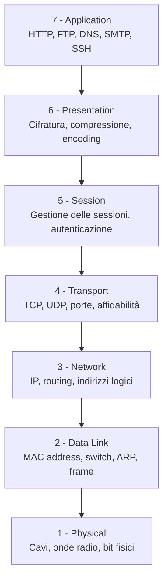
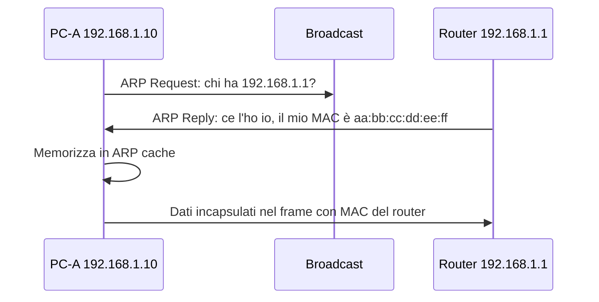
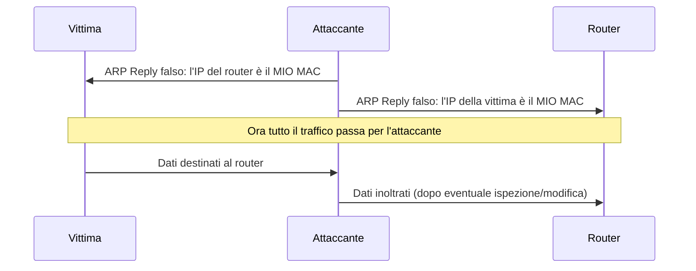
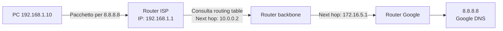
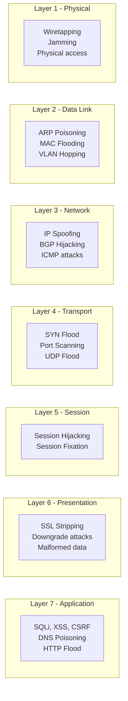

# Il Modello OSI: i 7 layer della rete e dove vengono attaccati

## Introduzione

Il **modello OSI** (Open Systems Interconnection) è un framework concettuale che descrive come i dati viaggiano attraverso una rete dividendo il processo in **7 layer distinti**. Ogni layer ha responsabilità specifiche, comunica con i layer adiacenti tramite interfacce definite, e può essere analizzato indipendentemente.

Per chi lavora in sicurezza informatica, il modello OSI è uno strumento di analisi indispensabile: ogni categoria di attacco colpisce uno o più layer specifici, e ogni difesa opera a un determinato livello. Capire i layer significa capire perché certi attacchi funzionano, perché certi controlli li bloccano, e perché altri non bastano.

---

## I 7 layer in sintesi



Il principio fondamentale: quando invii dati, ogni layer aggiunge le proprie informazioni (**incapsulamento**) scendendo dalla 7 alla 1. Quando ricevi dati, ogni layer rimuove le proprie informazioni (**de-incapsulamento**) risalendo dalla 1 alla 7.

---

## Layer 1 — Physical (Fisico)

Il layer fisico si occupa della trasmissione grezza dei **bit** attraverso un mezzo fisico: cavi in rame, fibra ottica, onde radio WiFi, segnali infrarossi. Non conosce il significato dei dati — trasmette solo sequenze di 0 e 1.

**Componenti:** cavi Ethernet (Cat5e, Cat6, Cat7), fibra ottica, antenne WiFi, hub, ripetitori, connettori fisici.

**Cosa può andare storto:** cavi danneggiati, interferenze elettromagnetiche, segnale WiFi debole, attacchi fisici all'infrastruttura.

### Attacchi al Layer 1

**Wiretapping fisico:** intercettazione fisica di un cavo. Un attaccante con accesso fisico alla rete può inserire un dispositivo di tap su un cavo Ethernet e catturare tutto il traffico non cifrato.

**Jamming:** interferenza intenzionale del segnale radio per rendere inutilizzabile una rete WiFi. Un'antenna che trasmette rumore sulla stessa frequenza satura il canale.

**Physical access attack:** l'attacco più semplice e spesso più efficace. Se un attaccante può sedersi davanti a un computer o inserire una chiavetta USB, molte difese digitali diventano irrilevanti.

### Difese al Layer 1

Sicurezza fisica dei locali, controllo degli accessi alle sale server, blocco delle porte USB inutilizzate, cavi in condotti protetti, rilevatori di intrusione fisica.

---

## Layer 2 — Data Link (Collegamento dati)

Il layer Data Link si occupa della comunicazione tra dispositivi **sulla stessa rete locale**. Introduce il concetto di **indirizzo MAC** (Media Access Control) — un identificatore fisico a 48 bit assegnato a ogni interfaccia di rete.

**Componenti:** switch, bridge, schede di rete, frame Ethernet.

**Protocolli chiave:** Ethernet, WiFi (802.11), ARP (Address Resolution Protocol), STP (Spanning Tree Protocol).

### ARP: come funziona

ARP traduce gli indirizzi IP in indirizzi MAC sulla rete locale. Quando il tuo computer vuole comunicare con 192.168.1.1, manda un broadcast: "Chi ha l'IP 192.168.1.1? Mandami il tuo MAC address."



### Attacchi al Layer 2

**ARP Poisoning / ARP Spoofing:** ARP non ha autenticazione — chiunque può rispondere a una ARP Request con un MAC falso. Un attaccante può mandare risposte ARP gratuite (non richieste) per associare il proprio MAC all'IP del router o di un altro host, diventando il punto di transito per tutto il traffico — un **Man-in-the-Middle classico**.



**MAC Flooding:** inonda uno switch con frame con MAC address sempre diversi, saturando la tabella MAC dello switch (CAM table). Lo switch non riesce più a instradare i frame correttamente e inizia a fare broadcast su tutte le porte — trasformandosi di fatto in un hub. Tutto il traffico diventa visibile a tutti gli host connessi.

**VLAN Hopping:** sfrutta configurazioni errate degli switch per saltare da una VLAN a un'altra, aggirando la segmentazione della rete.

### Difese al Layer 2

**Dynamic ARP Inspection (DAI):** gli switch enterprise possono verificare che le risposte ARP corrispondano alla tabella DHCP snooping, bloccando le risposte ARP false.

**Port Security:** limita il numero di MAC address per porta dello switch e blocca i MAC non autorizzati.

**802.1X:** richiede autenticazione prima di consentire l'accesso alla rete, anche fisicamente.

---

## Layer 3 — Network (Rete)

Il layer Network si occupa dell'**instradamento dei pacchetti** attraverso reti diverse usando indirizzi IP logici. Mentre il layer 2 conosce solo la rete locale, il layer 3 sa come raggiungere qualsiasi destinazione su internet.

**Componenti:** router, firewall layer 3, indirizzi IP, subnet mask.

**Protocolli chiave:** IP (IPv4/IPv6), ICMP, routing protocol (OSPF, BGP).

### Come funziona il routing



Ogni router consulta la propria **routing table** per decidere dove mandare il pacchetto. Il percorso non è predefinito — può cambiare in base alla disponibilità della rete.

### Attacchi al Layer 3

**IP Spoofing:** falsificazione dell'indirizzo IP sorgente in un pacchetto. Usato negli amplification DDoS (il server di destinazione risponde all'IP falso della vittima) e per aggirare controlli basati sull'IP.

**ICMP Attacks:** ICMP (usato da `ping` e `traceroute`) può essere sfruttato per ricognizione della rete, redirezione del traffico (ICMP redirect), o flooding (Ping of Death, Smurf Attack).

**BGP Hijacking:** BGP (Border Gateway Protocol) è il protocollo che gestisce il routing globale di internet. Un attore malevolo (o un errore di configurazione) può annunciare di possedere un range di IP che non gli appartiene, dirottando il traffico. Incidenti storici: Pakistan Telecom che nel 2008 ha "rubato" accidentalmente il traffico di YouTube a livello globale.

**Fragmentation attacks:** pacchetti IP frammentati in modo anomalo per confondere i sistemi di sicurezza che analizzano solo il primo frammento.

### Difese al Layer 3

**Firewall stateful layer 3:** filtrano i pacchetti in base a IP sorgente/destinazione, protocollo, e stato della connessione.

**Ingress/Egress filtering:** i router di bordo scartano i pacchetti con IP sorgente palesemente falsi (che non appartengono alle reti che li originano).

**Route filtering BGP:** verifica e filtra gli annunci BGP prima di accettarli, mitigando il BGP hijacking.

---

## Layer 4 — Transport (Trasporto)

Il layer Transport si occupa della comunicazione end-to-end tra applicazioni, usando le **porte** per identificare i servizi. Gestisce l'affidabilità (TCP) o la velocità senza overhead (UDP).

**Protocolli chiave:** TCP, UDP.

### Attacchi al Layer 4

**SYN Flood:** il three-way handshake TCP viene sfruttato mandando migliaia di SYN con IP sorgente falsificato. Il server risponde con SYN-ACK e alloca risorse per ogni connessione half-open. Senza mai ricevere l'ACK finale, le risorse si esauriscono.

**UDP Flood:** inondazione di pacchetti UDP verso porte casuali. Il server risponde con ICMP "port unreachable" per ogni pacchetto, saturando la banda.

**Port Scanning:** Nmap e strumenti simili scandagliano sistematicamente le porte aperte di un host per identificare i servizi in ascolto. Non è un attacco in sé, ma la fase di ricognizione che precede l'attacco.

```
Nmap: SYN → porta 80
Server: SYN-ACK (porta APERTA)

Nmap: SYN → porta 3389
Server: RST (porta CHIUSA)

Nmap: SYN → porta 8443
Nessuna risposta (porta FILTRATA da firewall)
```

### Difese al Layer 4

**SYN Cookies:** il server non alloca risorse fino al completamento dell'handshake, usando cookie crittografici nell'ISN (Initial Sequence Number).

**Firewall stateful:** traccia lo stato delle connessioni TCP — blocca pacchetti che non appartengono a una connessione stabilita.

**Rate limiting per porta/IP:** limita il numero di nuove connessioni per secondo da un singolo IP.

---

## Layer 5 — Session (Sessione)

Il layer Session gestisce la creazione, il mantenimento e la chiusura delle **sessioni di comunicazione** tra applicazioni. Nella pratica moderna, le responsabilità del layer 5 sono spesso incorporate nei protocolli di layer superiori.

**Esempi:** gestione delle sessioni HTTP (cookie di sessione), autenticazione RPC, NetBIOS session service.

### Attacchi al Layer 5

**Session Hijacking:** un attaccante ruba un token di sessione valido e lo usa per impersonare l'utente autenticato, senza aver mai conosciuto la password.

**Session Fixation:** l'attaccante impone alla vittima un ID di sessione da lui controllato prima dell'autenticazione. Quando la vittima si autentica, l'attaccante può usare quell'ID per accedere come lei.

---

## Layer 6 — Presentation (Presentazione)

Il layer Presentation si occupa del **formato dei dati**: cifratura, decifratura, compressione, encoding (ASCII, Unicode), conversione tra formati. Garantisce che i dati inviati da un sistema siano comprensibili a un altro.

**Esempi:** TLS/SSL (cifratura), JPEG/PNG (compressione immagini), ASCII/UTF-8 (encoding testo).

### Attacchi al Layer 6

**SSL Stripping:** l'attaccante intercetta la connessione e fa credere al server che il client non supporti HTTPS, facendo degradare la connessione a HTTP non cifrato. L'utente vede la pagina normalmente (magari senza il lucchetto) ma il traffico è in chiaro.

**Cryptographic downgrade attacks:** POODLE, BEAST, DROWN — vulnerabilità che forzano l'uso di versioni obsolete di SSL/TLS con cipher suite deboli.

**Malformed data attacks:** dati in formato inaspettato o malformato per sfruttare bug nei parser — buffer overflow in librerie di decompressione, exploit in parser XML/JSON.

---

## Layer 7 — Application (Applicazione)

Il layer Application è quello più vicino all'utente finale — gestisce i **protocolli applicativi** con cui le applicazioni comunicano. È il layer più attaccato perché è il più esposto e il più complesso.

**Protocolli:** HTTP/HTTPS, FTP, SMTP, DNS, SSH, DHCP, SNMP.

### Attacchi al Layer 7

**SQL Injection:** input malevolo in un form web inietta comandi SQL nel database. Opera completamente al layer applicativo — il traffico è HTTP valido, la connessione TCP è regolare.

**Cross-Site Scripting (XSS):** iniezione di JavaScript malevolo in una pagina web che viene eseguito nel browser della vittima.

**Directory Traversal:** richieste HTTP che usano `../` per accedere a file fuori dalla directory web root.

```
GET /download?file=../../../../etc/passwd HTTP/1.1
```

**HTTP Flood (Layer 7 DDoS):** richieste HTTP legittime (GET o POST) che colpiscono endpoint costosi (ricerche nel database, generazione di report) sovraccaricando il server applicativo senza saturare la banda di rete.

**DNS Poisoning:** manipolazione delle risposte DNS per reindirizzare il traffico. Opera al layer applicativo (DNS è un protocollo applicativo) ma ha effetti a cascata su tutti i layer superiori.

---

## Il modello OSI e la sicurezza: mappa completa



---

## TCP/IP vs OSI

Nella pratica, si usa spesso il **modello TCP/IP** (o Internet model) invece del modello OSI. Ha 4 layer invece di 7:

| TCP/IP | OSI equivalente |
|---|---|
| Application | Layer 5, 6, 7 |
| Transport | Layer 4 |
| Internet | Layer 3 |
| Network Access | Layer 1, 2 |

Il modello OSI è più preciso concettualmente — il modello TCP/IP è più aderente a come internet funziona davvero. In sicurezza si usa spesso il riferimento OSI per la precisione, ma entrambi i modelli sono validi.

---

## Perché i layer sono importanti in sicurezza

Un firewall che opera al layer 3 filtra in base agli IP — non può vedere il contenuto delle richieste HTTP (layer 7). Un WAF che opera al layer 7 può rilevare una SQL injection — non può bloccare un SYN flood (layer 4). Un sistema di cifratura al layer 6 protegge il contenuto — non protegge l'identità degli interlocutori se il DNS è compromesso (layer 7).

**Difesa in profondità** significa avere controlli di sicurezza a più layer simultaneamente. Nessun singolo controllo è sufficiente perché nessun singolo layer è sufficiente.

---

## Conclusione

Il modello OSI non è solo un esercizio teorico — è la griglia mentale che permette di analizzare qualsiasi problema di rete con precisione. Quando analizzi un attacco, identificare il layer colpito ti dice immediatamente quali strumenti di difesa sono pertinenti e quali sono inutili.

Un penetration tester che conosce i layer OSI sa esattamente dove cercare le vulnerabilità. Un blue teamer che conosce i layer OSI sa dove posizionare i controlli e come interpretare gli alert. È uno degli investimenti concettuali con il miglior ritorno nella sicurezza informatica.
