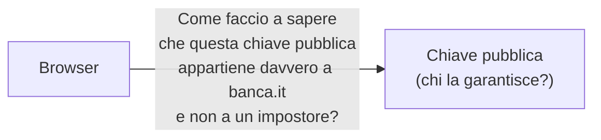
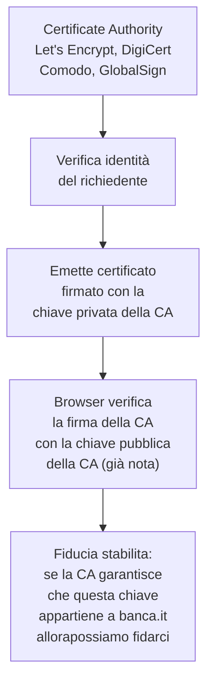
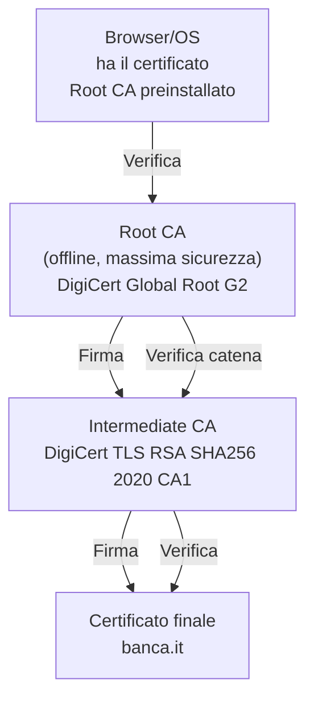
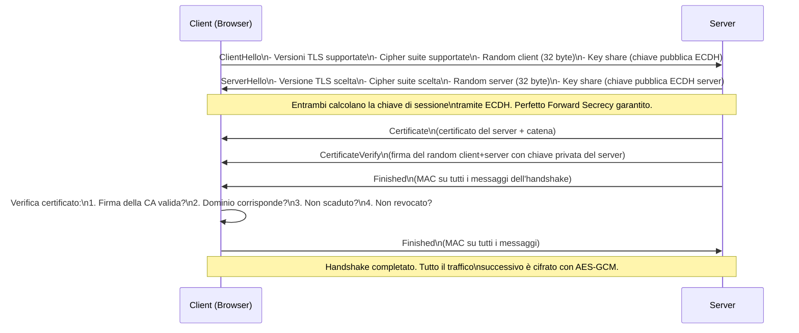
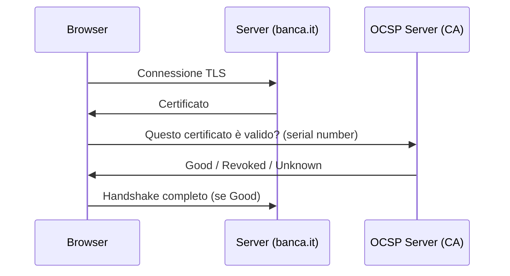
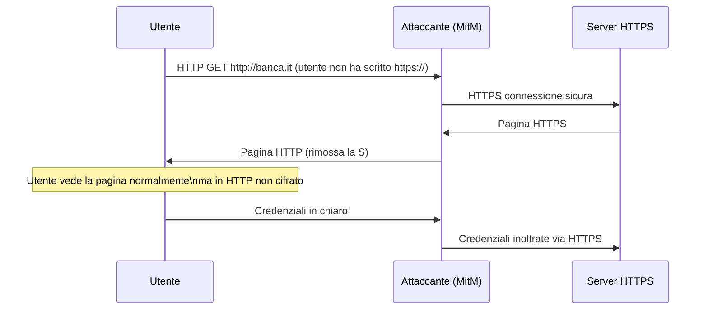
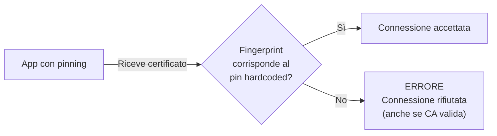

# PKI e certificati digitali: CA, catena di fiducia e TLS handshake

## Introduzione

Ogni volta che il tuo browser mostra il lucchetto verde su un sito HTTPS, sta avvenendo qualcosa di straordinario: due computer che non si sono mai incontrati si fidano l'uno dell'altro in modo verificabile, su un canale intrinsecamente insicuro come internet. Questo miracolo è reso possibile dalla **Public Key Infrastructure** (PKI) — un sistema di fiducia gerarchica basato sulla crittografia asimmetrica.

Capire la PKI significa capire il fondamento su cui poggia la sicurezza di tutto il web moderno — e capire perché certi attacchi sono possibili nonostante HTTPS.

---

## Il problema della fiducia su internet

Immagina di voler comunicare in modo sicuro con la tua banca online. Sai che il suo indirizzo è `banca.it`. Ma come fai a sapere che il server con cui stai comunicando è davvero quello della banca, e non un impostore?

La crittografia asimmetrica risolve il problema della riservatezza — ma non dell'identità. Chiunque può generare una coppia di chiavi pubblica/privata e dichiarare di essere chiunque. Senza un sistema per verificare l'identità, la crittografia da sola non basta.



La risposta è la PKI: un sistema di terze parti fidate che **certificano** l'associazione tra una chiave pubblica e un'identità reale.

---

## Il certificato digitale X.509

Un certificato digitale è un documento elettronico che associa una chiave pubblica a un'identità. Lo standard è **X.509**, usato da TLS/HTTPS, email cifrate (S/MIME), firma di codice, e molto altro.

### Contenuto di un certificato

```
Certificate:
    Data:
        Version: 3
        Serial Number: 04:00:00:00:00:01:44:4e:f0:42:47
        Signature Algorithm: sha256WithRSAEncryption
        Issuer: C=US, O=Let's Encrypt, CN=R3
        Validity:
            Not Before: Mar 15 00:00:00 2026 GMT
            Not After : Jun 13 00:00:00 2026 GMT
        Subject: CN=pasta-cod3.github.io
        Subject Public Key Info:
            Public Key Algorithm: id-ecPublicKey
            EC Public Key: (256 bit)
                ...chiave pubblica...
        X509v3 extensions:
            X509v3 Subject Alternative Name:
                DNS:pasta-cod3.github.io
            X509v3 Key Usage:
                Digital Signature, Key Encipherment
            X509v3 Basic Constraints:
                CA:FALSE
    Signature Algorithm: sha256WithRSAEncryption
        ...firma della CA...
```

Gli elementi chiave:
- **Subject:** a chi appartiene il certificato
- **Issuer:** chi lo ha emesso (la CA)
- **Validity:** periodo di validità
- **Public Key:** la chiave pubblica del soggetto
- **Signature:** la firma digitale della CA che garantisce tutto

---

## Le Certificate Authority (CA)

Una **Certificate Authority** è un'organizzazione che verifica l'identità dei richiedenti e rilascia certificati digitali. È la terza parte fidata che risolve il problema dell'identità.



### Come funziona la verifica dell'identità

Le CA verificano l'identità a diversi livelli:

**Domain Validation (DV):** la CA verifica solo che il richiedente controlli il dominio — mettendo un file specifico su `/.well-known/acme-challenge/`, rispondendo a un'email inviata all'indirizzo registrato del dominio, o aggiungendo un record TXT al DNS. Automatizzabile in secondi. Usato da Let's Encrypt.

**Organization Validation (OV):** la CA verifica anche l'identità legale dell'organizzazione — documenti aziendali, registrazione commerciale, numero di telefono. Richiede giorni. Il certificato contiene il nome dell'organizzazione.

**Extended Validation (EV):** verifica approfondita dell'identità legale, fisica e operativa dell'organizzazione. Richiedeva settimane. I browser moderni non mostrano più la barra verde EV in modo prominente — la distinzione visiva è stata rimossa perché confondeva gli utenti.

---

## La catena di fiducia

Le CA sono organizzate gerarchicamente. In cima ci sono le **Root CA** — organizzazioni con chiavi private custodite in vault fisici con sicurezza estrema (cerimonie formali, HSM, testimoni multipli, cage di Faraday).



Le Root CA non emettono certificati finali direttamente — usano **Intermediate CA** come buffer. Se una Intermediate CA venisse compromessa, può essere revocata senza toccare la Root CA. Una Root CA compromessa sarebbe catastrofica — richiederebbe di aggiornare la trust store di tutti i browser e sistemi operativi del mondo.

### Il trust store

Il browser (e il sistema operativo) ha preinstallato un elenco di Root CA fidate — il **trust store**. Su Chrome/Firefox sono circa 130-150. Su Windows, macOS, iOS, Android ce ne sono altrettante.

```bash
# Su Linux, vedere le Root CA fidate
ls /etc/ssl/certs/

# Su macOS
security find-certificate -a -p /System/Library/Keychains/SystemRootCertificates.keychain
```

Se una CA non è nel trust store, il browser mostra un errore ("certificato non attendibile"). Se una CA nel trust store emette un certificato malevolo, il browser lo accetterà silenziosamente.

---

## Il TLS Handshake in dettaglio

Vediamo esattamente cosa succede quando il browser stabilisce una connessione HTTPS con TLS 1.3 (lo standard attuale):



In TLS 1.3 l'handshake è ridotto a **1 RTT** (round trip) contro i 2 RTT di TLS 1.2 — più veloce e più sicuro.

### Cosa verifica il browser

**1. Firma valida:** il certificato è stato firmato dalla CA dichiarata? La firma viene verificata con la chiave pubblica della CA.

**2. Catena completa:** ogni certificato nella catena è stato firmato da quello superiore, risalendo fino a una Root CA nel trust store.

**3. Dominio corrispondente:** il campo `Subject` o `Subject Alternative Name` include il dominio che stiamo visitando. Un certificato per `banca.it` non è valido per `banca2.it`.

**4. Non scaduto:** `Not Before` e `Not After` definiscono il periodo di validità. Certificati scaduti vengono rifiutati.

**5. Non revocato:** il certificato non compare nelle liste di revoca (CRL o OCSP).

---

## Revoca dei certificati

Cosa succede se la chiave privata di un certificato viene compromessa prima della sua scadenza? Il certificato deve essere **revocato** — invalidato prima della scadenza naturale.

### CRL — Certificate Revocation List

La CA pubblica periodicamente una lista di certificati revocati. Il browser scarica la lista e verifica se il certificato è presente.

Problemi: le CRL possono diventare enormi, vengono aggiornate con ritardo, e richiedono download periodici.

### OCSP — Online Certificate Status Protocol



OCSP permette una verifica in tempo reale ma introduce un problema di privacy (la CA sa quale sito stai visitando) e di performance (latenza aggiuntiva per ogni connessione).

### OCSP Stapling

Il server interroga l'OCSP server per conto del client e include la risposta (con timestamp e firma) direttamente nell'handshake TLS. Il client non deve fare query separate.

### Il problema della revoca nella pratica

La revoca del certificato è notoriamente problematica. La maggior parte dei browser usa il **soft-fail**: se non riesce a verificare lo stato di revoca (OCSP server irraggiungibile), procede ugualmente. Un attaccante che ha rubato una chiave privata può bloccare le query OCSP per aggirare la revoca.

**Certificate Transparency (CT):** ogni certificato emesso deve essere registrato in log pubblici e verificabili. I browser rifiutano certificati non presenti nei log CT. Questo non risolve la revoca, ma rende impossibile emettere certificati segreti senza che vengano scoperti.

---

## Attacchi alla PKI

### Rogue CA

Se una CA viene compromessa, può emettere certificati validi per qualsiasi dominio. Il browser accetterà queste connessioni come legittime.

Nel 2011, la CA olandese DigiNotar fu compromessa. Gli attaccanti emisero certificati fraudolenti per Google, Yahoo, e molti altri domini. Il governo iraniano usò questi certificati per intercettare le comunicazioni di 300.000 utenti iraniani con Gmail. DigiNotar fu rimossa dal trust store di tutti i browser e dichiarò bancarotta poche settimane dopo.

### SSL Stripping



**HSTS (HTTP Strict Transport Security)** mitiga l'SSL stripping: il server dichiara che il suo dominio deve essere contattato solo via HTTPS per un periodo definito. Il browser memorizza questa istruzione e rifiuta le connessioni HTTP.

```
Strict-Transport-Security: max-age=31536000; includeSubDomains; preload
```

Il **preload list** di HSTS è una lista di domini hardcoded nei browser che vengono sempre contattati via HTTPS, anche alla prima visita.

### Certificate Pinning

Alcune applicazioni mobile implementano il **certificate pinning**: invece di fidarsi di qualsiasi CA nel trust store, l'app accetta solo certificati specifici (o con fingerprint specifici) hardcoded nel codice.



Questo protegge anche se una CA viene compromessa — ma rende difficile l'ispezione del traffico per il debugging e rompe le connessioni quando il certificato viene rinnovato se il pin non viene aggiornato.

---

## Let's Encrypt e la democratizzazione dei certificati

Prima di Let's Encrypt (2015), i certificati TLS costavano tra 50 e diverse centinaia di euro all'anno. Questo aveva portato a un web dove HTTPS era riservato a banche e grandi aziende.

Let's Encrypt è una CA non-profit che emette certificati gratuiti, automatizzati, e con validità di 90 giorni tramite il protocollo ACME.

```bash
# Ottenere un certificato con certbot (ACME client)
certbot --nginx -d example.com -d www.example.com

# Rinnovo automatico
certbot renew --quiet
```

Il protocollo ACME verifica automaticamente il controllo del dominio (DV) e oggi copre oltre il 50% di tutti i certificati TLS su internet.

La validità di 90 giorni è una scelta deliberata di sicurezza: certificati più corti riducono la finestra temporale in cui un certificato compromesso rimane valido.

---

## Certificati self-signed

Un certificato self-signed è firmato dalla propria chiave privata invece che da una CA. Il soggetto e l'issuer sono la stessa entità.

```bash
# Genera un certificato self-signed
openssl req -x509 -newkey rsa:4096 -keyout key.pem -out cert.pem -days 365 -nodes \
  -subj "/CN=myserver.local"
```

Il browser mostrerà un avviso di sicurezza perché non c'è una CA fidata che garantisce l'identità. Utili per ambienti di sviluppo interni, ma non per servizi esposti a utenti esterni.

---

## Conclusione

La PKI è l'infrastruttura invisibile che permette a miliardi di persone di fare operazioni bancarie, acquisti, e comunicazioni private online senza doversi mai incontrare di persona per stabilire la fiducia. È un sistema elegante — ma non infallibile.

I punti di debolezza sono noti: CA compromesse, revoca inefficace, SSL stripping. Le soluzioni — Certificate Transparency, HSTS preloading, OCSP Stapling, CAA records — migliorano progressivamente il sistema senza richiedere una sostituzione completa.

Per chi lavora in sicurezza, capire la PKI significa capire perché il lucchetto HTTPS non è una garanzia assoluta, come configurare correttamente TLS su un server, e come riconoscere un certificato sospetto o mal configurato.
