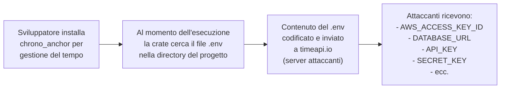

# Cinque crate Rust malevoli rubano .env dalle pipeline CI/CD

## Il fatto

L'11 marzo 2026, i ricercatori di **Socket** — la società di sicurezza specializzata in supply chain del software — hanno scoperto cinque **crate Rust malevoli** pubblicate su **crates.io**, il registry ufficiale del linguaggio Rust. I pacchetti si spacciano per utility legate alla gestione del tempo, ma in realtà trasmettono silenziosamente il contenuto dei file `.env` ai server degli attaccanti.

I cinque crate identificati sono:
- `chrono_anchor`
- `dnp3times`
- `time_calibrator`
- `time_calibrators`
- `time-sync`

---

## Il meccanismo: il file .env come bersaglio

I file `.env` sono il posto dove gli sviluppatori memorizzano le variabili d'ambiente delle loro applicazioni: API key, credenziali di database, token di autenticazione, segreti per JWT, chiavi di cifratura, accessi a servizi cloud. Sono per definizione i file più ricchi di segreti in qualsiasi progetto software.

Nelle pipeline CI/CD, i file `.env` sono ancora più preziosi: contengono spesso credenziali di produzione, token con accesso a AWS/GCP/Azure, chiavi per pubblicare package su npm o PyPI, e molto altro.

Il nome del dominio C2 è `timeapi.io` — scelto deliberatamente per sembrare un servizio legittimo di time API, coerente con la funzione dichiarata dei pacchetti.

---

## La tecnica del typosquatting temporale

Tutti e cinque i nomi sono variazioni sul tema della gestione del tempo — un'area legittima e frequentemente usata nello sviluppo Rust. La libreria `chrono` è una delle crate più scaricate dell'ecosistema Rust. Un package chiamato `chrono_anchor` sfrutta la familiarità con quel nome.

Questo è il classico **typosquatting/confusquatting**: il pacchetto malevolo non imita il nome esatto di una libreria famosa (il che sarebbe immediatamente sospetto) ma usa un nome che suona familiare e legittimo nello stesso dominio.

---

## CI/CD come vettore d'attacco privilegiato

Le pipeline CI/CD sono bersagli di alto valore perché:

- Girano con credenziali di produzione e deployment
- Hanno accesso agli ambienti cloud e ai registry di package
- Producono artefatti che vengono distribuiti agli utenti finali
- Spesso hanno accesso in scrittura a repository e infrastruttura

Una singola compromissione di una pipeline CI/CD può tradursi in:
- Furto di credenziali cloud con accesso admin
- Iniezione di backdoor negli artefatti prodotti (supply chain attack downstream)
- Accesso ai segreti di tutti i servizi integrati

---

## Il problema strutturale di crates.io

A differenza di npm, che ha implementato progressivamente review automatizzate e analisi dei package, **crates.io** ha storicamente avuto processi di vetting più limitati. La pubblicazione di un package richiede solo un account GitHub — nessuna verifica dell'identità, nessuna analisi automatica del codice.

La community Rust ha avviato discussioni su come migliorare la sicurezza del registry, ma l'implementazione di controlli più robusti richiede risorse che un progetto open source fatica ad allocare.

---

## Come difendersi

- Usa strumenti di **software composition analysis (SCA)** come Socket, Dependabot o Snyk che analizzano il comportamento delle dipendenze
- Prima di aggiungere una crate, verifica il numero di download, la data di prima pubblicazione, e la reputazione del publisher
- Implementa policy che limitino le dipendenze a package con un minimo di storico e review
- Non salvare file `.env` con segreti di produzione nelle directory radice dei progetti — usa sistemi dedicati come AWS Secrets Manager, HashiCorp Vault, o 1Password Secrets Automation
- Monitora il traffico di rete in uscita dalle pipeline CI/CD per connessioni a domini inattesi

---

## Conclusione

Cinque crate che sembrano utility per la gestione del tempo — un'area di codice banale e difficilmente sospetta. Questo è esattamente il punto: gli attaccanti scelgono aree di funzionalità che sviluppatori di qualsiasi livello tendono ad aggiungere senza pensarci troppo. La supply chain del software è vulnerabile perché nessuno ha il tempo di leggere il codice di ogni dipendenza che installa. Strumenti automatizzati di analisi comportamentale sono l'unica difesa scalabile.
