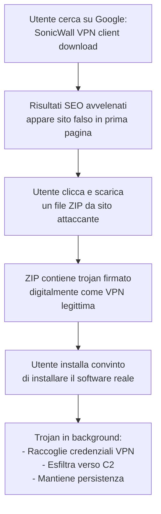

# Storm-2561: falsi client VPN rubano credenziali tramite SEO poisoning

## Il fatto

A metà gennaio 2026, il team **Microsoft Threat Intelligence** ha identificato una campagna malevola condotta da un threat actor tracciato come **Storm-2561** — un gruppo con un storico di attività di distribuzione malware tramite SEO poisoning attivo almeno da maggio 2025.

La campagna è sofisticata nella sua semplicità: gli utenti che cercano su Google software VPN enterprise legittimo vengono reindirizzati a siti controllati dagli attaccanti che distribuiscono trojan firmati digitalmente, progettati per sembrare client VPN autentici mentre rubano silenziosamente le credenziali VPN.

---

## Come funziona l'attacco

### SEO Poisoning

Il SEO poisoning è una tecnica dove gli attaccanti ottimizzano siti malevoli per apparire in cima ai risultati di ricerca per query legittime. Nel caso di Storm-2561, le query target includevano ricerche per prodotti enterprise come:

- **SonicWall** — firewall e VPN aziendali
- **Hanwha Vision** — sistemi di videosorveglianza IP
- **Pulse Secure / Ivanti Secure** — soluzioni di accesso remoto

Questi sono software tipicamente cercati da amministratori IT e sistemisti — persone con accesso privilegiato alle reti aziendali. Il targeting è preciso: non utenti consumer, ma professionisti con credenziali di valore.

### Trojan firmati digitalmente

Il dettaglio più preoccupante della campagna è l'uso di **firme digitali valide** sui trojan distribuiti. Il codice malevolo viene firmato con certificati legittimi — probabilmente acquistati, rubati, o ottenuti tramite aziende di comodo — che bypassano i controlli di Windows SmartScreen e molte soluzioni antivirus che si basano sulla firma del codice come indicatore di legittimità.

---

## Il valore delle credenziali VPN

Perché le credenziali VPN sono così preziose per gli attaccanti?

Una credenziale VPN aziendale valida è spesso la chiave che apre l'intera rete interna. A differenza di una password per un'applicazione web, la VPN tipicamente dà accesso a:

- Sistemi non esposti su internet (database, server interni, Active Directory)
- Segmenti di rete critici
- Accesso come se l'attaccante fosse fisicamente nell'ufficio

Per questo le credenziali VPN hanno un valore altissimo sui mercati underground e sono spesso vendute come "initial access" dai **Initial Access Broker (IAB)** — criminali specializzati nel vendere l'accesso a reti aziendali già compromesse ad altri gruppi (tipicamente ransomware).

---

## Initial Access Broker: il mercato che sta dietro

Storm-2561 opera in un ecosistema criminale dove la specializzazione è la norma. I gruppi come questo non necessariamente gestiscono le intrusioni successive: vendono l'accesso ottenuto ad altri attori.

Il mercato degli IAB è stimato in crescita costante. Una credenziale VPN per un'azienda Fortune 500 può valere da qualche migliaio a decine di migliaia di dollari sul darknet, a seconda dei privilegi associati e del settore dell'azienda target.

---

## Come difendersi

**Per gli utenti:**
- Scarica sempre il software dai siti ufficiali del vendor — non da risultati di ricerca generici
- Verifica l'URL prima di scaricare: il sito di SonicWall è `sonicwall.com`, non varianti simili
- Usa un password manager: le credenziali VPN non devono essere riutilizzate su altri servizi

**Per le organizzazioni:**
- Implementa MFA su tutti i punti di accesso VPN — le credenziali rubate da sole non bastano
- Considera soluzioni ZTNA (Zero Trust Network Access) che eliminano la VPN tradizionale
- Monitora i log di autenticazione VPN per login anomali (orari insoliti, posizioni geografiche diverse, multiple sessioni simultanee)
- Utilizza soluzioni di DNS filtering per bloccare i domain distribuiti dagli attaccanti

---

## Conclusione

Storm-2561 dimostra che gli attacchi più efficaci non richiedono exploit tecnici avanzati. Avvelenare i risultati di ricerca, confezionare un installer convincente con firma digitale valida, e aspettare che gli amministratori IT scarichino "il loro software" è sufficiente per compromettere reti aziendali. La difesa inizia dall'igiene di download: solo siti ufficiali, sempre.
