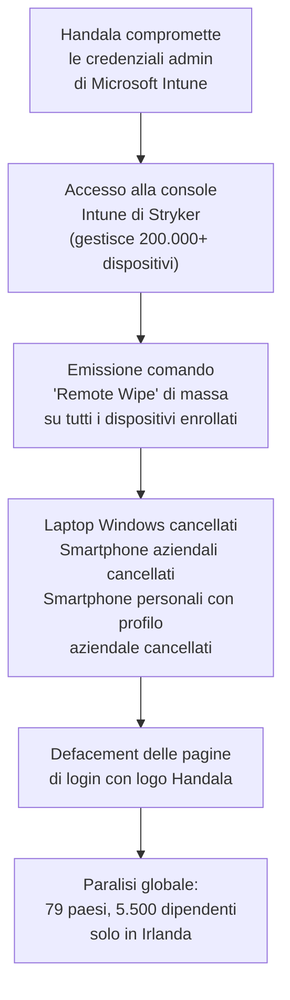

# Stryker: Handala cancella 200.000 dispositivi con Microsoft Intune come arma

## Il fatto

L'11 marzo 2026, poco dopo la mezzanotte, i dipendenti di Stryker Corporation in tutto il mondo — Stati Uniti, Irlanda, Australia, India e altri paesi — hanno cominciato a perdere l'accesso a reti aziendali, sistemi interni e comunicazioni. Dispositivi connessi alla rete sono stati cancellati o resi inutilizzabili, e alcune pagine di login hanno iniziato a mostrare il logo di un gruppo hacker.

Il gruppo responsabile si chiama **Handala** — un collettivo hacktivista legato all'Iran. In poche ore, Handala ha rivendicato un "colpo senza precedenti" contro Stryker, sostenendo di aver cancellato oltre 200.000 sistemi, server e dispositivi mobile in 79 paesi, e di aver esfiltrato 50 terabyte di dati critici prima di eseguire il wipe.

Stryker è una delle più grandi aziende di tecnologia medica al mondo. Fortune 500, 56.000 dipendenti, oltre 25 miliardi di dollari di fatturato nel 2025 — e produttrice di dispositivi chirurgici, impianti ortopedici e neurotecnologie usati in ospedali di tutto il mondo.

---

## L'arma: Microsoft Intune usato contro se stesso

Il dettaglio più inquietante dell'attacco non è il malware — perché malware, tecnicamente, non c'era. Secondo una fonte con conoscenza diretta dell'attacco che ha parlato con KrebsOnSecurity, i responsabili sembrano aver usato Microsoft Intune — un servizio Microsoft per la gestione dei dispositivi aziendali — per emettere un comando di "remote wipe" contro tutti i dispositivi connessi.

Intune è uno strumento legittimo, usato dai team IT per gestire e proteggere i dispositivi aziendali da un'unica console web. Include una funzionalità di cancellazione remota progettata per i dispositivi smarriti o rubati. Questo vettore d'attacco è importante perché significa che i tool tradizionali di endpoint detection potrebbero non aver rilevato la fase iniziale: il wipe è stato eseguito tramite canali amministrativi legittimi.

Dipendenti Stryker su Reddit hanno confermato di aver ricevuto istruzioni urgenti di disinstallare Intune Company Portal, Teams e il client VPN dai propri dispositivi personali — nel tentativo di fermare la propagazione del wipe ai device privati enrollati per accesso aziendale.

---

## La motivazione: geopolitica e vendetta

Handala ha pubblicato un messaggio sostenendo di aver attaccato Stryker "in ritorsione per il brutale attacco alla scuola di Minab e in risposta ai continui attacchi informatici contro le infrastrutture" dell'Iran e dei suoi alleati. Il gruppo si riferiva alla scuola femminile di Minab a Teheran, che l'esercito americano avrebbe bombardato nei suoi recenti attacchi contro l'Iran, uccidendo più di 175 persone, la maggior parte bambini.

Il manifesto di Handala si riferisce a Stryker come una "corporazione di radici sioniste" — un riferimento alla acquisizione nel 2019 dell'azienda israeliana OrthoSpace da parte di Stryker.

---

## Chi è Handala

Handala (conosciuto anche come Handala Hack Team, Hatef, Hamsa) è emerso nel dicembre 2023 come operazione hacktivista legata al Ministero dell'Intelligence e della Sicurezza iraniano (MOIS), con obiettivo principale le organizzazioni israeliane, usando malware distruttivo progettato per cancellare dispositivi Windows e Linux.

Secondo IBM X-Force Exchange, le operazioni di Handala si concentrano sull'impatto distruttivo e psicologico. Il gruppo impiega phishing, wiper malware personalizzato, estorsione in stile ransomware, furto di dati e attività hack-and-leak. Le campagne presentano sistematicamente messaggi ideologici, rivendicazioni gonfiate o fuorvianti, e targeting deliberato di settori critici come sanità ed energia.

---

## L'impatto operativo

In Irlanda, l'interruzione improvvisa ha colpito oltre 5.500 dipendenti, bloccando immediatamente le attività di progettazione e ingegneria presso i principali hub tecnologici. Cork rappresenta la base più grande di Stryker fuori dagli Stati Uniti, profondamente integrata nella rete produttiva globale dell'azienda.

Numerosi dipendenti hanno riferito che l'attacco ha interrotto l'accesso ai servizi e alle applicazioni interne, costringendo alcune sedi a tornare ai flussi di lavoro "carta e penna" dopo che i sistemi sono diventati inaccessibili.

Stryker produce dispositivi implantabili, strumenti chirurgici e attrezzature per ospedali in tutto il mondo. Una interruzione prolungata delle attività di produzione significa ritardi nelle forniture di dispositivi medici critici.

---

## La risposta di Stryker e della CISA

Un portavoce di Stryker ha dichiarato a TechCrunch: "Stryker sta vivendo un'interruzione globale della rete nel nostro ambiente Microsoft a causa di un attacco informatico. Non abbiamo indicazioni di ransomware o malware e riteniamo che l'incidente sia contenuto."

L'azienda ha presentato un Form 8-K alla SEC — il documento obbligatorio per eventi materiali che possono influenzare il valore azionario. La CISA ha dichiarato di star lavorando "spalla a spalla con i partner del settore pubblico e privato mentre continuiamo a scoprire informazioni rilevanti e forniamo assistenza tecnica per l'attacco mirato a Stryker."

---

## La lezione: MDM come superficie d'attacco critica

Questo vettore d'attacco è significativo perché significa che i tool tradizionali di endpoint detection potrebbero non aver rilevato la fase iniziale. Il wipe è stato eseguito tramite canali amministrativi legittimi.

**Misure immediate raccomandate per chi usa Intune:**
- Abilitare l'approvazione da parte di un secondo amministratore per operazioni ad alto impatto (remote wipe, bulk policy deployment)
- Implementare MFA con FIDO2 sugli account admin Intune
- Monitorare gli accessi alla console Intune per attività anomale
- Inventariare quali dispositivi personali sono enrollati e rivedere la policy

---

## Conclusione

L'attacco a Stryker non è stato eseguito con malware esotico o zero-day sconosciuti. È stato eseguito abusando di uno strumento di gestione aziendale legittimo. Questo è il segnale più preoccupante: la superficie d'attacco include ora ogni strumento amministrativo con accesso privilegiato ai dispositivi. Chi controlla Intune, controlla ogni laptop e smartphone dell'organizzazione.
