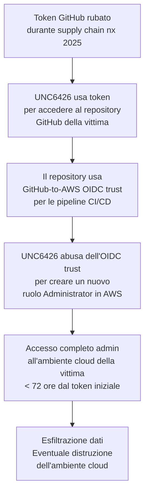

# UNC6426: da un token GitHub rubato ad admin AWS in 72 ore

## Il fatto

L'11 marzo 2026, Google Threat Intelligence ha pubblicato il **Cloud Threat Horizons Report H1 2026**, documentando uno degli attacchi cloud più rapidi e metodici degli ultimi anni. Un threat actor identificato come **UNC6426** ha sfruttato chiavi rubate durante il supply chain attack del pacchetto **nx npm** nel 2025 per compromettere completamente l'ambiente cloud di una vittima in meno di **72 ore**.

---

## Il punto di partenza: l'attacco alla supply chain nx

Nel 2025, il pacchetto npm **nx** — usato da centinaia di migliaia di sviluppatori per gestire monorepo JavaScript e TypeScript — fu vittima di un supply chain attack. L'attacco iniettò codice malevolo che, durante l'installazione in ambienti CI/CD, rubava i token GitHub e le variabili d'ambiente presenti nel sistema.

nx è uno strumento core nell'ecosistema Angular, React e Node.js enterprise. La compromissione ha distribuito token rubati a migliaia di pipeline di sviluppo prima che il problema venisse identificato e risolto. Molte organizzazioni hanno ruotato le credenziali — ma non tutte.

---

## La catena di compromissione: 72 ore

UNC6426 ha usato un token GitHub rubato durante quell'attacco per innescare una escalation fulminante:



Il passaggio critico è l'abuso del **GitHub-to-AWS OIDC (OpenID Connect) trust**. Questa è una feature legittima che permette alle pipeline GitHub Actions di autenticarsi ad AWS senza credenziali statiche, usando token OIDC temporanei. È una buona pratica di sicurezza — ma solo se il repository GitHub è sicuro. Quando UNC6426 controllava il repository, poteva assumere i ruoli AWS configurati per quella pipeline.

---

## Perché OIDC trust è una superficie d'attacco sottovalutata

Molte organizzazioni configurano trust OIDC tra GitHub e AWS senza restrizioni sufficienti sulle condizioni dell'assunzione del ruolo. Una configurazione comune ma insicura è:

```json
{
  "Condition": {
    "StringLike": {
      "token.actions.githubusercontent.com:sub": "repo:myorg/myrepo:*"
    }
  }
}
```

Il wildcard `*` alla fine significa che qualsiasi branch, tag, o workflow nel repository può assumere quel ruolo. Se l'attaccante controlla il repository, controlla AWS.

La configurazione corretta dovrebbe specificare branch protetti o ambienti specifici:

```json
{
  "Condition": {
    "StringEquals": {
      "token.actions.githubusercontent.com:sub": "repo:myorg/myrepo:ref:refs/heads/main",
      "token.actions.githubusercontent.com:environment": "production"
    }
  }
}
```

---

## Le implicazioni per la supply chain

Il caso UNC6426 dimostra una proprietà pericolosa degli attacchi supply chain: le chiavi rubate non hanno una data di scadenza immediata. Un token rubato mesi prima, in un attacco che sembrava risolto, può essere tenuto in riserva e usato quando l'opportunità si presenta — o venduto ad altri actor.

---

## Cosa fare

- Ruota immediatamente tutti i token GitHub e le chiavi API presenti in ambienti CI/CD che usavano nx nel 2025
- Rivedi le policy OIDC trust tra GitHub e AWS, eliminando i wildcard e limitando a branch/ambienti specifici
- Monitora i log di AWS CloudTrail per creazioni di ruoli IAM non pianificate
- Implementa SCP (Service Control Policies) che blocchino la creazione di ruoli con permessi Admin da pipeline CI/CD
