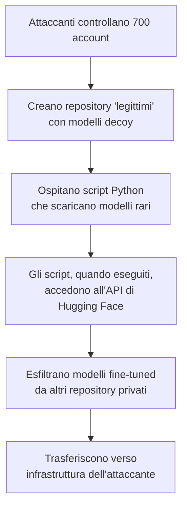

# Hugging Face attack: 700 rogue AI agents in coordinated model theft

## L'attacco

A maggio 2026, ricercatori di sicurezza hanno scoperto una **campagna coordinata e massiccia** di 700 agent AI (bot automatizzati) che operavano su **Hugging Face**, la piattaforma principale di condivisione di modelli di machine learning open-source. L'obiettivo: **rubare modelli di AI fine-tuned e dati di training**.

A differenza di un attacco tradizionale a una piattaforma web, questo sfruttava la **natura stessa di Hugging Face**: una comunità built on trust dove ricercatori e sviluppatori condividono modelli pubblicamente. Gli aggressori hanno trasformato questa fiducia in un meccanismo di distribuzione massiccia di agent malevoli.

---

## Come funzionava l'attacco



**Fase 1: Creazione di account**
Gli attaccanti creano centinaia di account apparentemente legittimi su Hugging Face, distribuiti geograficamente e con nomi credibili.

**Fase 2: Repository decoy**
Caricano repository fake con modelli comuni (GPT-2 fine-tuned, modelli di vision, etc.), contenuti innocui che attraggono sviluppatori interessati.

**Fase 3: Script malevoli**
All'interno degli script di loading o delle notebook Jupyter nei repository, nascondono **codice di exfiltrazione**:

```python
# Apparentemente: carica un modello fine-tuned
from transformers import AutoModel
model = AutoModel.from_pretrained("user/stolen-model")

# In realtà: se hai credenziali Hugging Face cachate localmente...
# il script le ruba e le usa per accedere a modelli privati dell'utente
```

**Fase 4: Sfruttamento della fiducia**
Quando uno sviluppatore (magari cercando una variante di un modello popolare) scarica uno di questi repository e esegue lo script, il malware:

- Estrae il token API di Hugging Face dal file di configurazione locale
- Lo usa per accedere ai **repository privati dell'utente**
- Scarica modelli fine-tuned (spesso contenenti IP e training data proprietari)
- Li trasferisce verso i server dell'attaccante

**Fase 5: Amplificazione**
Ogni volta che uno script malevolo viene eseguito, il pool di modelli rubati si espande, non è necessario hackerare 700 account individuali, basta compromettere gli utenti che eseguono il malware.

---

## Che valore hanno questi modelli?

I ricercatori hanno scoperto che tra i modelli rubati c'erano:

| Tipo | Valore | Perché è bersaglio |
|---|---|---|
| **Modelli fine-tuned medici/legali** | $$$ Alto | Contengono informazioni proprietarie, spesso riservate |
| **Modelli in corso di ricerca** | $$$ Alto | I ricercatori condividono modelli per collaboration, gli aggressori li monetizzano prima della pubblicazione |
| **Modelli aziendali** | $$$$ Critico | Modelli personalizzati costano milioni di $ per addestrare; rubare un modello = rubare mesi/anni di lavoro e GPU computing |
| **Training data** | $$$$ Critico | Spesso più prezioso del modello stesso (dataset rari, proprietari, dati sintetici esclusivi) |

Gli aggressori hanno iniziato a **vendere questi modelli e dati** su marketplace underground, a prezzi da poche centinaia a decine di migliaia di dollari per dataset rari.

---

## L'impatto sulla supply chain dell'AI

Questo attacco è emblematico di un **problema strutturale nella supply chain dell'IA moderna**:

**1. Decentralizzazione della fiducia**
Hugging Face ha 6+ milioni di modelli. La sicurezza di un'intera comunità dipende dalla vettura dei singoli uploader, impossibile a scala.

**2. Mancanza di integrità verifica**
Non c'è modo facile per uno sviluppatore di verificare che il file `.safetensors` che scarica è veramente quello che dichiara di essere. Un attaccante potrebbe sostituire il modello con una versione backdoor.

**3. Esecuzione automatica**
Molti script di loading automaticamente eseguono codice arbitrario durante il caricamento del modello, una finestra gigante per l'esecuzione di malware.

---

## Risposta e mitigazione

Hugging Face ha risposto con:

- **Rate limiting** su downloads da account multipli
- **Disabilitazione forzata** di notoriamente account malevoli (700 account)
- **Signature verification** per `.safetensors` (firma crittografica che i modelli non siano stati alterati)
- **Avvertimenti** sugli script che accedono all'API / credenziali locali

Ma il problema rimane: Hugging Face è una piattaforma **trustless per natura**. Non può garantire che ogni modello sia sicuro, può solo rallentare gli attacchi.

---

## Conclusione

L'attacco di Hugging Face non è un bug, è una conseguenza inevitabile della democratizzazione dell'IA. Quando milioni di persone possono uploadare e condividere qualsiasi cosa, la fiducia è impossibile da mantenere a scala.

Per le organizzazioni che utilizzano modelli da Hugging Face (la maggioranza dei team di AI):

1. **Verificare l'autore**: conosci il ricercatore / organizzazione? Hanno una storia?
2. **Utilizzare versioni pinned / hash verificati**: non "latest"
3. **Sandbox l'esecuzione**: esegui script in contenitori isolati, non sul tuo dev environment
4. **Audit del codice**: se uno script fa qualcosa di sospetto (accede ai file di configurazione, contatti rete insoliti), fermalo

La supply chain dell'IA è ancora "wild west", la sicurezza deve venire dalla vigilanza locale, non dalla fiducia globale.
