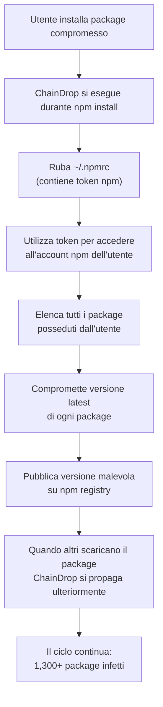

# ChainDrop: Malware NPM che si auto-riproduce e infetta 1,300+ Package

## L'attacco

A luglio 2026, ricercatori di sicurezza hanno scoperto una **campagna massiva di malware auto-propagante** su npm (Node Package Manager), il repository di pacchetti JavaScript più grande al mondo.

Il malware, chiamato **ChainDrop**, è particolare perché non è un attacco "one-shot" — è un **worm**: quando un package è compromesso e viene eseguito, il malware automaticamente:

1. Ruba credenziali npm dell'utente
2. Accede all'account dell'utente su npm
3. Compromette altri package posseduti da quell'utente
4. Si propaga ad altri package sulla piattaforma

Risultato: **1,300+ package** compromessi, con **2 miliardi di download mensili complessivi**.

---

## Come funziona la self-propagation

---

## Timeline di scoperta

| Fase | Timeline | Dettagli |
|---|---|---|
| **Infezione iniziale** | Metà luglio | Un o pochi package inizialmente compromessi |
| **Propagazione esplosiva** | 20-26 luglio | ChainDrop si auto-propaga; 100+ → 500+ → 1,300+ package |
| **Rilevamento** | 28 luglio | Ricercatori di sicurezza notano pattern anomalo di package updates |
| **Disclosure** | 30 luglio | npm e community notificati; advisory pubblico |
| **Remediation** | 31 luglio+ | npm revoca token compromessi; package rimossi/ripristinati |

La **finestra di esposizione** è stata circa 10 giorni — durante i quali ChainDrop ha infettato migliaia di developer machines.

---

## Impatto: chi è stato colpito?

Con 2 miliardi di download mensili, ChainDrop ha potenzialmente raggiunto:

**Tipo di sviluppatori:**
- Sviluppatori frontend (React, Vue, Angular dipendono da centinaia di pacchetti)
- Sviluppatori backend Node.js
- DevOps engineers (package usati in CI/CD pipelines)
- Startup e aziende enterprise che usano npm

**Paesi colpiti:**
Globale — npm ha utenti in 195+ paesi

**Livello di criticità:**
Se ChainDrop è stato installato in una CI/CD pipeline, potrebbe aver compromesso:
- Source code repositories
- Build artifacts
- Credentials di deployment
- Infrastruttura cloud

---

## Il payload: cosa fa ChainDrop

Oltre al furto di credenziali, ChainDrop:

1. **Rubare informazioni sensibili:**
   - Variabili d'ambiente (API keys, secrets, credentials)
   - Contenuto di file home directory
   - SSH keys private
   - Git credentials

2. **Installare backdoor:**
   - Aggiungere crypto-miner all'infrastruttura compromessa
   - Installare C2 beacon per accesso persistente

3. **Esfiltrare dati:**
   - Inviare stolen credentials a server controllato dall'attaccante
   - Esfiltrare source code

4. **Auto-propagarsi:**
   - Come descritto sopra, compromettere altri package

---

## npm response e mitigazione

**npm ha:**
1. ✅ Revocato i token compromessi (invalidando le credenziali rubate)
2. ✅ Rimosso le versioni malevole di 1,300+ package
3. ✅ Ripristinato le versioni clean dai backup
4. ✅ Publicato advisory sulla comunità
5. ✅ Aumentato il monitoraggio per rilevare simili attacchi in futuro

**Limiti della response:**
- ❌ Il malware era stato installato su milioni di dev machines — il ripristino su npm non li pulisce
- ❌ Qualsiasi credenziale / secret esfiltrata è **permanentemente compromessa** — sviluppatori devono ruotarle tutti
- ❌ Qualsiasi artifact di build generato durante l'infezione potrebbe contenere malware

---

## Cosa fare se sei stato esposto

**Se hai installato npm packages tra il 20-28 luglio:**

1. **Upgrade npm** alla versione più recente
2. **Pulisci il tuo sistema:**
   - Cerca processi strani (netstat -tulpn | grep ESTABLISHED)
   - Controlla ~/.npmrc per modifiche non autorizzate
   - Controlla ~/.ssh/id_rsa per accessi recenti
3. **Ruota tutti i secrets:**
   - npm token
   - API keys (AWS, GitHub, etc.)
   - SSH keys
   - Credenziali database
4. **Rivedi i log:**
   - CI/CD logs per esecuzioni anomale
   - Git logs per commit non autorizzati
   - Accessi ai repository

**Se gestisci build CI/CD:**

1. **Rerun il build** con npm registry pulita
2. **Revoca credenziali di deployment** usate durante la finestra di infezione
3. **Ripubblica gli artifact** (Docker images, compiled binaries, etc.)

---

## Lezione: npm supply chain è vulnerabile

ChainDrop dimostra che il modello di npm — chiunque può pubblicare package, e milioni li scaricano di default — **è un perfetto vettore per supply chain attack**.

Il problema non è npm specificamente — è l'intera ecosistema dei package manager (pip per Python, RubyGems, NuGet, etc.):

- **Fiducia implícita:** quando installi un package, assumi che è safe
- **Esecuzione automatica:** `npm install` esegue script automaticamente (package.json "install" script)
- **Scala massiccia:** una singola infezione si propaga a milioni di developer

---

## Conclusione

ChainDrop è una demonstrazione di perché la **supply chain security è il nuovo perimetro di sicurezza**. Non puoi più assumere che tutto il codice che scarichi da un repository pubblico è sicuro.

Per gli sviluppatori:
- ✅ Usa version pinning (specifica versione esatta, non "latest")
- ✅ Revedi il source code di package critici (open source, quindi puoi)
- ✅ Usa tools di scanning per rilevare package malevoli (npm audit, Snyk)
- ✅ Separa CI/CD credentials da dev environment

Per le organizzazioni:
- ✅ Implementa supply chain verification (Software Bill of Materials, signed artifacts)
- ✅ Usa private npm registries per controllare quali package sono consentiti
- ✅ Monitora l'attività di CI/CD pipeline anomala

ChainDrop non è il primo attacco npm supply chain, e non sarà l'ultimo.
