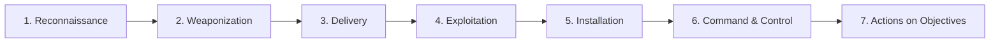
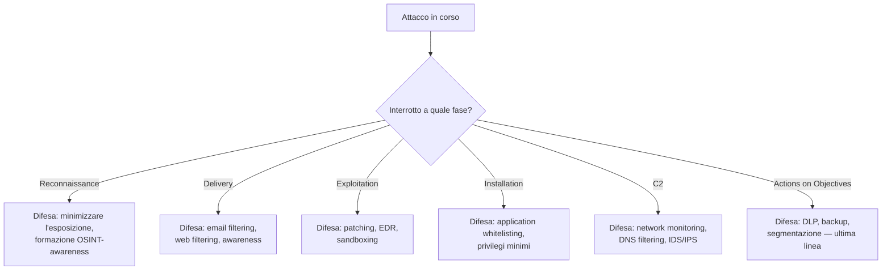
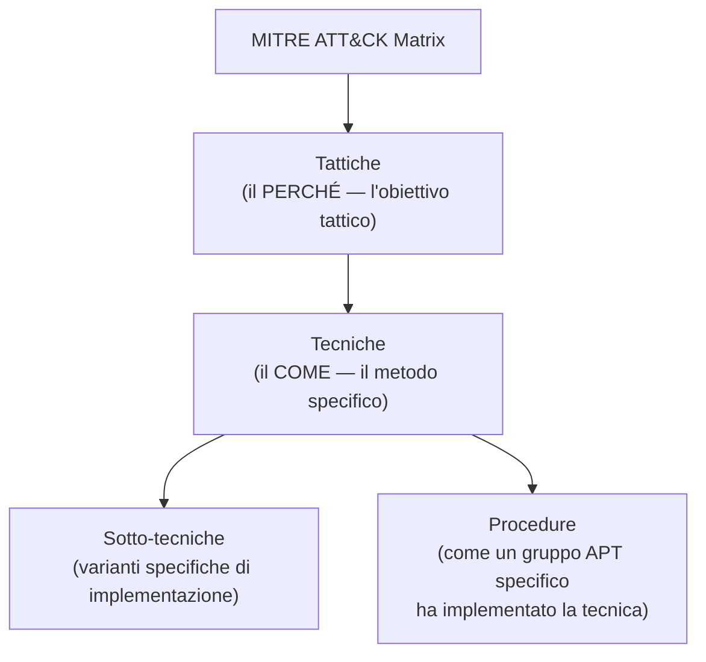
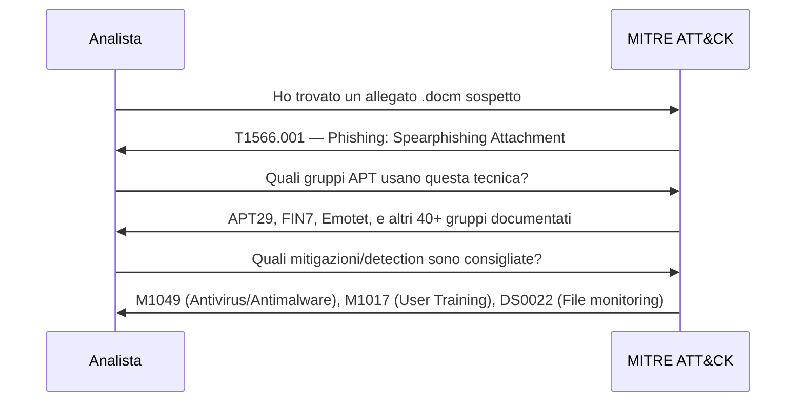

# Cyber Kill Chain e MITRE ATT&CK: le fasi di un attacco informatico

## Introduzione

Quando leggi il report di una breach, o segui un corso di penetration testing, torna sempre lo stesso schema: ricognizione, accesso iniziale, movimento laterale, esfiltrazione. Non è un caso — gli attacchi informatici, per quanto diversi nei dettagli tecnici, seguono fasi ricorrenti. Capire queste fasi è ciò che permette a un difensore di ragionare in anticipo: non "cosa sta facendo l'attaccante ora" ma "cosa farà dopo, e dove posso fermarlo prima che arrivi lì".

Due framework dominano questo modo di pensare: la **Cyber Kill Chain** di Lockheed Martin (2011) e **MITRE ATT&CK** (dal 2013 in poi). Non sono in competizione — rispondono a domande diverse, e i team di sicurezza maturi li usano insieme.

---

## La Cyber Kill Chain

Lockheed Martin ha adattato un concetto militare (la "catena di uccisione" che descrive le fasi di un attacco cinetico) al mondo cyber. L'idea centrale: **un attacco è una sequenza di fasi, e rompere anche una sola fase della catena vanifica l'intero attacco.**

**1. Reconnaissance** — l'attaccante raccoglie informazioni sul target: dipendenti su LinkedIn, tecnologie usate, indirizzi email, infrastruttura esposta. Spesso passa per OSINT puro, senza toccare mai il target.

**2. Weaponization** — l'attaccante prepara l'arma: un documento Office con macro malevola, un exploit per una vulnerabilità nota, un eseguibile confezionato per bypassare l'antivirus.

**3. Delivery** — l'arma raggiunge il target: email di phishing, chiavetta USB abbandonata, exploit su un servizio esposto a internet.

**4. Exploitation** — il codice malevolo viene eseguito: l'utente apre l'allegato e abilita le macro, oppure l'exploit sfrutta una vulnerabilità senza interazione umana.

**5. Installation** — l'attaccante stabilisce persistenza: una backdoor, un servizio che parte al boot, un task pianificato — per non dover ripetere l'exploitation ad ogni riavvio.

**6. Command & Control (C2)** — il malware stabilisce un canale di comunicazione con l'infrastruttura dell'attaccante, per ricevere comandi ed esfiltrare dati.

**7. Actions on Objectives** — l'obiettivo finale: furto di dati, cifratura per ransomware, sabotaggio, movimento laterale verso altri sistemi.

### Il principio difensivo: rompere la catena

Più a monte riesci a fermare l'attacco, meno danno subisci. Fermarlo in fase di reconnaissance è ideale ma raro da rilevare; fermarlo in "actions on objectives" significa che hai già perso — nella migliore delle ipotesi limiti il danno con backup e segmentazione.

### Limiti della Kill Chain

Il modello, per quanto influente, ha dei limiti noti: è stato pensato per il malware tradizionale e per attacchi che seguono un percorso lineare. Non descrive bene gli attacchi web-based (dove exploitation e delivery spesso coincidono), non copre gli insider threat, e non dice **come** vengono eseguite tecnicamente le singole fasi. È qui che entra in gioco MITRE ATT&CK.

---

## MITRE ATT&CK

ATT&CK sta per **Adversarial Tactics, Techniques, and Common Knowledge**. Non è un modello lineare a 7 fasi come la Kill Chain — è una **matrice**, una base di conoscenza pubblica e in continuo aggiornamento delle tecniche reali osservate usate dagli attaccanti.

### Le tattiche (le colonne della matrice)

A differenza della Kill Chain, ATT&CK non impone un ordine rigido: un attaccante può passare da una tattica all'altra e tornare indietro. Le tattiche principali (Enterprise Matrix):

| Tattica | Obiettivo dell'attaccante |
|---|---|
| Reconnaissance | Raccogliere informazioni per pianificare l'attacco |
| Resource Development | Costruire infrastruttura e strumenti (server C2, domini, malware) |
| Initial Access | Ottenere il primo punto d'appoggio nella rete |
| Execution | Eseguire codice malevolo su un sistema |
| Persistence | Mantenere l'accesso attraverso riavvii e cambi di credenziali |
| Privilege Escalation | Ottenere permessi più elevati |
| Defense Evasion | Evitare il rilevamento |
| Credential Access | Rubare credenziali (password, token, hash) |
| Discovery | Esplorare l'ambiente compromesso |
| Lateral Movement | Muoversi verso altri sistemi nella rete |
| Collection | Raccogliere i dati di interesse |
| Command and Control | Comunicare con l'infrastruttura compromessa |
| Exfiltration | Trasferire i dati fuori dalla rete |
| Impact | Manipolare, interrompere o distruggere sistemi/dati |

### Un esempio concreto: T1566 Phishing

Ogni tecnica in ATT&CK ha un ID univoco. **T1566 (Phishing)** appartiene alla tattica *Initial Access* e ha sotto-tecniche specifiche: T1566.001 (allegato malevolo), T1566.002 (link malevolo), T1566.003 (phishing via servizi terzi). Ogni sotto-tecnica documenta esempi reali di gruppi APT che l'hanno usata, e le mitigazioni/rilevamenti associati — rendendo ATT&CK non solo un modello teorico ma un catalogo operativo.

### Come si usa ATT&CK nella pratica

**Threat Intelligence:** i report sui gruppi APT sono mappati su tecniche ATT&CK, permettendo di confrontare in modo standardizzato il comportamento di attori diversi.

**Detection engineering:** i SOC costruiscono regole SIEM/EDR mappate esplicitamente su tecniche ATT&CK, per sapere con certezza quale copertura difensiva hanno e dove sono i buchi.

**Red team / purple team:** un red team può pianificare un'esercitazione emulando le tecniche di un gruppo APT specifico (es. "emuliamo APT29"), e il blue team verifica quali tecniche ha rilevato — un esercizio *purple team* per definizione.

**ATT&CK Navigator:** uno strumento visuale gratuito che permette di colorare la matrice in base alla copertura difensiva, alle tecniche osservate in un incidente, o alle tecniche usate da un attore specifico.

---

## Kill Chain vs ATT&CK: quando usare cosa

| | Cyber Kill Chain | MITRE ATT&CK |
|---|---|---|
| Struttura | Lineare, 7 fasi fisse | Matrice, tattiche non ordinate rigidamente |
| Livello di dettaglio | Alto livello, concettuale | Granulare, con tecniche e procedure specifiche |
| Migliore per | Spiegare il concetto di "rompere la catena" a un pubblico non tecnico | Detection engineering, threat intelligence, red/purple teaming |
| Copertura | Pensata per malware/intrusion tradizionali | Copre anche cloud, mobile, ICS, insider |
| Aggiornamento | Statico dal 2011 | Aggiornato costantemente dalla community |

Nella pratica, i due si integrano bene: la Kill Chain dà la narrativa di alto livello per spiegare un incidente a un dirigente, ATT&CK dà il dettaglio tecnico per costruire difese specifiche.

---

## Conclusione

Capire le fasi di un attacco non è un esercizio accademico — è ciò che trasforma la sicurezza da reattiva a proattiva. Un difensore che pensa in termini di Kill Chain si chiede sempre "in quale fase posso intercettare questo?" invece di aspettare l'ultima fase (il danno) per accorgersene. E un difensore che conosce ATT&CK non deve inventare da zero le proprie regole di detection: può partire dal catalogo di migliaia di tecniche reali già documentate, osservate, e mappate a mitigazioni concrete.

Che tu stia costruendo un SOC, pianificando un red team, o semplicemente cercando di capire un report di incident response, questi due framework sono il vocabolario comune con cui l'intero settore descrive gli attacchi.
