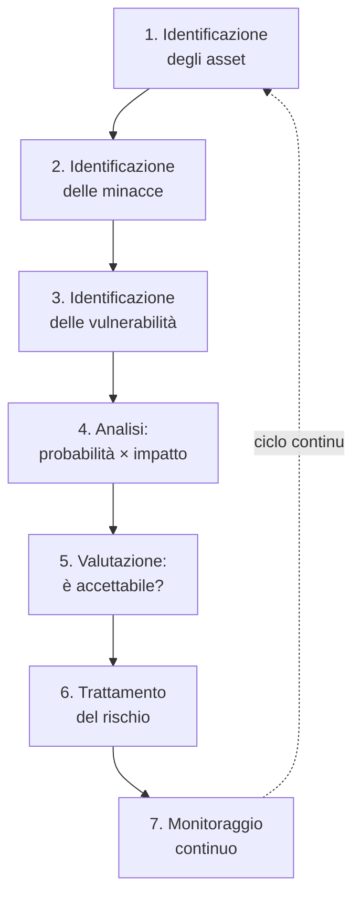
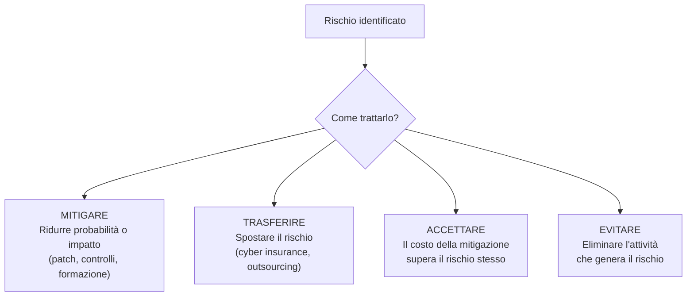
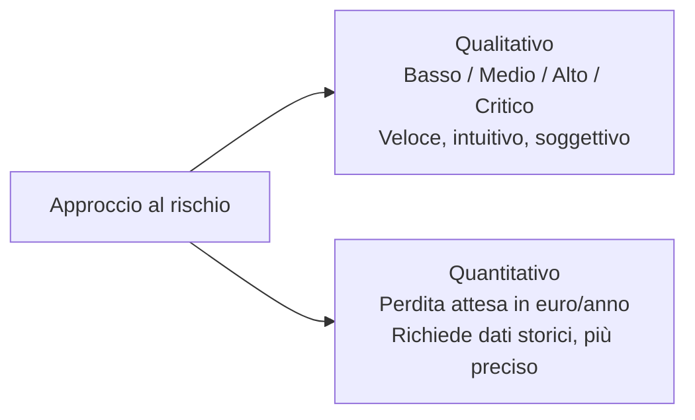

# Risk Management: come si valuta il rischio in sicurezza informatica

## Introduzione

Un'azienda non può correggere ogni vulnerabilità, formare ogni dipendente su ogni minaccia possibile, e cifrare ogni singolo dato con la massima sicurezza disponibile — non ci sono budget né tempo infiniti. Il **risk management** è la disciplina che risponde alla domanda più pratica della sicurezza informatica: *dato che non posso proteggere tutto al 100%, dove investo prima?*

Non è un esercizio burocratico da compilare per un audit. Fatto bene, è lo strumento che trasforma "abbiamo tante cose da sistemare" in una lista ordinata e giustificabile di priorità.

---

## Cos'è il rischio: la formula di base

Il rischio non esiste senza tutti e tre gli elementi insieme:

- **Asset** — qualcosa di valore: un database clienti, un server di produzione, la reputazione aziendale, la proprietà intellettuale.
- **Minaccia** — chi o cosa potrebbe causare danno: un attaccante esterno, un dipendente negligente, un guasto hardware, un evento naturale.
- **Vulnerabilità** — la debolezza che rende possibile il danno: una porta aperta, una password debole, personale non formato.

**Rischio = Probabilità × Impatto.** Un server con una vulnerabilità critica ma completamente isolato da internet, senza dati sensibili, e senza nessuno con motivo di attaccarlo, ha un rischio basso — nonostante la vulnerabilità sia "critica" sulla carta (CVSS alto). Il CVSS misura la gravità tecnica, non il rischio reale per la tua organizzazione specifica: sono cose diverse, e confonderle è uno degli errori più comuni.

---

## Il processo di Risk Management

### 1-3. Identificazione: cosa hai, cosa minaccia, dove sei debole

Non puoi valutare il rischio di un asset che non sai di avere. Un **inventario degli asset** aggiornato (server, applicazioni, dati, terze parti) è il prerequisito di qualsiasi risk management serio — è la stessa ragione per cui il vulnerability management parte sempre dall'asset discovery. Le minacce vanno catalogate per categoria (attori esterni motivati finanzariamente, state-sponsored, insider, eventi accidentali/naturali) e le vulnerabilità emergono da scansioni tecniche, audit di processo, e revisioni architetturali.

### 4. Analisi: la risk matrix

Lo strumento più diffuso per rendere il rischio confrontabile è la **matrice di rischio**, che incrocia probabilità e impatto su una griglia:

| | Impatto Basso | Impatto Medio | Impatto Alto | Impatto Critico |
|---|---|---|---|---|
| **Probabilità Alta** | Medio | Alto | Critico | Critico |
| **Probabilità Media** | Basso | Medio | Alto | Critico |
| **Probabilità Bassa** | Basso | Basso | Medio | Alto |
| **Probabilità Molto Bassa** | Basso | Basso | Basso | Medio |

Un ransomware su un server di backup isolato (probabilità media, impatto alto perché comunque richiede recovery) si posiziona diversamente da un data breach su un database clienti esposto senza autenticazione (probabilità alta, impatto critico). La matrice non elimina la soggettività — ma la rende **esplicita e discutibile**, invece di lasciarla implicita nella testa di una sola persona.

### 5-6. Valutazione e trattamento: le quattro strategie

Una volta calcolato il rischio, ci sono esattamente quattro modi per trattarlo:

**Mitigare** è l'opzione più comune: applicare una patch, aggiungere MFA, segmentare la rete. **Trasferire** significa spostare l'onere finanziario altrove — una polizza di cyber insurance non impedisce l'attacco, ma copre parte del danno economico. **Accettare** è legittimo quando il costo di mitigazione supera il rischio stesso (proteggere un dato pubblico con la stessa intensità di un segreto industriale non ha senso) — ma va **documentato e approvato formalmente**, non lasciato per negligenza. **Evitare** significa smettere di fare la cosa rischiosa: se un servizio legacy espone rischi sproporzionati al suo valore, a volte la risposta corretta è spegnerlo.

### 7. Monitoraggio continuo

Il rischio non è statico. Una nuova vulnerabilità pubblicata, un cambio nell'architettura, una nuova normativa, un nuovo gruppo di minaccia attivo nel tuo settore: tutto questo cambia il quadro. Il risk management è un ciclo, non un documento compilato una volta l'anno per l'audit.

---

## Rischio qualitativo vs quantitativo

L'approccio **qualitativo** (la matrice vista sopra) è veloce e intuitivo, ma soggettivo — persone diverse valutano "impatto alto" in modo diverso. L'approccio **quantitativo** cerca di esprimere il rischio in termini monetari, usando metriche come:

- **SLE (Single Loss Expectancy)** — la perdita economica attesa da un singolo evento.
- **ARO (Annualized Rate of Occurrence)** — quante volte l'evento è atteso in un anno.
- **ALE (Annualized Loss Expectancy)** = SLE × ARO — la perdita economica attesa annua.

Un data breach che costa mediamente 2 milioni di euro (SLE) con una probabilità stimata dello 0,1 all'anno (ARO) dà un ALE di 200.000 euro/anno — un numero che si può confrontare direttamente con il costo di un controllo di mitigazione, rendendo la decisione di investimento molto più difendibile davanti a un CFO. Il limite pratico: servono dati storici affidabili, che raramente esistono per eventi rari ma catastrofici (i famosi "cigni neri").

---

## Framework di riferimento

Il risk management in sicurezza informatica non si inventa da zero — esistono framework consolidati:

| Framework | Origine | Caratteristica |
|---|---|---|
| **NIST Risk Management Framework (RMF)** | Governo USA | Molto dettagliato, usato in ambito federale e regolamentato |
| **ISO/IEC 27005** | Standard internazionale | Parte della famiglia ISO 27001, integrato con il SGSI aziendale |
| **FAIR (Factor Analysis of Information Risk)** | Open standard | Focalizzato sull'approccio quantitativo, molto usato per comunicare con il business |
| **OCTAVE** | CERT/SEI Carnegie Mellon | Orientato all'autovalutazione interna, meno dipendente da consulenti esterni |

Non serve sceglierne uno "perfetto" — la maggior parte delle organizzazioni adatta un framework alle proprie dimensioni e al proprio settore, spesso combinandone elementi.

---

## Un errore comune: confondere rischio e vulnerabilità

Vale la pena ripeterlo perché è l'errore più frequente tra chi inizia: una vulnerabilità con CVSS 9.8 su un sistema di test isolato, senza dati, senza connettività a internet, rappresenta un rischio quasi nullo. Una vulnerabilità con CVSS 6.5 su un server di produzione esposto che processa pagamenti rappresenta un rischio enorme. Il punteggio di gravità tecnica è un solo input nel calcolo del rischio — il **contesto** (dove si trova l'asset, cosa protegge, chi potrebbe volerlo attaccare) è altrettanto, se non più, importante.

---

## Conclusione

Il risk management è quello che separa un team di sicurezza che reagisce al caos da uno che lo previene con criterio. Non elimina il rischio — nessuna organizzazione può azzerarlo — ma lo rende **visibile, misurabile e discutibile**, permettendo di allocare un budget limitato dove conta davvero.

La domanda da porsi ogni volta non è "questa cosa è pericolosa?" ma "quanto è probabile, quanto costerebbe se succedesse, e cosa costa prevenirla?" — è una domanda semplice da fare e sorprendentemente difficile da rispondere bene, ma è esattamente il lavoro del risk management.
