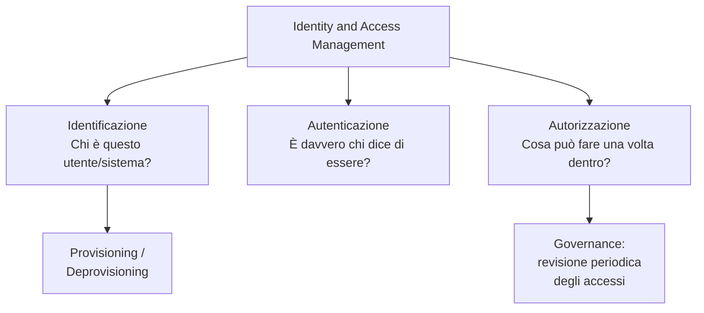
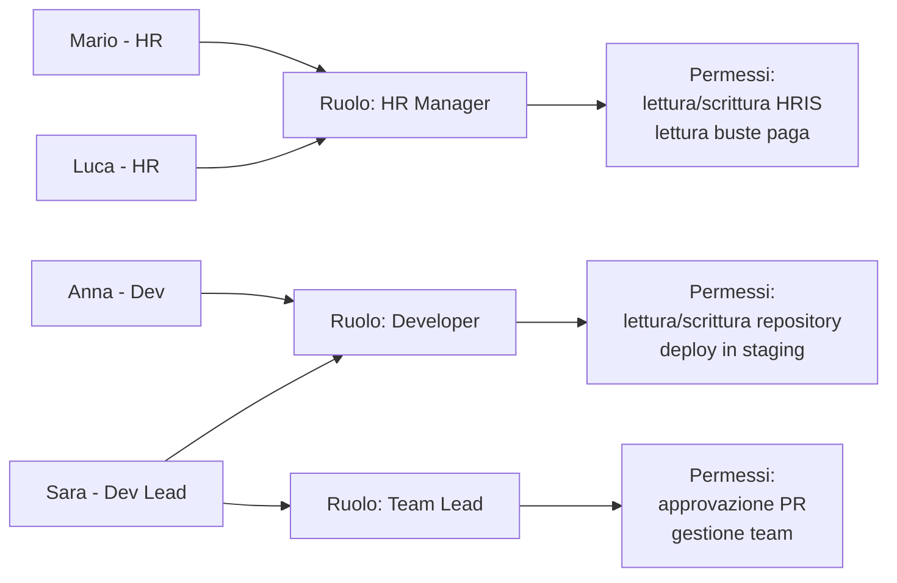
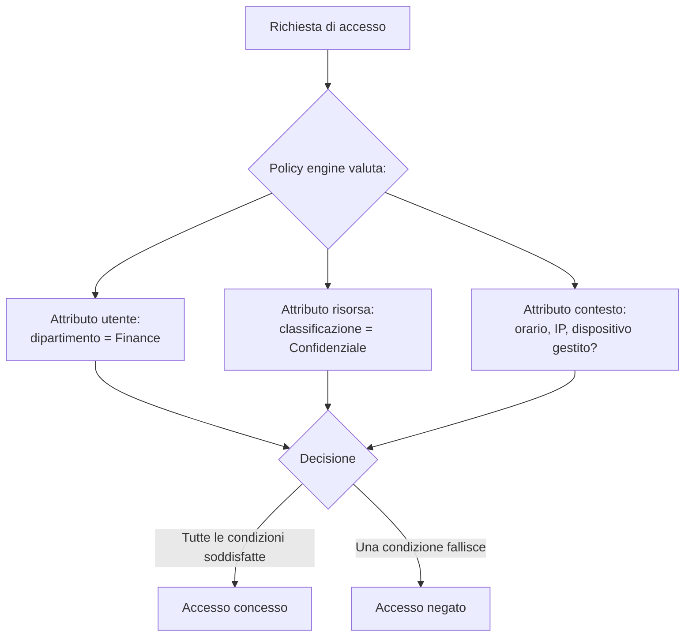
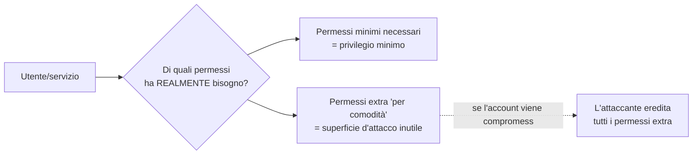
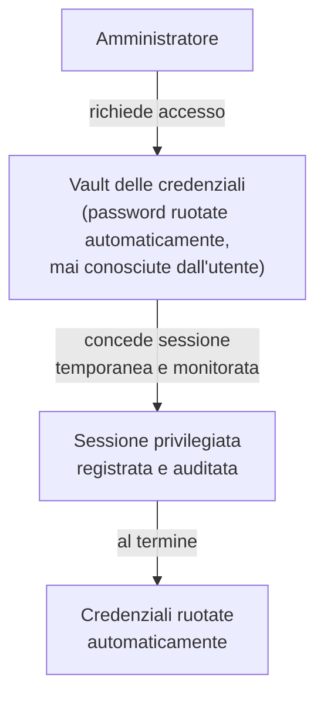

# IAM: Identity and Access Management, RBAC e principio del privilegio minimo

## Introduzione

L'autenticazione risponde alla domanda "chi sei?". Ma una volta che il sistema sa chi sei, resta una domanda altrettanto importante: **cosa puoi fare?** Un dipendente del marketing autenticato correttamente non dovrebbe poter leggere lo stipendio dei colleghi o modificare il codice sorgente del prodotto. L'**Identity and Access Management (IAM)** è la disciplina (e l'insieme di strumenti), che gestisce chi ha accesso a cosa, con quali permessi, e per quanto tempo.

Non è un dettaglio tecnico secondario. La maggior parte delle breach più gravi della storia non sono avvenute perché un attaccante ha "rotto" la crittografia, sono avvenute perché un account con troppi privilegi è stato compromesso, e quei privilegi eccessivi hanno permesso all'attaccante di muoversi ovunque.

---

## I tre pilastri dell'IAM

**Identificazione** e **autenticazione** sono il territorio del sistema di login (username, password, MFA, argomenti già trattati in dettaglio nell'articolo sull'autenticazione). L'IAM aggiunge due pezzi cruciali che spesso vengono trascurati: **autorizzazione** (cosa può fare l'utente dopo il login) e **governance** (chi decide e verifica questi permessi nel tempo).

---

## Modelli di controllo degli accessi

Esistono diversi modelli per decidere chi può accedere a cosa. I due più diffusi in ambito enterprise sono RBAC e ABAC.

### RBAC: Role-Based Access Control

Invece di assegnare permessi individualmente a ogni utente (impossibile da gestire su scala), i permessi vengono assegnati a **ruoli**, e gli utenti vengono assegnati ai ruoli.

Quando Sara diventa Team Lead, non le si assegnano permessi uno per uno: si aggiunge il ruolo "Team Lead" al suo profilo, e eredita automaticamente tutti i permessi associati. Quando lascia l'azienda, si rimuove l'utente e tutti i suoi accessi decadono insieme, niente permessi orfani dimenticati in giro.

**Vantaggi:** semplice da capire, facile da auditare ("chi ha il ruolo Amministratore Database?"), scala bene in organizzazioni con ruoli ben definiti.

**Limiti:** il "role explosion", organizzazioni complesse finiscono con centinaia di ruoli iper-specifici che diventano difficili da gestire quanto i permessi individuali che dovevano sostituire.

### ABAC: Attribute-Based Access Control

ABAC decide l'accesso in base ad **attributi** valutati dinamicamente al momento della richiesta, non a un ruolo statico assegnato in anticipo.

Una policy ABAC tipica: *"Un utente del dipartimento Finance può accedere ai documenti classificati Confidenziali solo durante l'orario lavorativo, da un dispositivo aziendale gestito, e solo se il documento appartiene al proprio centro di costo."* Questo livello di granularità è impossibile da replicare con soli ruoli statici senza un'esplosione combinatoria di ruoli.

**Vantaggi:** granularità molto fine, si adatta bene a contesti dinamici (accesso condizionato da orario, posizione, stato del dispositivo, il tipo di logica usato anche in architetture Zero Trust).

**Limiti:** più complesso da progettare, testare e auditare, capire "perché a questo utente è stato negato l'accesso" richiede di tracciare la valutazione di più attributi contemporaneamente.

### RBAC vs ABAC: quale scegliere

| | RBAC | ABAC |
|---|---|---|
| Complessità di gestione | Bassa-media | Alta |
| Granularità | Per ruolo | Per singola richiesta, contestuale |
| Auditabilità | Semplice ("chi ha questo ruolo") | Richiede tracciare le policy valutate |
| Adatto a | Organizzazioni con ruoli ben definiti e stabili | Ambienti dinamici, requisiti di compliance complessi |

Molte organizzazioni usano un ibrido: RBAC come base per la maggior parte degli accessi, con regole ABAC aggiuntive per i casi ad alta sensibilità.

---

## Il principio del privilegio minimo

Se c'è un concetto che riassume l'intera filosofia dell'IAM, è questo: **ogni identità (utente, servizio, applicazione), deve avere esattamente i permessi necessari per svolgere il proprio compito, niente di più.**

Perché conta così tanto: quando un account viene compromesso (tramite phishing, credential stuffing, o un malware infostealer), l'attaccante non "diventa" quell'utente in astratto, **eredita esattamente i suoi permessi**. Un account developer con accesso "per comodità" al database di produzione trasforma un singolo click su un link di phishing in un incidente che coinvolge dati di produzione, invece che restare contenuto a un ambiente di sviluppo.

### Come si applica in pratica

**Accesso just-in-time (JIT):** invece di privilegi amministrativi permanenti, l'utente richiede l'elevazione temporanea solo quando serve, per una finestra di tempo limitata, spesso con approvazione e logging obbligatori.

**Separazione dei compiti (Separation of Duties):** chi approva un pagamento non dovrebbe essere anche chi può crearlo, un principio che previene sia l'abuso interno sia limita il danno di un singolo account compromesso.

**Account privilegiati separati:** un amministratore di sistema dovrebbe avere un account "normale" per email e navigazione quotidiana, e un account separato con privilegi elevati usato solo per attività amministrative, così un phishing riuscito sull'account quotidiano non porta con sé i permessi di amministratore.

**Revisione periodica degli accessi (access review):** i permessi si accumulano nel tempo, un dipendente che cambia ruolo spesso mantiene gli accessi del ruolo precedente ("privilege creep"). Una revisione trimestrale o semestrale, dove i manager confermano esplicitamente che i loro riporti hanno ancora bisogno degli accessi assegnati, è l'unico modo pratico per evitare l'accumulo silenzioso di permessi inutilizzati.

---

## PAM: Privileged Access Management

Gli account con privilegi elevati (amministratori di dominio, root, account di servizio con accesso al database) meritano una categoria di controlli a parte, perché il loro compromesso è sproporzionatamente più dannoso.

Gli strumenti PAM (CyberArk, HashiCorp Vault, BeyondTrust) centralizzano le credenziali privilegiate in un "vault", concedono accesso temporaneo su richiesta, registrano ogni sessione amministrativa per audit, e ruotano automaticamente le password dopo ogni utilizzo, così anche un amministratore non conosce mai la password effettiva del sistema, riducendo drasticamente il rischio che venga riutilizzata, scritta da qualche parte, o rubata.

---

## Conclusione

L'autenticazione risponde a "chi sei", ma è l'IAM (RBAC, ABAC, privilegio minimo, PAM), a rispondere alla domanda che determina il danno reale in caso di compromissione: **cosa puoi fare una volta dentro?** Un sistema con autenticazione perfetta ma governance degli accessi disastrosa (tutti amministratori di tutto "per comodità") è comunque un sistema fragile. La disciplina dell'IAM è meno appariscente della crittografia o dell'MFA, ma è spesso ciò che decide se un incidente resta un episodio contenuto o diventa una breach totale.
