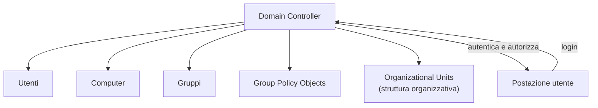
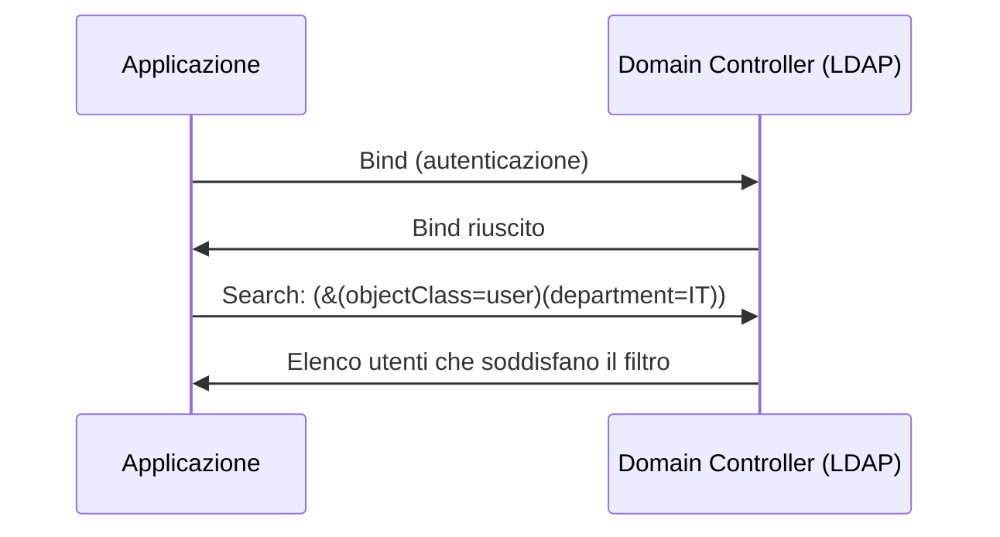
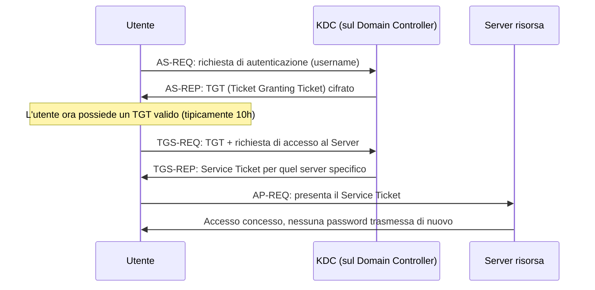
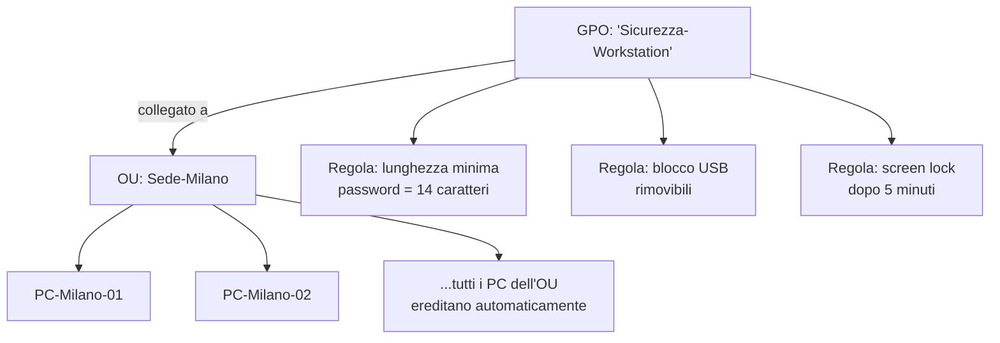
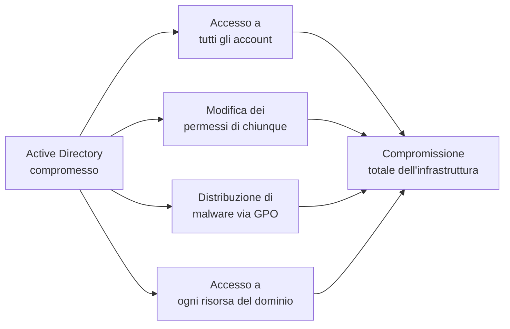

# Active Directory e LDAP: le fondamenta dell'identità aziendale

## Introduzione

Se hai letto l'articolo su Kerberoasting e AS-REP Roasting, sai già che Active Directory è il bersaglio preferito di ogni red team. Ma per capire *perché* quelle tecniche funzionano, serve prima capire *come funziona* Active Directory quando nessuno lo sta attaccando. Questo articolo fa un passo indietro: cos'è un domain controller, cosa significa "autenticarsi nel dominio", cos'è LDAP, e come Kerberos gestisce l'autenticazione, le fondamenta su cui poi si costruisce sia la difesa che l'attacco.

Active Directory (AD) è presente in circa il 90% delle reti aziendali basate su Windows. È il sistema che risponde alla domanda "chi sei e cosa puoi fare in questa rete", centralizzata per migliaia di utenti, computer e risorse.

---

## Cos'è un dominio Active Directory



Un **dominio** è un raggruppamento logico e amministrativo di utenti, computer e risorse, gestito centralmente da uno o più **Domain Controller (DC)**: server che ospitano il database di Active Directory e rispondono alle richieste di autenticazione e autorizzazione. Prima di Active Directory, ogni computer Windows gestiva utenti e permessi in modo isolato (workgroup); con un dominio, l'identità e i permessi diventano centralizzati e coerenti su tutta la rete.

### La struttura gerarchica

```
Forest (foresta)
 └── Domain (dominio): azienda.local
      ├── OU: Sede-Milano
      │    ├── OU: IT
      │    │    ├── Utente: mrossi
      │    │    └── Computer: PC-IT-01
      │    └── OU: HR
      │         └── Utente: lgialli
      └── OU: Sede-Roma
           └── OU: Vendite
                └── Utente: agialli
```

Una **foresta** può contenere più domini. Un dominio è organizzato in **Organizational Unit (OU)**: contenitori che riflettono la struttura organizzativa (per sede, dipartimento, funzione) e permettono di applicare policy e delegare l'amministrazione in modo granulare, senza dover gestire ogni singolo oggetto individualmente.

---

## LDAP: il protocollo sotto Active Directory

Active Directory, come database, parla **LDAP** (Lightweight Directory Access Protocol), un protocollo standard, non proprietario Microsoft, usato per interrogare e modificare servizi di directory. Ogni oggetto in AD (utente, gruppo, computer) ha un **Distinguished Name (DN)** che ne descrive la posizione esatta nella gerarchia:

```
CN=Mario Rossi,OU=IT,OU=Sede-Milano,DC=azienda,DC=local
```

Si legge da destra a sinistra: il dominio (`DC=azienda,DC=local`), poi l'OU (`Sede-Milano` → `IT`), infine il Common Name dell'oggetto (`Mario Rossi`). Questa struttura è ciò che permette query mirate: *"trovami tutti gli utenti nell'OU IT della sede di Milano"* diventa una query LDAP precisa e veloce.



Molte applicazioni aziendali (VPN, VoIP, sistemi HR, applicazioni interne) si integrano con Active Directory proprio tramite LDAP, per non dover gestire un proprio database utenti separato, un esempio pratico di **Single Sign-On** a livello infrastrutturale.

### LDAP in chiaro vs LDAPS

Il protocollo LDAP originale trasmette le query (incluse, in alcune configurazioni, le credenziali di bind) **senza cifratura**. **LDAPS** (LDAP over SSL/TLS, porta 636) cifra l'intera comunicazione. Una rete che usa ancora LDAP in chiaro espone potenzialmente credenziali a chiunque possa intercettare il traffico interno, una delle configurazioni deboli più comuni ancora trovate durante gli assessment.

---

## Kerberos: come funziona davvero l'autenticazione nel dominio

Active Directory usa **Kerberos** come protocollo di autenticazione predefinito (non NTLM, che resta per compatibilità legacy ma è considerato meno sicuro). Il nome viene dal cane a tre teste della mitologia greca, e non a caso, il protocollo coinvolge tre parti.



Il punto centrale: dopo il login iniziale, l'utente non deve **mai più inviare la password** per accedere ad altre risorse del dominio durante quella sessione. Ottiene un **TGT (Ticket Granting Ticket)** dal **KDC (Key Distribution Center)**, che gira sul Domain Controller, e lo usa per richiedere **Service Ticket** specifici per ogni risorsa a cui vuole accedere (un file server, un'applicazione, un altro server). Questo è anche ciò che rende possibile tecniche come il Kerberoasting: se un Service Ticket è cifrato con l'hash della password di un account di servizio debole, un attaccante può richiederlo legittimamente e poi provare a craccarlo offline, ma questo è approfondito nell'articolo sui vettori di attacco ad AD.

---

## Group Policy: applicare configurazioni su scala

I **Group Policy Object (GPO)** sono il meccanismo con cui un amministratore applica configurazioni (di sicurezza, software, restrizioni), a migliaia di computer e utenti contemporaneamente, senza toccare ogni macchina singolarmente.



Un GPO collegato a un'OU si applica a tutti gli oggetti (utenti o computer) contenuti in quell'OU, e nelle sue sotto-OU per ereditarietà, a meno che non venga esplicitamente bloccata l'ereditarietà o applicata una priorità diversa. Questo è potentissimo per la gestione, ma anche un vettore di attacco: un GPO compromesso o mal configurato può distribuire configurazioni malevole (o rimuovere protezioni) su migliaia di macchine in un colpo solo.

---

## Perché Active Directory è così centrale nella sicurezza aziendale



Chi controlla il Domain Controller controlla, di fatto, l'identità di ogni utente e computer del dominio: può creare account amministrativi, resettare qualsiasi password, modificare permessi, distribuire codice via GPO. Per questo Active Directory è definito il "cuore" dell'infrastruttura Windows enterprise, e per questo la sua protezione (patching dei DC, monitoraggio dei privilegi amministrativi, account Tier-0 separati, auditing delle modifiche) è tra le priorità più alte di qualsiasi blue team.

---

## Conclusione

Active Directory non è solo "il posto dove si fa login", è l'infrastruttura di fiducia su cui si appoggia praticamente ogni altra risorsa aziendale: file server, applicazioni interne, VPN, email. LDAP fornisce il linguaggio per interrogare questa struttura, Kerberos garantisce che l'autenticazione avvenga senza esporre ripetutamente le password, e i GPO permettono di applicare policy su scala.

Capire questi meccanismi non è solo un prerequisito per l'attacco (Kerberoasting, AS-REP Roasting, abuso di GPO), è il prerequisito per la difesa: non puoi proteggere bene un sistema di cui non capisci il funzionamento interno.
