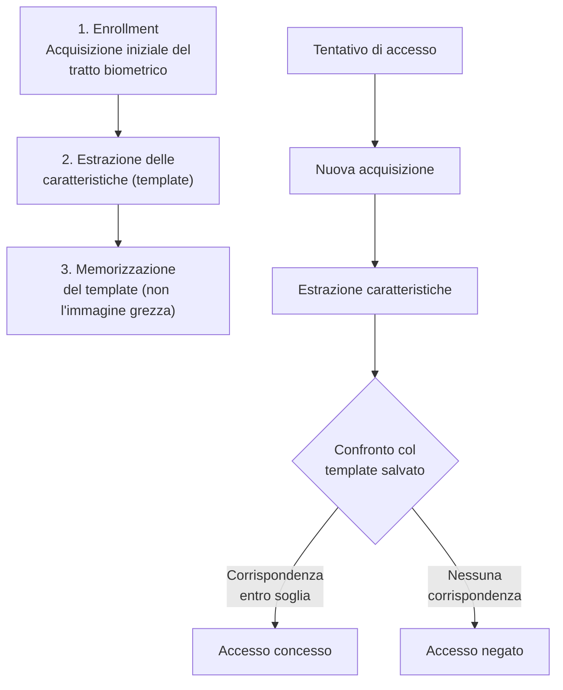
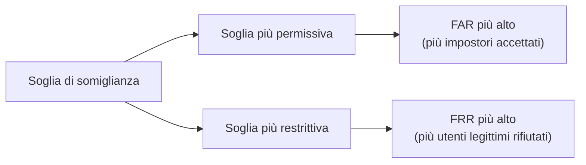
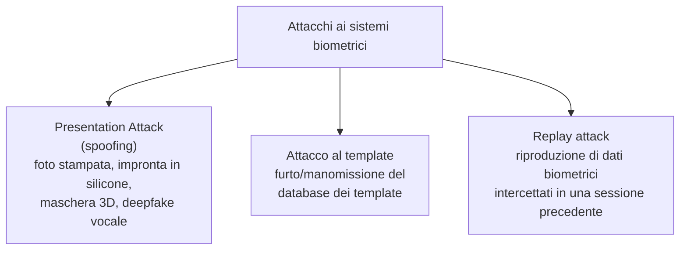
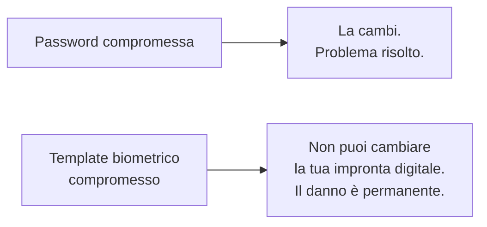

# Biometria e fattori di autenticazione fisici

## Introduzione

Sblocchi il telefono guardandolo. Passi il dito su un sensore per entrare in ufficio. Un aeroporto ti scansiona il volto invece di controllare il passaporto a mano. La biometria (l'autenticazione basata su **qualcosa che sei**, il terzo dei tre fattori classici insieme a "qualcosa che sai" e "qualcosa che hai"), è passata in pochi anni da tecnologia da film di spionaggio a gesto quotidiano.

Ma "il tuo volto è la tua password" nasconde più complessità tecnica di quanto sembri, e alcune proprietà che la rendono fondamentalmente diversa (non necessariamente migliore), rispetto a password e token.

---

## Come funziona un sistema biometrico

Un punto spesso frainteso: un sistema biometrico ben progettato **non memorizza la tua impronta digitale o la foto del tuo volto**. Durante l'enrollment, estrae un **template**: una rappresentazione matematica delle caratteristiche distintive (le minuzie di un'impronta, le distanze tra i punti di riferimento facciali), e scarta l'immagine originale. Al momento dell'accesso, il nuovo campione viene convertito nello stesso formato e confrontato matematicamente col template salvato, non pixel per pixel.

Questo è cruciale: a differenza di una password, **un template biometrico compromesso non può essere "cambiato"**. Non puoi generarti un nuovo pollice. Per questo, come vedremo, la protezione del template stesso è un requisito di sicurezza fondamentale, non opzionale.

---

## Le modalità biometriche principali

| Modalità | Come funziona | Punti di forza | Debolezze |
|---|---|---|---|
| **Impronta digitale** | Mappa delle minuzie (biforcazioni, terminazioni delle creste papillari) | Economica, matura, ampiamente diffusa | Copiabile da superfici toccate, non funziona con dita danneggiate/bagnate |
| **Riconoscimento facciale** | Distanze e proporzioni tra punti di riferimento del volto, spesso con mappa 3D a infrarossi | Comoda, contactless, veloce | Sensibile a illuminazione, invecchiamento, possibili bias su alcune caratteristiche demografiche |
| **Iride** | Pattern unico e stabile nel tempo dell'iride oculare | Altissima accuratezza, pattern molto stabile | Hardware costoso, percepita come invasiva |
| **Voce** | Caratteristiche spettrali e comportamentali del parlato | Utile per autenticazione remota (telefono) | Vulnerabile a registrazioni e, sempre più, a deepfake vocali |
| **Comportamentale** | Ritmo di battitura, movimento del mouse, andatura | Continua, invisibile all'utente | Meno matura, più soggetta a falsi positivi/negativi |

---

## Le due metriche che contano davvero

Nessun sistema biometrico è mai un confronto binario perfetto, è sempre una decisione statistica basata su una soglia di somiglianza. Questo introduce due tipi di errore, in tensione tra loro:

**FAR (False Acceptance Rate)**: la probabilità che il sistema accetti erroneamente una persona non autorizzata come se fosse quella legittima. È la metrica di sicurezza: un FAR alto significa che il sistema è facile da ingannare.

**FRR (False Rejection Rate)**: la probabilità che il sistema rifiuti erroneamente l'utente legittimo. È la metrica di usabilità: un FRR alto significa un sistema frustrante da usare, che spesso finisce per essere disabilitato o aggirato dagli utenti stufi.

Regolare la soglia di sensibilità è sempre un compromesso tra questi due: un sistema di sblocco del telefono tollera un FAR leggermente più alto per un'esperienza fluida; un sistema di controllo accessi a una centrale nucleare accetta un FRR più alto (qualche ritardo in più) in cambio di un FAR quasi nullo.

---

## Gli attacchi alla biometria

**Presentation attack (spoofing):** il tipo di attacco più noto, usare una copia fisica o digitale del tratto biometrico. Impronte digitali ricreate in silicone da un'immagine ad alta risoluzione, foto stampate per ingannare telecamere semplici, maschere 3D contro sistemi di riconoscimento facciale poco sofisticati. La contromisura è il **liveness detection**: verificare che il campione provenga da una persona viva e presente (rilevando micro-movimenti, riflessi della pupilla, texture della pelle sotto infrarossi) e non da una riproduzione statica.

**Attacco al template:** se il database dei template biometrici viene compromesso, il danno è potenzialmente permanente, non puoi "resettare" un'impronta digitale come faresti con una password. Per questo i template dovrebbero essere cifrati, e sempre più spesso memorizzati esclusivamente in hardware dedicato e isolato sul dispositivo stesso (come la Secure Enclave di Apple o il Trusted Execution Environment su Android), invece che su un server centralizzato, così che nemmeno un compromesso del server esponga i template di tutti gli utenti.

---

## Biometria come fattore unico: perché è rischioso

Questa è la differenza filosofica più importante rispetto agli altri fattori: **un segreto rivelato può essere sostituito, un tratto biometrico no.** Per questo, quasi tutte le best practice di sicurezza seria raccomandano di non usare mai la biometria come **unico** fattore per accessi critici, va combinata con un secondo fattore (PIN, dispositivo), esattamente come previsto dal principio del MFA. La biometria sblocca comodamente il tuo telefono, ma dietro le quinte, spesso, autentica ancora verso il servizio con un token o una chiave crittografica, non trasmette mai il dato biometrico stesso alla rete.

### Un dettaglio importante: FIDO2 e biometria si integrano bene

Negli standard moderni come FIDO2/WebAuthn (già trattati nell'articolo sull'autenticazione), la biometria non viene mai trasmessa a un server remoto: **sblocca localmente una chiave privata memorizzata sul dispositivo**, che poi firma la richiesta di autenticazione. Il server non riceve né conosce mai il tuo tratto biometrico, riceve solo una firma crittografica valida. Questo è il modo corretto e sicuro di combinare comodità biometrica e sicurezza: il dato biometrico non lascia mai il dispositivo dell'utente.

---

## Implicazioni legali e di privacy

I dati biometrici sono classificati come **categoria speciale di dati personali** dal GDPR (art. 9), con protezioni rafforzate rispetto ai dati personali ordinari, proprio per l'irreversibilità del danno in caso di esposizione. Un'organizzazione che raccoglie dati biometrici deve avere una base giuridica specifica, informare chiaramente gli utenti, e implementare misure di sicurezza proporzionate alla sensibilità del dato. Diverse aziende tecnologiche sono state oggetto di cause legali significative (es. negli USA, sotto il Biometric Information Privacy Act dell'Illinois) proprio per raccolta o conservazione impropria di dati biometrici.

---

## Conclusione

La biometria offre qualcosa che password e token non possono replicare: un fattore che non puoi dimenticare, perdere, o (facilmente) prestare a qualcun altro. Ma questa stessa proprietà la rende un fattore da maneggiare con cura architetturale: template non recuperabili in chiaro, elaborazione locale sul dispositivo quando possibile, liveness detection contro lo spoofing, e (sempre) l'uso combinato con un secondo fattore per gli accessi che contano davvero. "Qualcosa che sei" è potente, ma proprio perché non puoi cambiarlo, il sistema che lo protegge deve essere costruito assumendo che, un giorno, qualcuno ci proverà.
