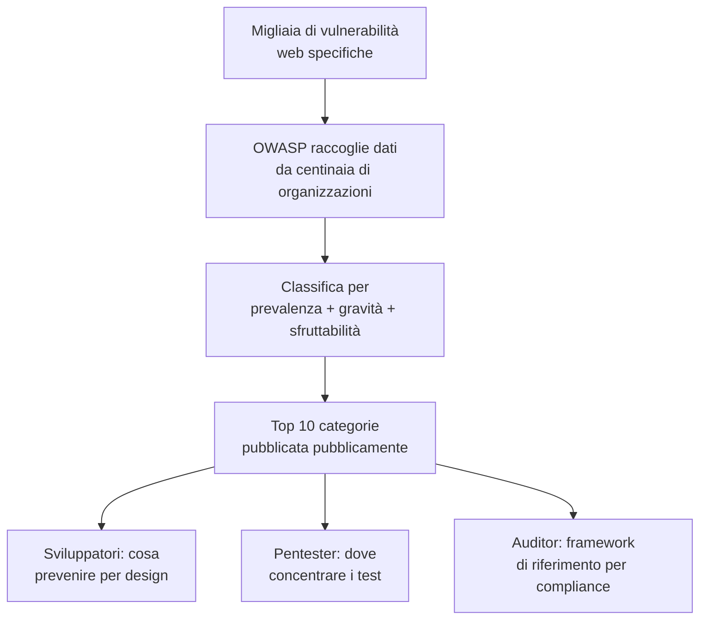
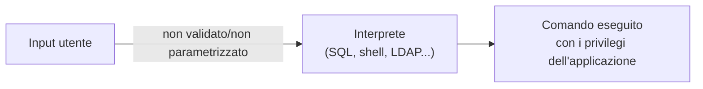
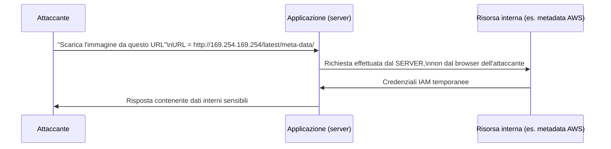
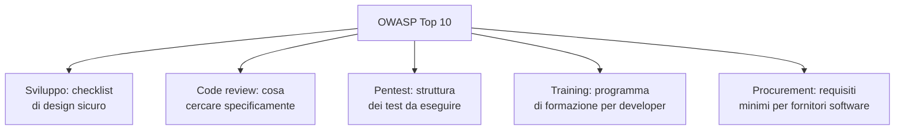

# OWASP Top 10: le vulnerabilità web più critiche

## Introduzione

Se hai già letto gli articoli su SQL Injection e XSS di questo blog, conosci già due delle vulnerabilità più famose del web. Ma come si inseriscono nel quadro più ampio della sicurezza delle applicazioni? La **OWASP Top 10** è la risposta: una classifica, aggiornata periodicamente dall'**Open Worldwide Application Security Project** (organizzazione no-profit dedicata alla sicurezza del software), delle categorie di vulnerabilità web più critiche e più diffuse, basata su dati reali raccolti da centinaia di organizzazioni.

Non è una lista di bug specifici, è una **tassonomia**: un modo condiviso di classificare e comunicare i problemi di sicurezza delle applicazioni web, usato da sviluppatori, pentester, auditor e persino da normative di compliance come riferimento standard.

---

## Perché esiste una classifica



Senza una lista prioritizzata, un team con risorse limitate rischia di disperdere gli sforzi. La Top 10 dà un ordine di priorità basato su prevalenza reale (quanto spesso si trova) e impatto potenziale, non è esaustiva, ma copre la maggioranza dei problemi che causano breach reali.

---

## Le 10 categorie (edizione più recente)

### A01: Broken Access Control

Al primo posto: controlli di accesso implementati male o assenti, che permettono a un utente di accedere a dati o funzioni per cui non è autorizzato, cambiando un ID nell'URL (`/api/ordini/1234` → `/api/ordini/1235`) o accedendo direttamente a un endpoint amministrativo senza le verifiche adeguate.

```
GET /api/utenti/482/dati-personali HTTP/1.1
Authorization: Bearer <token-utente-483>
→ Se il server non verifica che 482 corrisponda al token, restituisce
  i dati personali di un altro utente. Questo si chiama IDOR
  (Insecure Direct Object Reference).
```

### A02: Cryptographic Failures

Cifratura assente, deprecata (MD5, SHA-1 per password), o mal implementata (chiavi hardcoded, TLS non forzato, dati sensibili trasmessi in chiaro). Tema già approfondito negli articoli su crittografia e PKI di questo blog.

### A03: Injection

La categoria storica che include SQL Injection, ma anche NoSQL Injection, Command Injection, LDAP Injection: qualsiasi caso in cui input non validato viene interpretato come **codice o comando** invece che come semplice dato.



### A04: Insecure Design

Una categoria relativamente nuova: problemi che nascono dall'**architettura**, non da un bug di implementazione. Un flusso di reset password senza rate limiting, un processo di checkout che non verifica lato server il prezzo inviato dal client, difetti che nessuna patch può correggere senza ridisegnare il flusso stesso.

### A05: Security Misconfiguration

Configurazioni di default non modificate, credenziali admin/admin lasciate attive, messaggi di errore troppo verbosi che rivelano stack trace, servizi cloud esposti senza restrizioni (lo stesso tema del "misconfigurazioni AWS" già trattato in questo blog per il cloud specificamente).

### A06: Vulnerable and Outdated Components

Librerie e framework con vulnerabilità note (CVE pubbliche) non aggiornati. Il famoso caso Log4Shell (CVE-2021-44228) ha dimostrato quanto una singola libreria vulnerabile, usata indirettamente da migliaia di applicazioni, possa avere un impatto sproporzionato, la supply chain del software è ormai una superficie d'attacco a sé.

### A07: Identification and Authentication Failures

Gestione debole delle sessioni, credenziali predefinite, assenza di protezione contro credential stuffing e brute force, mancanza di MFA, l'intero territorio già coperto nell'articolo sull'autenticazione.

### A08: Software and Data Integrity Failures

Fiducia mal riposta in aggiornamenti, plugin o pipeline CI/CD senza verifica dell'integrità (firma digitale, checksum). Include gli attacchi alla supply chain software, dipendenze compromesse che iniettano codice malevolo in un pacchetto legittimo, un tema sempre più rilevante man mano che il software moderno dipende da centinaia di librerie di terze parti.

### A09: Security Logging and Monitoring Failures

Se un attacco non viene loggato, non può essere rilevato. Molte breach vengono scoperte mesi dopo (a volte da terzi), proprio per assenza di log adeguati o di monitoraggio attivo su quei log. Un tema che si collega direttamente al mondo SIEM e SOC.

### A10: Server-Side Request Forgery (SSRF)

Un'applicazione che accetta un URL da input utente e lo richiama server-side, senza restrizioni, può essere costretta a fare richieste verso risorse interne che dovrebbero restare inaccessibili dall'esterno, inclusi endpoint di metadati cloud (spesso usati per rubare credenziali temporanee AWS/Azure/GCP).



---

## Tabella riassuntiva

| # | Categoria | In breve |
|---|---|---|
| A01 | Broken Access Control | Accesso a dati/funzioni non autorizzate |
| A02 | Cryptographic Failures | Cifratura assente o mal implementata |
| A03 | Injection | Input interpretato come comando |
| A04 | Insecure Design | Difetti architetturali, non di codice |
| A05 | Security Misconfiguration | Configurazioni di default o permissive |
| A06 | Vulnerable and Outdated Components | Librerie con CVE note non aggiornate |
| A07 | Identification and Authentication Failures | Gestione debole di login e sessioni |
| A08 | Software and Data Integrity Failures | Fiducia non verificata in codice/pipeline |
| A09 | Security Logging and Monitoring Failures | Attacchi non rilevati per mancanza di log |
| A10 | Server-Side Request Forgery | Il server fa richieste per conto dell'attaccante |

---

## Come si usa davvero la Top 10



Un errore comune è trattare la Top 10 come una checklist da spuntare una tantum. Il valore reale emerge quando viene integrata nel processo di sviluppo: revisioni del codice che cercano esplicitamente pattern di injection, test automatizzati (SAST/DAST) mappati sulle categorie, e formazione degli sviluppatori che spiega **perché** certi pattern sono pericolosi, non solo quali evitare. OWASP pubblica anche risorse collegate, il **Testing Guide**, il **Cheat Sheet Series**, e progetti come **Juice Shop** (un'applicazione volutamente vulnerabile per esercitarsi in sicurezza), che rendono la Top 10 un punto di partenza pratico, non solo teorico.

---

## Conclusione

La OWASP Top 10 non è una lista di bug, è un linguaggio comune. Quando un pentester scrive "A01: Broken Access Control" in un report, uno sviluppatore in Giappone e un CISO in Brasile sanno esattamente di cosa sta parlando, senza bisogno di spiegazioni aggiuntive. È lo stesso ruolo che il modello OSI gioca per il networking o MITRE ATT&CK per la threat intelligence: una tassonomia condivisa che rende possibile comunicare, misurare e migliorare la sicurezza in modo sistematico, invece che rincorrere ogni singolo bug come un caso isolato.
