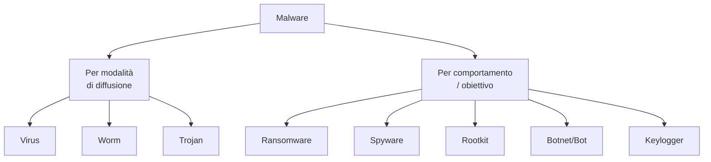
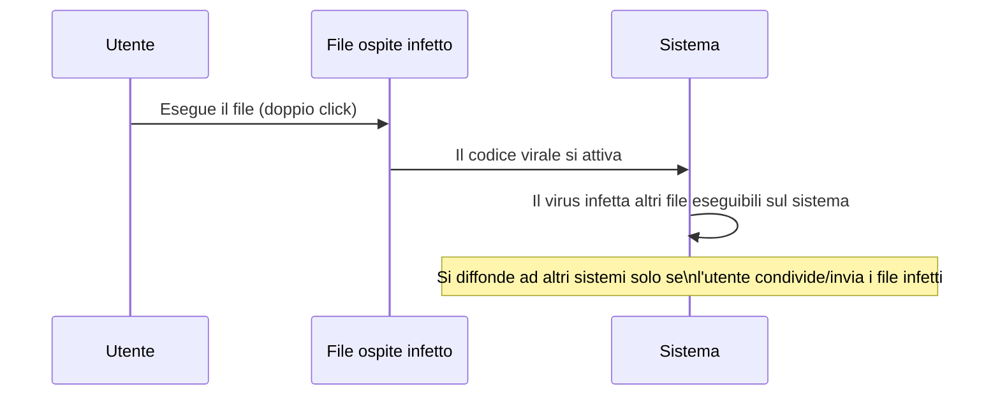
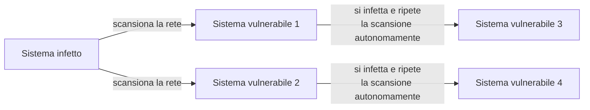
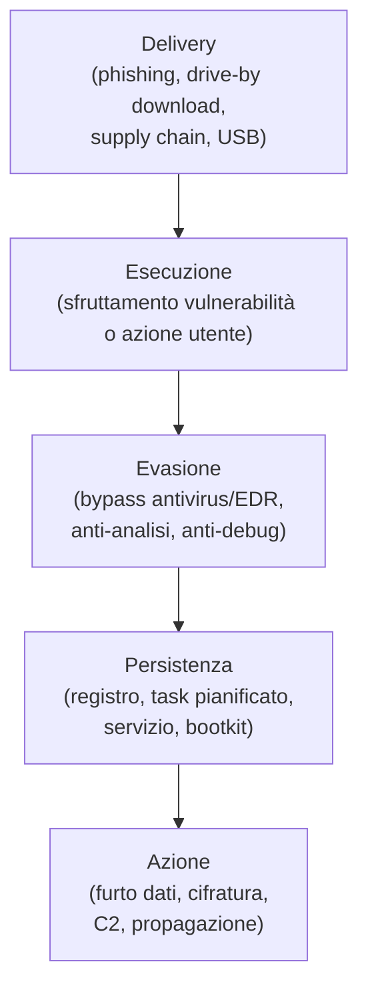

# Malware: tipologie e come funzionano

## Introduzione

"Malware" è un termine ombrello (deriva da *malicious software*), che nel linguaggio comune viene spesso usato come sinonimo di "virus". In realtà descrive categorie di comportamento molto diverse tra loro, ognuna con un obiettivo e un meccanismo di diffusione specifico. Prima di poter analizzare un campione (l'argomento dell'articolo dedicato all'analisi malware) o capire come si sviluppa un attacco ransomware nel dettaglio, serve una mappa chiara: cosa distingue un worm da un trojan, e perché questa distinzione conta per la difesa.

---

## La tassonomia di base

Questa tassonomia non è rigida, un singolo malware moderno spesso combina più categorie (un trojan che scarica un ransomware che include funzionalità worm per propagarsi in rete). Ma capire le categorie pure aiuta a ragionare sui meccanismi di difesa specifici per ciascuna.

---

## Classificati per modalità di diffusione

### Virus

Un virus **si attacca a un file o programma ospite** e richiede un'azione umana per attivarsi, eseguire il programma infetto, aprire il documento con la macro malevola. Non si diffonde autonomamente: ha bisogno che l'utente esegua il file infetto, dopodiché il virus si replica infettando altri file sullo stesso sistema.

### Worm

Un worm, a differenza del virus, **si diffonde autonomamente attraverso la rete**, senza bisogno di un file ospite né di un'azione dell'utente, spesso sfruttando vulnerabilità di rete. Il Morris Worm del 1988 (già raccontato nella sezione Storia di questo blog) e WannaCry (2017, che sfruttava EternalBlue) sono esempi storici di worm che si sono propagati a velocità esplosiva proprio per questa autonomia.

### Trojan (Cavallo di Troia)

Un trojan si presenta come software legittimo o utile (un'utility gratuita, un allegato che sembra una fattura, un finto aggiornamento), ma nasconde una funzione malevola. A differenza di virus e worm, **non si autoreplica**: si affida all'inganno per essere installato volontariamente dalla vittima. Molti trojan moderni sono "downloader": il loro unico compito è scaricare ed eseguire il vero payload malevolo dopo l'installazione iniziale, per aggirare i controlli statici degli antivirus.

---

## Classificati per comportamento e obiettivo

### Ransomware

Cifra i file della vittima e richiede un riscatto per la chiave di decifrazione. Il modello **double extortion**, ormai dominante, aggiunge l'esfiltrazione dei dati prima della cifratura: anche se la vittima ripristina da backup senza pagare, gli attaccanti minacciano di pubblicare i dati rubati. L'argomento è approfondito in dettaglio nell'articolo dedicato all'anatomia di un attacco ransomware.

### Spyware

Raccoglie informazioni sulla vittima senza consenso (abitudini di navigazione, credenziali, dati finanziari), e le trasmette all'attaccante. Una sottocategoria specifica è l'**infostealer**, oggi tra le famiglie di malware più diffuse: progettato specificamente per rubare credenziali salvate nel browser, cookie di sessione, wallet di criptovalute e dati delle carte di credito, spesso rivenduti in blocco su marketplace del dark web.

### Keylogger

Registra ogni tasto premuto sulla tastiera, catturando password, messaggi, numeri di carta, spesso implementato come componente di uno spyware più ampio piuttosto che come malware a sé stante.

### Rootkit

Progettato per **nascondere la propria presenza e quella di altro malware**, operando a un livello di privilegio molto profondo nel sistema operativo (kernel-level) o persino sotto di esso (bootkit, firmware). Un rootkit efficace può ingannare gli strumenti di sistema stessi: un elenco processi può semplicemente "non mostrare" il processo malevolo, perché il rootkit ha intercettato e manipolato la chiamata di sistema che genera quella lista. Per questo il rilevamento dei rootkit spesso richiede strumenti esterni che analizzano il sistema da un punto di osservazione che il rootkit non controlla (boot da un supporto esterno pulito, confronto di hash a basso livello).

### Bot e Botnet

Un dispositivo infetto da malware "bot" diventa parte di una rete controllata a distanza (una **botnet**) dall'attaccante tramite infrastruttura C2 (Command & Control). Le botnet vengono usate per attacchi DDoS distribuiti, invio massivo di spam, mining di criptovalute a insaputa della vittima, o come rete proxy per nascondere l'origine di altri attacchi. Mirai (2016), che infettò centinaia di migliaia di dispositivi IoT con credenziali di default, è uno degli esempi storici più noti.

---

## Il ciclo di vita tipico di un malware moderno

Il malware moderno raramente è "solo" una categoria pura. Un tipico attacco combina un trojan (delivery via allegato ingannevole) che scarica un infostealer (raccolta credenziali) che a sua volta apre la strada a un ransomware distribuito manualmente dopo che gli attaccanti hanno usato le credenziali rubate per muoversi lateralmente nella rete, lo stesso schema che vedremo nel dettaglio nell'articolo sull'anatomia di un attacco ransomware.

---

## Fileless malware: quando non c'è nemmeno un file

Una tendenza rilevante degli ultimi anni è il **malware fileless**: codice malevolo che vive esclusivamente in memoria, sfruttando strumenti legittimi già presenti nel sistema operativo (PowerShell, WMI, macro di Office) per eseguire le proprie azioni, senza mai scrivere un eseguibile malevolo su disco. Questo approccio (noto anche come *Living off the Land*), rende inefficaci gli antivirus tradizionali basati su firme di file, e richiede strumenti di detection comportamentale (EDR) capaci di osservare **cosa fa** un processo, non solo **cos'è**.

---

## Conclusione

Distinguere le categorie di malware non è un esercizio di nomenclatura fine a se stesso: ogni categoria implica un vettore di diffusione e un meccanismo di difesa specifico. Un worm richiede patching tempestivo e segmentazione di rete per limitare la propagazione autonoma; un trojan richiede formazione degli utenti e filtro delle email; un rootkit richiede strumenti di detection specializzati che operino a un livello di privilegio superiore al malware stesso. Capire *cosa* si sta affrontando è sempre il primo passo per capire *come* fermarlo.
