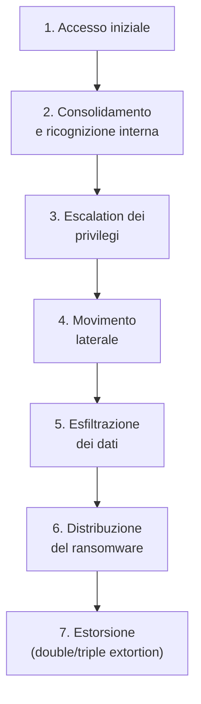
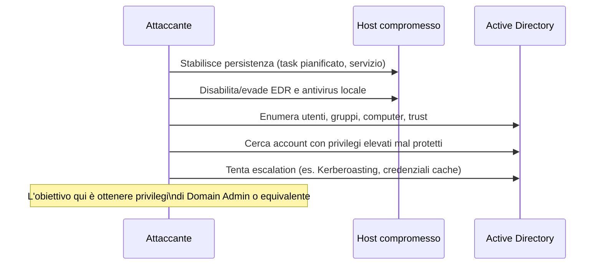
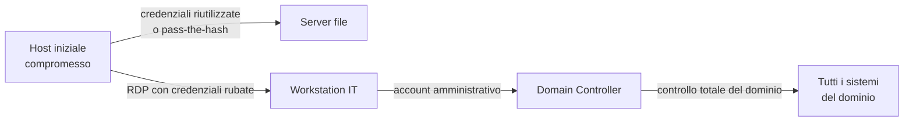
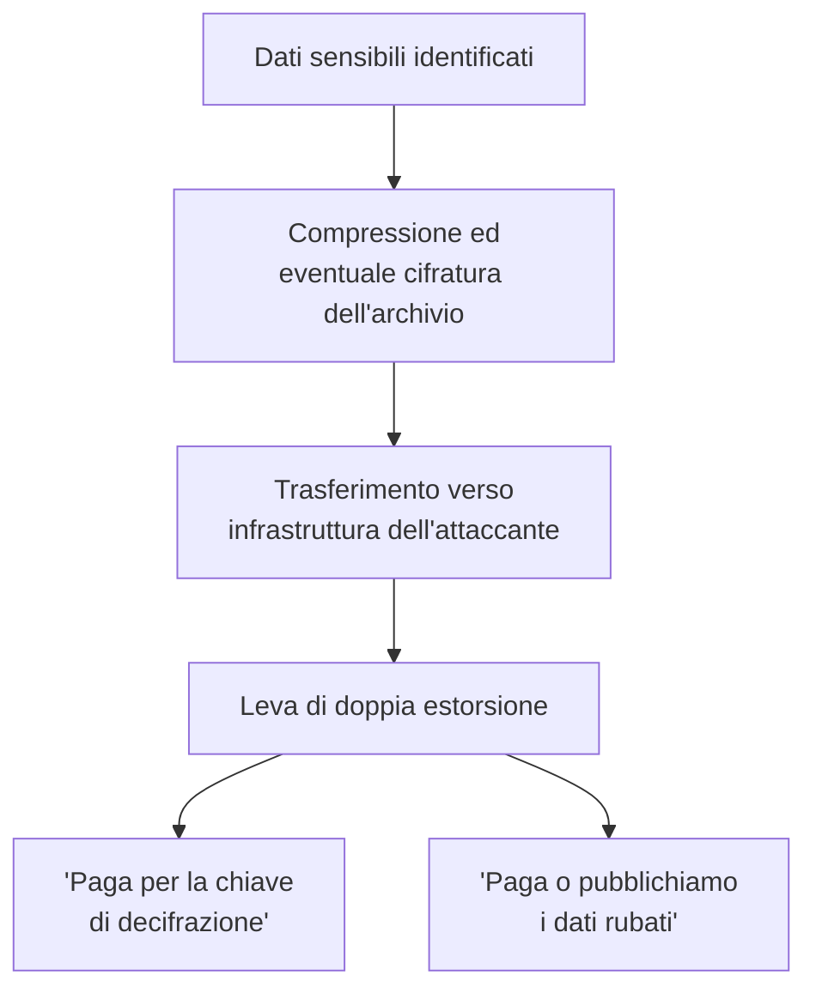
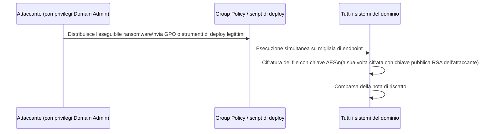
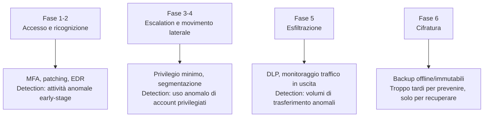

# Anatomia di un attacco ransomware: dalla compromissione all'estorsione

## Introduzione

L'immagine popolare del ransomware è quella di un virus che, aprendo un allegato sbagliato, cifra istantaneamente il computer. La realtà degli attacchi ransomware moderni — quelli che fanno notizia, che paralizzano ospedali e multinazionali — è molto più strutturata: **la cifratura è l'ultimo passo di una campagna che spesso dura giorni o settimane**, durante la quale gli attaccanti esplorano la rete, rubano dati, ed espandono l'accesso prima di premere il grilletto.

Capire questa sequenza — applicando la Cyber Kill Chain e MITRE ATT&CK già visti in questo percorso a un caso concreto — è ciò che permette a un blue team di intercettare l'attacco *prima* della cifratura, nella finestra in cui è ancora possibile fermarlo senza danni irreversibili.

---

## La timeline di un attacco ransomware moderno

Il tempo che intercorre tra il punto 1 e il punto 6 — noto come **dwell time** — nei casi peggiori dura settimane. È in questa finestra che la maggior parte delle difese ha la reale possibilità di intervenire; una volta raggiunta la fase di cifratura, le opzioni si riducono drasticamente.

---

## Fase 1: Accesso iniziale

I vettori più comuni, in ordine di prevalenza osservata negli ultimi anni:

| Vettore | Come funziona |
|---|---|
| **Credenziali RDP esposte** | Servizi Desktop Remoto raggiungibili da internet con password deboli o riutilizzate, spesso trovate tramite scanner automatici o acquistate da broker di accessi iniziali |
| **Phishing** | Allegato o link malevolo che installa un trojan/loader iniziale |
| **Vulnerabilità note non patchate** | Exploit su VPN, firewall o applicazioni esposte con CVE pubbliche |
| **Initial Access Broker** | Gruppi specializzati che vendono accessi già ottenuti a gruppi ransomware, come servizio |

Questo ultimo punto merita attenzione: l'economia del cybercrime si è **specializzata**. Chi ottiene l'accesso iniziale spesso non è lo stesso gruppo che distribuisce il ransomware — lo vende, come un vero e proprio mercato B2B criminale.

---

## Fase 2-3: Consolidamento, ricognizione interna ed escalation

Una volta dentro, l'attaccante raramente cifra subito la macchina compromessa — troppo poco valore, troppo rischio di essere scoperto presto. Invece, usa strumenti spesso **legittimi** già presenti nell'ambiente (living off the land: PowerShell, WMI, PsExec, strumenti di amministrazione IT reale) per mappare la rete, capire cosa vale la pena colpire, e cercare un percorso verso privilegi amministrativi di dominio — esattamente le tecniche di attacco ad Active Directory viste nell'articolo dedicato.

---

## Fase 4: Movimento laterale

Con privilegi amministrativi di dominio, l'attaccante ha visibilità e accesso praticamente ovunque. È a questo punto che la portata potenziale del danno passa da "un computer" a "l'intera infrastruttura" — server di backup inclusi, che i gruppi ransomware più sofisticati cercano attivamente di individuare e distruggere **prima** della cifratura, proprio per eliminare la via di recovery più semplice della vittima.

---

## Fase 5: Esfiltrazione — la svolta della "double extortion"

Prima di cifrare, i gruppi ransomware moderni **copiano** i dati più sensibili verso un'infrastruttura sotto il loro controllo — cloud storage pubblico, server propri, a volte persino servizi di file sharing legittimi per confondersi nel traffico normale.

Questo è il motivo per cui "abbiamo i backup, non pagheremo" non è più una risposta sufficiente contro il ransomware moderno: anche con un ripristino perfetto da backup, il rischio della pubblicazione dei dati esfiltrati resta. Alcuni gruppi aggiungono una **terza** leva (triple extortion): contattano direttamente clienti o partner della vittima, o lanciano un attacco DDoS aggiuntivo per aumentare la pressione a pagare.

---

## Fase 6: Distribuzione ed esecuzione del ransomware

L'esecuzione finale è spesso **simultanea su larga scala**, distribuita proprio tramite gli stessi meccanismi di amministrazione centralizzata (GPO, strumenti di deploy software) che l'IT usa legittimamente — un'ironia tecnica non da poco: l'infrastruttura pensata per gestire l'azienda in modo efficiente diventa il mezzo di distribuzione dell'attacco. Tecnicamente, quasi tutti i ransomware moderni usano cifratura ibrida (AES per i file, RSA per proteggere la chiave AES) — lo stesso principio già visto nell'articolo sulla crittografia.

---

## Fase 7: Negoziazione ed estorsione

Molti gruppi ransomware oggi operano con una professionalità quasi aziendale: portali di negoziazione dedicati, "servizio clienti" per assistere la vittima nel pagamento in criptovaluta, e in alcuni casi persino garanzie di "non ripubblicazione" dopo il pagamento — promesse che, va detto, non hanno alcun valore legale o pratico reale. Il modello **RaaS (Ransomware-as-a-Service)** ha ulteriormente industrializzato questo settore: gli sviluppatori del ransomware affittano il proprio strumento ad "affiliati" che eseguono materialmente l'attacco, dividendo il ricavato — abbassando drasticamente la barriera tecnica per lanciare una campagna.

---

## Dove intervenire: la finestra difensiva

Il punto chiave: **la maggior parte delle difese tradizionali (antivirus, backup) sono concentrate sull'ultima fase**, quando il danno è già fatto o in corso. I programmi di sicurezza più maturi spostano l'attenzione verso il rilevamento delle fasi 2-4 (ricognizione interna, escalation, movimento laterale) — comportamenti molto più difficili da mascherare completamente, e che offrono una finestra di intervento molto più ampia rispetto ai pochi minuti della cifratura vera e propria.

---

## Conclusione

Il ransomware non è un evento istantaneo — è la fase finale, visibile e rumorosa, di una campagna che nella maggior parte dei casi è iniziata giorni o settimane prima, in silenzio. Capire questa sequenza — accesso, ricognizione, escalation, movimento laterale, esfiltrazione, cifratura, estorsione — è ciò che trasforma la difesa da "speriamo che il backup funzioni" a "possiamo intercettarlo prima che arrivi a colpire". Ogni fase di questa catena è un'opportunità mancata per l'attaccante se il difensore sa cosa cercare — lo stesso principio della Cyber Kill Chain applicato al caso più pratico e più temuto della sicurezza informatica moderna.
